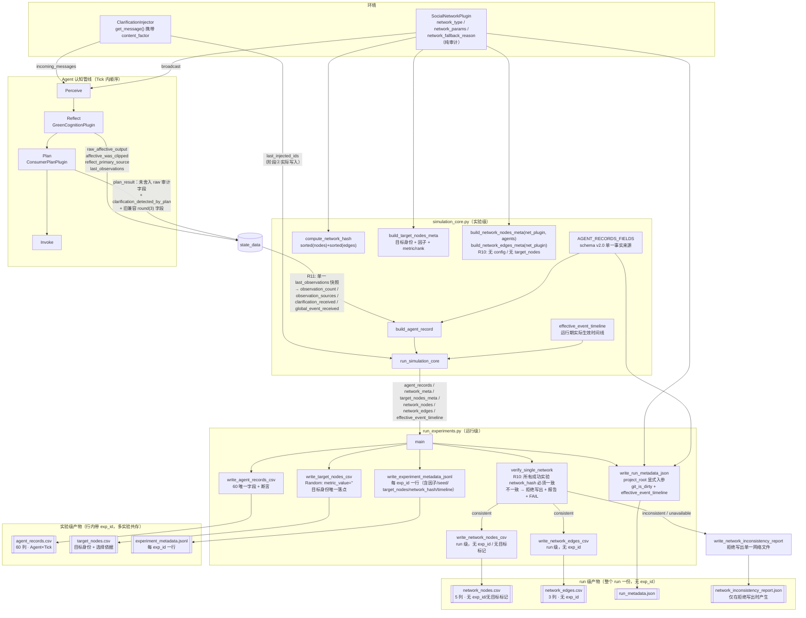

# 设计文档：agent-records-observability（TASK_002 第五轮 · 定向补正）

## Overview

把 `agent_records` 从 21 列的「结果快照」升级为 **60 列**的**可审计证据链**（schema v2.0），
并补齐运行级元数据（源码/Prompt/Persona 哈希、LLM 采样参数、网络结构指纹、目标节点选择依据、
本次实验实际生效的事件时间线），使论文第 5–6 章的每一个数值都能回溯到
「哪份代码、哪个 Prompt、哪张网络、哪条被实际观察到的消息」。

设计的第一原则是**只增加可观测性，不改变仿真行为**：所有参与信任计算的表达式逐字保留，
新增字段一律旁路输出；这一点由「实施前生成的 pre-TASK_002 行为基线 fixture + 零容差逐 Tick 比对」强制保证。
第二原则是**禁止推断代替记录**：`network_type`、`clarification_content_type`、`global_event_received`、
`effective_event_timeline`、`top_p` 等必须来自真实建图分支、真实被观察到的消息、真实运行期状态、
真实配置文件；缺失即记 `"unknown"` / `"missing:*"` / `""`，绝不填充假设默认值，
也绝不用「tick 与常量比较」之类的推断顶替实际记录。

### 本轮（第五轮）定向补正清单

第四轮设计主体（Architecture / Components / Error Handling / 兼容性 / 正确性属性 / 实施顺序）通过，
本轮在生成 fixture 与应用生产 diff **之前**只做以下 4 项定向补正，第四轮 R1–R9 全部保留：

| # | 补正 | 落点 |
|---|---|---|
| R10 | 网络输出**分层**：`network_nodes.csv` / `network_edges.csv` 改为 **run 级静态文件**（整个 run 一份），不含 `exp_id` / `is_clarification_target`；目标身份与选择依据**只**在 `target_nodes.csv`；写出前必须验证所有成功实验的 `network_hash` 一致，不一致则**拒绝写出**并落盘不一致报告 + 判 FAIL | §Architecture、§C4、§C5、§3.4、§3.5、§6-P17、§9-P-ART-* |
| R11 | 实际观察来源**收窄**：`_observed_source_present()` 只读 `last_observations`（删除 `observations` 回退），签名改为接收**观察列表**；`observation_count` / `observation_sources` / `global_event_received` / `clarification_received` 共用 `build_agent_record` 内取的**同一份快照** | §C4、§Data Models、§3.4、§5-T4/T13、§6-P21、§9-P-OBS-4 |
| R12 | `experiment_metadata.jsonl` 补齐 9 个字段（因子 3 项、`clarification_tick`、`random_seed`、`budget_k`、`target_nodes`、`network_hash`、`effective_event_timeline`）；异常分支必须保存 `config.to_dict()` | §C6、§3.5、§5-T15、§6-P20 |
| R13 | fixture **锁定测试输入**：新增 `test_harness_sha256`（测试文件自身哈希，验证时必须完全相同）；`git_is_dirty` 必须为 **bool**（`"unknown"` → 拒绝生成，退出码 2）；新增 `git merge-base --is-ancestor` 祖先关系检查 | §4.2b、§4.4、§5-T17、§6-P19、§9-P-FIX-* |

> **字段数不变**：R10–R13 不新增、不删除、不改名任何 `agent_records` 列。
> `agent_records.csv` 仍为 **60 列**（R10 移除的两列属于 `network_nodes.csv`，与 60 列 schema 无关；
> R11 只改变四个已有字段的**取值来源与快照口径**，不改变字段集合）。

### 第四轮（R1–R9）定向补正清单（保留，未改动）

第三轮设计主体（Architecture / Components / Error Handling / 兼容性 / 实施顺序）通过，
第四轮做了以下 9 项定向补正：

| # | 补正 | 落点 |
|---|---|---|
| R1 | 恢复澄清**四阶段**字段（target / injected / received / detected_by_plan），四者语义互不替代；`inject()` 签名与返回类型不变，另加 `last_injected_ids` | §Data Models、§C2、§3.1、§3.3、§3.4 |
| R2 | 新增 `global_event_scheduled` / `global_event_received`，后者只从 `last_observations` 判定 | §Data Models、§3.4 |
| R3 | 新增三个产物：`network_edges.csv`、`network_nodes.csv`、`experiment_metadata.jsonl` | §C5、§3.2、§3.4、§3.5 |
| R4 | 删除「从 `ENTERPRISE_STRATEGY` 重建 `global_event_ticks`」，改为保存并读取 `effective_event_timeline` | §3.4、§3.5 |
| R5 | fixture 增加 `generated_from_commit` / `git_branch` / `git_is_dirty` / `baseline_file_sha256`，并对生产文件做**未提交修改前置检查**（脏则拒绝生成） | §4.2b、§4.4 |
| R6 | 数量口径全文统一为 **12 条 trace / 100 个 Tick 快照 / 500 个逐字段比对点**（旧口径的两个错误数字已从全文删除） | §4.5、§5、§6、§9 |
| R7 | 删除「`round(x,12)` 无损表示 float64」的错误表述；行为不变性改为直接比较**运行期未舍入状态** | §Data Models 精度策略、§4.1、§6-P7、§9-Property 2 |
| R8 | `run_metadata` 增加 `git_is_dirty` | §3.5、§6-P8 |
| R9 | 字段总数由 56 → **60**，全文所有字段数出现处同步更新（无 56 残留）；`has_clarification_observed` 与 `is_target_node` 的语义重复问题一并裁定 | 全文 |

> **不再强制维持 56 列**：审计字段的完整性优先于列数守恒。本轮新增/改名的字段全部为
> **本设计自身引入、从未落盘过任何历史数据**的审计列，因此改名不产生兼容性债务
> （schema v2.0 的唯一定义即为本文的 60 列；不存在 56 列的 v2.0 历史产物）。

## 本轮范围与硬性约束

本文档是 TASK_002 的**设计稿**，不是实施记录。本轮（第五轮）同样**未修改任何项目源文件**：
唯一写入的文件是 `.kiro/specs/agent-records-observability/design.md`。
`tests/` 下**未创建或修改任何文件**，第 3 节的生产代码 diff **未被应用**；
`tests/fixtures/task002/pre_task002_behavior_trace.json` 尚未生成。
所有代码（生产 diff、验收测试全文、fixture 前置检查）均以文本形式存在于本文档内。

所有代码变更以「完整可应用 unified diff」形式给出（第 3 节），全部基于以下真实文件当前内容生成
（已逐行核对行号）：

| 文件 | 当前行数 | 已核对锚点行号 |
|---|---|---|
| `clarification_injector.py` | 124 | 76 `def get_message`、82 `"type": "clarification"` |
| `plugins/environment/network/SocialNetworkPlugin.py` | 119 | 30 `n = len(agent_ids)`、35/39/43 三个建图分支 |
| `plugins/agent/plan/ConsumerPlanPlugin.py` | 333 | 135/145/160/173/296/316/325 |
| `simulation_core.py` | 476 | 18/124/307/396/417/475 |
| `run_experiments.py` | 407 | 21/29/173/175/323/339 |

> **应用建议**：本文 diff 的 `@@` 行数为人工计算值。为消除计数误差风险，请使用
> `git apply --recount --whitespace=nowarn <patch>`（`--recount` 会忽略 hunk 头中的行数并重新计算），
> 或 `patch -p1 -l < <patch>`。上下文行内容本身均取自真实文件，可安全匹配。

### 前置事实（已核对）

- TASK_001 已完成：`GreenCognitionPlugin.py` 在无观察时清空临时认知状态，66/66 PASS，
  证据在 `results/task001_validation/20260730_201049/`。
- `configs/models_config.yaml` 当前**没有** `top_p` 键（只有 `name/model/api_key/base_url/capabilities/temperature/seed`）
  → 因此 `top_p` 必须记为 `"unknown"`（第 12 项修正之一，见 §7-5）。
- 5 个待修改文件当前**均未** `import hashlib`、**均未** `import time`
  → 第 12 项的正确落点是「本轮只新增确实被使用的导入，且不引入 `time`」，而不是删除现有导入（见 §7-12）。
- `ConsumerPlanPlugin.py` 当前 `fallback_plan` 的 `reason` 是字典最后一项、无语法错误
  → 第 1 项的落点是「在其后追加字段时必须先补逗号」（见 §7-1）。

本轮（第五轮）为 R12 新增核对（逐项读取 `experiment_config.py` 确认，不作假设）：

| 需要的取值 | 真实存在？ | 真实名称与性质 |
|---|---|---|
| `ExperimentConfig.to_dict()` | ✅ 存在（第 84–89 行） | `asdict(self)` + 追加 `exp_id` 与 `clarification_tick` 两个 key |
| `content_factor` / `channel_factor` / `timing_factor` | ✅ | dataclass 字段，`asdict` 直接包含 |
| `random_seed` | ✅ | dataclass 字段，默认 `42`（**不是** `seed`） |
| `budget_k` | ✅ | dataclass 字段，默认 `3` |
| `clarification_tick` | ✅ | **`@property`**，不是 dataclass 字段 → `asdict` 不含它，但 `to_dict()` 显式补上；`no-clarification` 时为 `None` |
| `exp_id` | ✅ | 同为 `@property`，由 `to_dict()` 补上 |
| 其他被一并带入的字段 | ✅ | `num_agents` / `total_ticks` / `scandal_tick`（`asdict` 自带，本轮不单独落列） |

- `ExperimentConfig` 是 `@dataclass(frozen=True)`，`exp_id` 为只读 property
  → 测试中只能通过不同因子组合获得不同 `exp_id`，**不得**尝试赋值（§5 的 `OK_FACTORS` / `BAD_FACTORS` 即此原因）。
- `run_experiments.py` 当前 `except` 分支为 `results.append({"exp_id": config.exp_id, "error": str(e)})`
  → **确实没有**保存 config，R12 的落点是在该字典中补 `"config": config.to_dict()`（config 是循环变量，作用域内可用）。

---

## Architecture

数据流与组件关系：



关键单向依赖（第 3–5 条为第四轮新增，第 6–8 条为本轮 R10/R11 新增）：

1. `network_type` 只能由 `SocialNetworkPlugin` 在**实际建图分支内**写入。
2. `clarification_content_type` 只能由 `ConsumerPlanPlugin` 从**实际 `last_observations`** 读取。
3. `clarification_injected`（阶段②）只能来自 `ClarificationInjector.last_injected_ids`
   —— 即注入器**本 Tick 实际成功写入 inbox** 的 Agent ID 列表，不得由 `should_inject()` 或
   `agent_id in target_nodes` 推断。
4. `clarification_received`（阶段③）与 `global_event_received` 只能由记录器从该 Agent
   **实际的 `last_observations`** 判定；**严禁**用 `tick == clarification_tick` 或
   `tick in ENTERPRISE_STRATEGY` 之类的时间比较推断。
5. `effective_event_timeline` 只能在 `run_simulation_core` 运行期从**当时生效的**
   `ENTERPRISE_STRATEGY`（可能已被 `_run_with_patch` 改写）采集，
   随实验结果返回；`run_metadata.json` 只允许从实验结果读取，**不得**从常量重建。
6. **（R10）网络拓扑是 run 级事实**：所有 12 组实验共用同一 `random_seed=42` 与同一
   `register_agents` 路径，因此拓扑必须完全相同。`network_nodes.csv` / `network_edges.csv`
   因此只写一份、不含 `exp_id`。这份「唯一网络」的前提**必须被验证**，
   而不是被假设：写出前逐实验比对 `network_hash`，不一致即拒绝写出（见 §C5）。
7. **（R10）目标身份只有一个落点**：`is_clarification_target` 作为**列**只存在于
   `agent_records.csv`（Agent×Tick 粒度）；作为**行集合**只存在于 `target_nodes.csv`。
   `network_nodes.csv` 是纯拓扑事实，不得混入随实验变化的目标标记 —— 否则同一份
   run 级文件会被 12 组不同的目标集合反复覆盖，产生「最后写者胜」的静默污染。
8. **（R11）「实际观察」只有一个来源**：`last_observations`。
   `build_agent_record` 在函数开头取**一次**快照，`observation_count` /
   `observation_sources` / `clarification_received` / `global_event_received` 四者
   **全部复用该变量**。禁止回退读取 `observations`（那是 Perceive 的累积缓冲，
   可能含跨 Tick 残留），也禁止分别重复读取（重复读取会在 state 被并发写入时产生
   四个字段互相矛盾的记录）。

`run_experiments.py` 与 `simulation_core.py` 都不允许再从配置或常量反推以上任何值。

---

## Components and Interfaces

### C1 `SocialNetworkPlugin`（环境层，纯审计扩展）

```pascal
ATTRIBUTE network_type            : String   // "uninitialized"|"empty"|"complete"|"barabasi_albert"|"erdos_renyi"
ATTRIBUTE network_params          : Dict     // {"n":…} | {"n":…,"m":2,"seed":…} | {"n":…,"p":0.3,"seed":…}
ATTRIBUTE network_fallback_reason : String   // "" 或 "barabasi_albert_failed: <Type>: <msg>"
```

职责：在**实际执行的建图分支内部**记录分支名与生成参数。
不新增方法，不改变 `register_agents` / `broadcast_message` / `get_successors` 的行为。

### C2 `ClarificationInjector`（澄清注入，消息包扩展 + 注入回执）

```pascal
ATTRIBUTE last_injected_ids : List[String]   // 本次 inject() 实际成功写入 inbox 的 Agent ID

FUNCTION get_message() -> Dict
  RETURNS {source: "Enterprise_Clarification", content: String,
           type: "clarification", content_factor: String}   // content_factor 为新增键

ASYNC FUNCTION inject(agents, current_tick) -> int          // 签名与返回类型**不变**
  POSTCONDITION: last_injected_ids 被本次调用覆盖写（含"未注入"时置空列表）
  POSTCONDITION: return value = len(last_injected_ids)
  POSTCONDITION: set(last_injected_ids) ⊆ set(target_nodes)
```

职责：
1. 让「内容类型」随消息本体一起流动，使下游只依赖被观察到的事实；
2. 提供**注入回执** `last_injected_ids`，让阶段②（`clarification_injected`）有真实来源。

`inject()` 的签名与返回类型保持 `-> int` 不变，既有调用点
（`simulation_core.py` 第 307 行 `injected_count = await injector.inject(...)`）零改动。
`last_injected_ids` 在**每次**调用开头无条件重置为 `[]`，避免上一 Tick 的回执泄漏到后续 Tick。

### C3 `ConsumerPlanPlugin`（Plan 层，审计字段生产者）

```pascal
// 写入 state["plan_result"] 的新增键（全部为未舍入原值或枚举/布尔）
previous_trust_raw, baseline_trust_raw, trust_after_decay_raw, affective_change_raw,
trust_score_raw, shock_anchor_before_raw, shock_anchor_after_raw, decay_rate_raw,
sensitivity_multiplier, trust_clipped_at_bound, anchor_update_branch,
clr_anchor_lift_ratio, clr_lift_raw, is_quiet_day,
clarification_detected_by_plan, clarification_content_type, plan_fallback_used
```

`clarification_detected_by_plan`（阶段④）记录的是 Plan 层**自己**识别到的澄清，
也就是**实际驱动了行为分支**（`quiet_ticks` 重置、`anchor_update_branch="clarification"`）的那个布尔量。
它与记录器独立计算的阶段③ `clarification_received` 分开落盘：两者不一致即说明
「Agent 收到了澄清但 Plan 没识别」或反之，属必须暴露的缺陷，不允许用一个字段掩盖。
（本键即第三轮设计中的 `has_clarification_observed` 改名，语义收窄为「Plan 层识别结果」。）

不变量：旧键 `current_trust / trust_after_decay / affective_change / shock_anchor /
decay_lambda / quiet_ticks / is_buying / is_posting` 的值与精度完全不变。

### C4 `simulation_core`（实验层，schema 与构造入口）

```pascal
CONSTANT AGENT_RECORDS_SCHEMA_VERSION : String = "2.0"
CONSTANT AGENT_RECORDS_FIELDS         : List[String]   // 60 个唯一字段，单一事实来源

FUNCTION _audit_float(value, digits=12)            -> Float | ""
FUNCTION _observed_source_present(observations, source, msg_type="") -> Bool
                                     // R11：入参是**观察列表**（不是 s_data），
                                     //      调用方必须传入唯一的 last_observations 快照；
                                     //      函数内不再有任何 observations 回退
FUNCTION compute_network_hash(graph)               -> String   // sha256(sorted nodes + sorted edges)
FUNCTION build_network_meta(net_plugin, config)    -> Dict
FUNCTION build_target_nodes_meta(graph, config, target_nodes) -> List[Dict]
FUNCTION build_network_nodes_meta(net_plugin, agents) -> List[Dict]
                                     // R10：run 级拓扑事实，行内**不含** exp_id
                                     //      与 is_clarification_target
FUNCTION build_network_edges_meta(net_plugin)         -> List[Dict]
                                     // R10：行内**不含** exp_id
FUNCTION build_effective_event_timeline(strategy)              -> List[Dict]
FUNCTION build_agent_record(config, tick, agent_id, cluster_type, social_role,
                            trust, s_data, plan, thought,
                            out_degree, in_degree,
                            is_clarification_target,      // 阶段① target_nodes 成员
                            clarification_injected,       // 阶段② 注入回执
                            cumulative_buyers_count) -> Dict   // 恰含 60 键
                            // 阶段③ clarification_received / global_event_received
                            // 在函数内部由**唯一的 last_observations 快照**判定，
                            // 不接受外部传入（R11）
```

**R11 的单一快照契约**（`build_agent_record` 内部）：

```pascal
last_obs ← s_data.get("last_observations") or []      // 全函数只取这一次
observation_count      ← len(last_obs)
observation_sources    ← join(sorted(distinct(o.source for o in last_obs)))
clarification_received ← _observed_source_present(last_obs, "Enterprise_Clarification", "clarification")
global_event_received  ← _observed_source_present(last_obs, "Global News")
```

四者共用 `last_obs`，因此下述不一致在结构上**不可能**出现：
`observation_count = 0` 却 `clarification_received = True`，
或 `observation_sources` 不含 `"Global News"` 却 `global_event_received = True`。
这条一致性由 §9 的 P-OBS-4 与 §5 的 T4 断言强制。

`run_simulation_core` 的返回值新增
`agent_records_schema_version` / `network_meta` / `target_nodes_meta` /
`network_nodes` / `network_edges` / `effective_event_timeline`。

其中 `network_nodes` / `network_edges` 仍**逐实验返回**（R10 不改变这一点）：
返回它们是为了让运行层能在写出唯一一份 run 级文件之前，**用真实数据交叉验证
「12 组实验的拓扑确实相同」**。若只由某一组实验返回，这个验证就无从进行 ——
「假设拓扑相同」正是本轮要消除的东西。

`build_effective_event_timeline(strategy)` 在主循环开始前对**运行期实际生效的**
`ENTERPRISE_STRATEGY` 取快照，产出 `[{tick, content_sha256, char_count}, …]`（按 tick 升序）。
`_run_with_patch` 会就地改写该字典，因此运行期快照能真实反映「本次实验只有 Tick 5 丑闻」这一事实。

### C5 `run_experiments`（运行层，落盘与元数据）

```pascal
FUNCTION write_agent_records_csv(results, output_path)                  // 断言 60 且无重复
FUNCTION write_target_nodes_csv(results, output_path)                   // Random: metric_value=""
FUNCTION verify_single_network(results) -> Dict                         // R10 前置验证，见下
FUNCTION write_network_nodes_csv(results, output_path, verification) -> Bool   // run 级，5 列
FUNCTION write_network_edges_csv(results, output_path, verification) -> Bool   // run 级，3 列
FUNCTION write_network_inconsistency_report(verification, output_path)  // 仅在拒绝写出时调用
FUNCTION write_experiment_metadata_jsonl(results, output_path)          // 每 exp_id 一行（18 字段）
FUNCTION write_run_metadata_json(results, output_path, project_root, run_id,
                                 network_verification) -> Dict          // 含 network_consistency
FUNCTION _sha256_file(path)     -> String    // 缺失时 "missing:<name>"，绝不 "unknown"
FUNCTION _read_git_info(project_root) -> Dict   // branch / commit / is_dirty（不可判定 → "unknown"）
FUNCTION _git_is_dirty(project_root) -> Bool | String   // "unknown" 表示无法判定
FUNCTION _read_llm_config(project_root) -> Dict   // 缺失参数 → "unknown"；api_key 只记 present
```

产物（6 个常规产物 + 1 个仅在失败时出现的报告，全部同步到 `latest/`）：

| 产物 | 内容 | 粒度 | 行内含 `exp_id`？ |
|---|---|---|---|
| `agent_records.csv` | 60 列可审计证据链 | 实验级：Agent × Tick | ✅ |
| `target_nodes.csv` | **目标身份 + 实验因子 + `selection_metric` / `metric_value` / `rank`** | 实验级：Agent（仅目标节点） | ✅ |
| `experiment_metadata.jsonl` | 因子、seed、预算、目标节点、网络指纹、生效时间线、运行时序、缓存/回放计数、成功与错误 | 实验级：每 exp_id 一行 | ✅ |
| `network_nodes.csv` | 节点属性与度数（**5 列**：`agent_id` / `cluster_type` / `social_role` / `out_degree` / `in_degree`） | **run 级：整个 run 一份** | ❌ |
| `network_edges.csv` | 有向边全量（**3 列**：`source_agent_id` / `target_agent_id` / `is_directed`） | **run 级：整个 run 一份** | ❌ |
| `run_metadata.json` | 源码/Prompt/Persona 哈希、LLM 参数、git（含 `is_dirty`）、实际生效事件时间线、网络一致性验证结论 | run 级 | — |
| `network_inconsistency_report.json` | **仅当** run 级网络前提被证伪时产生 | run 级 | 报告内逐实验列出 |

#### R10 网络输出分层的理由

`network_nodes.csv` / `network_edges.csv` 描述的是**拓扑**。拓扑由
`register_agents(agents, seed=config.random_seed)` 唯一决定，而 12 组配置的
`random_seed` 全部为 `42`、`num_agents` 全部为 `20` ——
所以 12 份拷贝逐字节相同，按实验重复写入只是把同一张图抄 12 遍
（20 节点 × 12 = 240 行节点、边表同理），既无信息量又会诱导下游做
「按 exp_id 分组」的无意义聚合。

真正随实验变化的只有**目标身份与选择依据**（`hub` 与 `random` 选出的是不同节点，
`rank` / `metric_value` 也不同）。因此这部分整体归到 `target_nodes.csv`，
`network_nodes.csv` 保持为纯拓扑事实表。这也解释了为什么必须把
`is_clarification_target` 从节点表移除：一个 run 级文件被 12 组不同目标集合覆盖，
结果只取决于写入顺序，是典型的静默污染。

#### R10 一致性验证与失败行为（拒绝写出）

`verify_single_network(results)` 在写出任何网络文件**之前**执行：

```pascal
FUNCTION verify_single_network(results) -> Dict
  INPUT : 全部实验结果（含失败组）
  OUTPUT: {status, network_hash, source_exp_id, hash_groups, node_mismatch, edge_mismatch, checked}

  ok_results ← [r FOR r IN results IF "error" NOT IN r AND "network_meta" IN r]
  IF ok_results = ∅ THEN RETURN {status: "unavailable", …}
  hash_groups ← group ok_results BY r.network_meta.network_hash     // {hash: [exp_id…]}
  IF |hash_groups| > 1 THEN RETURN {status: "inconsistent", …}
  // 哈希一致后，再逐行核对节点表/边表（哈希只覆盖拓扑，节点表还含 cluster/role）
  IF ∃ r : rows(r.network_nodes) ≠ rows(ok_results[0].network_nodes) THEN
    RETURN {status: "inconsistent", node_mismatch: […]}
  IF ∃ r : rows(r.network_edges) ≠ rows(ok_results[0].network_edges) THEN
    RETURN {status: "inconsistent", edge_mismatch: […]}
  RETURN {status: "consistent", network_hash: …, source_exp_id: min(exp_id)}
END FUNCTION
```

`source_exp_id` 取按字典序最小的成功 `exp_id`，使「选哪一组作为 run 级代表」是确定性的。

失败行为（三选一的裁定）：

| 选项 | 采纳？ | 理由 |
|---|---|---|
| 抛异常中断 `main()` | ❌ | 网络文件写出发生在 12 组实验（可能耗费数小时真实 LLM 调用）全部跑完之后。此时抛异常会连带丢掉 `summary.csv` / `trajectories.csv` / `agent_records.csv` / `run_metadata.json` —— 为了一个审计产物的契约问题销毁全部实验证据，代价与收益完全不成比例 |
| 写出「某一组」的网络文件并打印警告 | ❌ | 这正是本轮要消除的「假设代替验证」：产物看起来正常，但它到底属于哪一组网络无从判断，审计价值为负 |
| **拒绝写出 + 落盘不一致报告 + 判 FAIL** | ✅ **采纳** | 缺失文件是一个**响亮且无法误读**的信号（下游读取即报 `FileNotFoundError`，不会静默用错数据）；报告保留了完整诊断信息；其他证据完好无损；FAIL 由退出码与 `run_metadata` 双重记录，CI 可判定 |

采纳方案的具体行为：

1. **不创建** `network_nodes.csv` 与 `network_edges.csv`（连表头都不写 —— 空表头文件会被下游当成「网络为空」）。
2. 写出 `network_inconsistency_report.json`，内容为：
   ```jsonc
   {
     "status": "inconsistent",                  // 或 "unavailable"
     "reason": "network_hash differs across successful experiments",
     "checked_experiments": 12,
     "hash_groups": {                           // 每个指纹 → 属于它的 exp_id 列表
       "a1b2…": ["Rational-Hub-Imm", "…"],
       "c3d4…": ["Empathy-Random-D3"]
     },
     "per_experiment": [
       {"exp_id": "Rational-Hub-Imm", "network_hash": "a1b2…",
        "num_nodes": 20, "num_edges": 38,
        "network_type": "barabasi_albert", "network_params": {"n": 20, "m": 2, "seed": 42},
        "random_seed": 42, "num_agents": 20}
     ],
     "node_row_mismatch": [], "edge_row_mismatch": [],
     "refused_outputs": ["network_nodes.csv", "network_edges.csv"],
     "remedy": "Topology must be identical across the run (same seed / same num_agents). Inspect per_experiment above: differing random_seed or num_agents, or a non-deterministic register_agents path."
   }
   ```
   报告刻意包含 `random_seed` / `num_agents` / `network_type` / `network_params`
   —— 一致性被打破时，答案几乎总在这四项里。
3. 在 `run_metadata.json` 顶层写入 `network_consistency`（`status` / `network_hash` /
   `hash_groups` / `refused_outputs`），使唯一的运行级元数据文件自身即可判定。
4. `main()` 打印醒目错误、把该项加入 `errors` 列表（因此也进 `errors.log`），
   并在**所有其他产物与图表写完之后**以 `SystemExit(3)` 结束进程。
   退出码 `3` 专指「网络一致性契约被违反」，与既有的 `0` 区分。
5. `status = "unavailable"`（12 组全失败，没有任何成功实验可比对）同样拒绝写出，
   报告内 `reason` 记为 `"no successful experiment reported network_meta"`，
   退出码同为 `3` —— 无法判定与判定为错，对 run 级产物的可信度而言后果相同（fail-closed）。

### C6 `experiment_metadata.jsonl` 字段来源（**已核对真实来源，不作假设**）

字段总数 **18**（R12 在原 9 个基础上补齐 9 个）。分组：标识 1 + 实验因子与参数 6 +
运行时序 2 + Router 审计 3 + 实验输入指纹 3 + 状态 3。

| 字段 | 真实来源 | 缺失/不适用时的记法 |
|---|---|---|
| `exp_id` | `ExperimentConfig.exp_id`（只读 property，经 `to_dict()` 落入 `result["config"]["exp_id"]`；写入时优先取 `r["exp_id"]`） | — |
| `content_factor` | `result["config"]["content_factor"]` ← dataclass 字段（**R12 新增**） | 无 config（理论上不应出现）→ `""` |
| `channel_factor` | `result["config"]["channel_factor"]` ← dataclass 字段（**R12 新增**） | 同上 → `""` |
| `timing_factor` | `result["config"]["timing_factor"]` ← dataclass 字段（**R12 新增**） | 同上 → `""` |
| `clarification_tick` | `result["config"]["clarification_tick"]` ← `ExperimentConfig` 的 **`@property`**，由 `to_dict()` 显式补入（**R12 新增**） | `timing_factor="no-clarification"` 时该 property 返回 `None` → 写 `""`（不适用），**不写 0**（0 是合法 Tick 值域外的伪装） |
| `random_seed` | `result["config"]["random_seed"]` ← dataclass 字段，真实名为 `random_seed`（**不是** `seed`）（**R12 新增**） | 同上 → `""` |
| `budget_k` | `result["config"]["budget_k"]` ← dataclass 字段（**R12 新增**） | 同上 → `""` |
| `started_at` | `run_experiments.main` 循环内在 `_run_with_patch` 调用**前**取 `datetime.datetime.now().isoformat(timespec="seconds")` | 当前代码**没有**该计时点，属新增插桩（纯审计，位于仿真调用之外） |
| `finished_at` | 同上，调用**后**取值（`finally` 中取，异常路径也有值） | — |
| `recording_cache_size` | 录制组：运行后 `len(rec_router.cache)`（`RecordingRouter.cache` → `self._cache`，真实存在，见 `run_experiments.py` 第 60–62 行）；回放组：`len(llm_cache)`，即该组实际**消费**的缓存规模 | 未注入任何 Router（`override_router=None`）时记 `""` |
| `replay_miss_count` | 回放组：`rp_router.miss_count`（`ReplayRouter.miss_count`，真实存在，见第 76 行与第 89 行自增） | 录制组无该属性 → 记 `""`（**不记 0**：0 表示"回放了但一次都没 miss"，与"不适用"必须可区分） |
| `router_role` | `main()` 内 `"recording" if is_baseline else "replay"` | 未注入 Router → `"none"` |
| `target_nodes` | `[row["agent_id"] for row in result["target_nodes_meta"]]` ← 真实选点结果（**R12 新增**） | 失败实验没有选点结果 → `[]`（空列表，与"选中 0 个"在语义上一致，因为失败实验确实未投放） |
| `network_hash` | `result["network_meta"]["network_hash"]` ← `compute_network_hash(graph)`（**R12 新增**） | 失败实验 → `""`；该列使每行都能独立回指自己那张网络，也是 §C5 一致性验证的逐行证据 |
| `effective_event_timeline` | `result["effective_event_timeline"]` ← 运行期快照（**R12 新增**） | 失败实验 → `[]`（与 `run_metadata` 的处理一致，绝不从常量重建） |
| `success` | `"error" not in result` | — |
| `error_type` | `type(e).__name__`（在 `except` 分支中新增记录，当前错误字典只有 `error` 文本） | 成功时 `""` |
| `error` | `str(e)`（已存在于 `results.append({"exp_id":…, "error": str(e)})`） | 成功时 `""` |

> 取值规则的四条硬性约定：
> 1. `recording_cache_size` 记录的是**该实验实际使用的 LLM 缓存条数**（录制组=产出规模，回放组=消费规模），
>    并同时写 `router_role ∈ {"recording","replay","none"}` 说明语义，避免两种规模被混读。
> 2. 任何"当前代码不存在真实来源"的项（`started_at` / `finished_at` / `error_type`）
>    一律以**新增审计插桩**方式取得真实值，绝不用估算或事后推断填充。
> 3. **（R12）异常结果也必须带 config**：`run_experiments` 的 `except` 分支写入
>    `{"exp_id", "error", "error_type", "run_audit", "config": config.to_dict()}`。
>    只保存 `exp_id + error` 会让失败实验丢失「它是哪一组因子、什么 seed」这一最关键的
>    复现信息 —— 而失败实验恰恰是最需要复现的。因子/seed/预算四项对失败行**照常填充**，
>    只有依赖运行结果的三项（`target_nodes` / `network_hash` / `effective_event_timeline`）记空。
> 4. 所有取值一律 `dict.get(key, 缺省)`，`config` 缺失时整行仍写出（`exp_id` + 状态可用），
>    绝不因缺一个键而丢一整行 —— 「每个 exp_id 恰好一行」是本产物的核心契约。

---

## Data Models

**第 1 部分：最终 60 字段列表**

精度策略说明（本轮 R7 修正）：

- **兼容(4)**：`round(x, 4)`，与 schema v1.0 完全一致，禁止改动。
- **审计(12)**：`round(x, 12)`，源头 `plan_result` 内保存的是**未舍入原始 float**。
  12 位小数的用途是**高精度复算**：它远细于本模型任何有意义的数值差异，
  任何大于 `1e-9` 的差异都必然在该列中可分辨。
  **不声称**这是 float64 的无损表示 —— 十进制文本 CSV 一般无法无损往返 float64，
  这个说法不成立，本轮已删除。
- **原样**：int / bool / str 直接落盘。
- **空值**：不适用时写 `""`（空字符串），禁止用 `0` 冒充。

> **行为不变性不依赖 CSV 精度**：pre/post 比对**直接取运行期未舍入状态**
> （`state_data["trust_score"]`、`state_data["shock_anchor"]`、`plan_result[...]` 的内存值），
> 在内存中做 `==` 精确比较，完全不经过 CSV 序列化。CSV 的 12 位小数只服务于事后复算，
> 不承担任何不变性证明职责。详见 §4.1。

| # | 字段名 | 类型 | 精度/舍入 | 来源模块 | 新增审计 | 旧兼容(v1.0) |
|---|---|---|---|---|---|---|
| 1 | `schema_version` | str | 原样 `"2.0"` | simulation_core 常量 | ✅ | — |
| 2 | `exp_id` | str | 原样 | ExperimentConfig | — | ✅ |
| 3 | `tick` | int | 原样 | 主循环 | — | ✅ |
| 4 | `agent_id` | str | 原样 | Agent | — | ✅ |
| 5 | `cluster_type` | str | 原样 | GreenProfilePlugin | — | ✅ |
| 6 | `social_role` | str | 原样 | GreenProfilePlugin | — | ✅ |
| 7 | `content_factor` | str | 原样 | ExperimentConfig | ✅ | — |
| 8 | `channel_factor` | str | 原样 | ExperimentConfig | ✅ | — |
| 9 | `timing_factor` | str | 原样 | ExperimentConfig | ✅ | — |
| 10 | `clarification_tick_config` | int \| `""` | 原样（None→`""`） | ExperimentConfig | ✅ | — |
| 11 | `trust_score` | float | 兼容(4) | state_data | — | ✅ |
| 12 | `baseline_trust` | float | 兼容(4) | state_data | — | ✅ |
| 13 | `trust_after_decay` | float | 兼容(4) | plan_result | — | ✅ |
| 14 | `affective_change` | float | 兼容(4) | plan_result | — | ✅ |
| 15 | `shock_anchor` | float | 兼容(4) | plan_result | — | ✅ |
| 16 | `quiet_ticks` | int | 原样 | plan_result | — | ✅ |
| 17 | `decay_lambda` | float | 原样 | plan_result | — | ✅ |
| 18 | `previous_trust_raw` | float | 审计(12) | ConsumerPlanPlugin | ✅ | — |
| 19 | `baseline_trust_raw` | float | 审计(12) | ConsumerPlanPlugin | ✅ | — |
| 20 | `trust_after_decay_raw` | float | 审计(12) | ConsumerPlanPlugin | ✅ | — |
| 21 | `affective_change_raw` | float | 审计(12) | ConsumerPlanPlugin | ✅ | — |
| 22 | `trust_score_raw` | float | 审计(12) | ConsumerPlanPlugin | ✅ | — |
| 23 | `shock_anchor_before_raw` | float | 审计(12) | ConsumerPlanPlugin | ✅ | — |
| 24 | `shock_anchor_after_raw` | float | 审计(12) | ConsumerPlanPlugin | ✅ | — |
| 25 | `decay_rate_raw` | float | 审计(12) | ConsumerPlanPlugin | ✅ | — |
| 26 | `sensitivity_multiplier` | float | 审计(12) | ConsumerPlanPlugin | ✅ | — |
| 27 | `trust_clipped_at_bound` | bool | 原样 | ConsumerPlanPlugin | ✅ | — |
| 28 | `anchor_update_branch` | str | 原样（4 取值） | ConsumerPlanPlugin | ✅ | — |
| 29 | `clr_anchor_lift_ratio` | float \| `""` | 审计(12) | ConsumerPlanPlugin | ✅ | — |
| 30 | `clr_lift_raw` | float \| `""` | 审计(12) | ConsumerPlanPlugin | ✅ | — |
| 31 | `raw_affective_output` | float | 审计(12) | GreenCognitionPlugin | ✅ | — |
| 32 | `trust_change_affective_used` | float | 审计(12) | GreenCognitionPlugin | ✅ | — |
| 33 | `affective_was_clipped` | bool | 原样 | GreenCognitionPlugin | ✅ | — |
| 34 | `reflect_primary_source` | str | 原样 | GreenCognitionPlugin | ✅ | — |
| 35 | `reflect_message_sources` | str | `";"` 连接 | GreenCognitionPlugin | ✅ | — |
| 36 | `observation_count` | int | 原样 | **单一 `last_observations` 快照**（R11） | ✅ | — |
| 37 | `observation_sources` | str | `";"` 连接（排序） | **单一 `last_observations` 快照**（R11） | ✅ | — |
| 38 | `is_buying` | bool | 原样 | plan_result | — | ✅ |
| 39 | `is_posting` | bool | 原样 | plan_result | — | ✅ |
| 40 | `post_content` | str | 截断 200 | plan_result | — | ✅ |
| 41 | `plan_reason` | str | 截断 300 | plan_result | ✅ | — |
| 42 | `plan_fallback_used` | bool | 原样 | ConsumerPlanPlugin | ✅ | — |
| 43 | `hypocrisy_perceived` | bool | 原样 | latest_thought | — | ✅ |
| 44 | `importance` | float | 原样 | latest_thought | — | ✅ |
| 45 | `reasoning` | str | 截断 300 | latest_thought | — | ✅ |
| 46 | `has_global_event` | bool | 原样（v1.0 兼容别名，deprecated） | 运行期 ENTERPRISE_STRATEGY | — | ✅ |
| 47 | `global_event_scheduled` | bool | 原样（调度事实） | 运行期 ENTERPRISE_STRATEGY | ✅ | — |
| 48 | `global_event_received` | bool | 原样（**实际观察**） | **单一 `last_observations` 快照**（R11） | ✅ | — |
| 49 | `has_clarification` | bool | 原样（配置声称，实验级） | ExperimentConfig | — | ✅ |
| 50 | `is_clarification_target` | bool | 原样（阶段①） | node_selector → injector.target_nodes | ✅ | — |
| 51 | `clarification_injected` | bool | 原样（阶段②） | ClarificationInjector.last_injected_ids | ✅ | — |
| 52 | `clarification_received` | bool | 原样（阶段③，**实际观察**） | **单一 `last_observations` 快照**（R11） | ✅ | — |
| 53 | `clarification_detected_by_plan` | bool | 原样（阶段④，Plan 识别） | ConsumerPlanPlugin | ✅ | — |
| 54 | `clarification_content_type` | str \| `""` | 原样（实际观察） | ConsumerPlanPlugin ← ClarificationInjector | ✅ | — |
| 55 | `is_quiet_day` | bool | 原样 | ConsumerPlanPlugin | ✅ | — |
| 56 | `out_degree` | int | 原样 | SocialNetworkPlugin.graph | ✅ | — |
| 57 | `in_degree` | int | 原样 | SocialNetworkPlugin.graph | ✅ | — |
| 58 | `tick_posts_total` | int | 原样（结算后回填） | 主循环 | ✅ | — |
| 59 | `tick_buys_total` | int | 原样（结算后回填） | 主循环 | ✅ | — |
| 60 | `cumulative_buyers` | int | 原样 | 主循环 | — | ✅ |

统计：**60 个唯一字段 = 21 个 v1.0 兼容字段 + 39 个新增审计字段**。

**本轮（第五轮）字段数核对结论：仍为 60，未增未减未改名。** 逐项核对：

| 本轮补正 | 是否触及 `agent_records` 字段集合？ | 说明 |
|---|---|---|
| R10 网络输出分层 | ❌ 不触及 | 移除的 `exp_id` / `is_clarification_target` 是 **`network_nodes.csv` 的列**，不是 `agent_records` 的列。`agent_records` 的 `is_clarification_target`（#50）与 `out_degree`（#56）/ `in_degree`（#57）全部保留 |
| R11 观察来源收窄 | ❌ 不触及 | 只改变 #36 / #37 / #48 / #52 四个**已有**字段的取值来源与快照口径，字段名与类型不变 |
| R12 `experiment_metadata` 补齐 | ❌ 不触及 | 新增字段全部落在 `experiment_metadata.jsonl`（独立产物，18 字段），与 60 列 schema 无交集 |
| R13 fixture 锁定输入 | ❌ 不触及 | 只影响 fixture JSON 的元数据键 |

因此 `AGENT_RECORDS_FIELDS` 的两条模块级断言（`== 60`、无重复）、CSV 表头断言、
`EXPECTED_FIELD_COUNT = 60`、P3 / P5 / P6 判据全部**保持原样**。

- `trust_after_decay`（#13）在整个列表中只出现一次；高精度版本使用**不同名**的
  `trust_after_decay_raw`（#20），这是第 2 项阻断问题的结构性根治方式。
- v1.0 的 21 个字段全部保留，且**相对顺序与 v1.0 完全一致**（新增字段插入其间），
  因此按列名读取的既有分析脚本零改动可用。
  v1.0 字段在 v2.0 中的位置序列：2,3,4,5,6,11,12,13,14,15,16,17,38,39,40,43,44,45,46,49,60（严格递增）。

`anchor_update_branch` 取值域：`"clarification"` / `"global_event"` / `"social_positive"` / `"none"`。

### 澄清 / 全局事件字段的语义辨析（R1 / R2 / R9）

**澄清四阶段**（#50–#53）刻画的是一条**投放链路**，四个字段各自回答一个不同的问题，
任何两个都不能互相替代：

| 阶段 | 字段 | 回答的问题 | 唯一合法来源 |
|---|---|---|---|
| ① 选中 | `is_clarification_target` | 该 Agent 是否被选为投放目标？ | `injector.target_nodes` |
| ② 写入 | `clarification_injected` | 注入器本 Tick 是否**确实**把消息写进了它的 inbox？ | `injector.last_injected_ids` |
| ③ 收到 | `clarification_received` | 该 Agent 本 Tick 是否**确实**观察到了这条澄清？ | 记录器读 `last_observations`（R11：**只**读它，无 `observations` 回退） |
| ④ 识别 | `clarification_detected_by_plan` | Plan 层是否**确实**把它识别为澄清并据此改变分支？ | `plan_result` |

典型的可诊断断裂（正是拆成四列的理由）：

- ①=True、②=False → 注入器在该 Tick 没有触发（时机配置错误，或 `should_inject` 判定异常）。
- ②=True、③=False → 消息进了 inbox 但没进入观察流（信箱限流 `msgs[-3:]` 挤掉、Perceive 过滤）。
- ③=True、④=False → Agent 收到了澄清但 Plan 没识别（source/type 判定与消息实际结构不匹配）。
- ④=True 而 `anchor_update_branch ≠ "clarification"` → 分支标签与信任更新不一致。

**语义重复的裁定**（对应 R9 的要求）：

| 第三轮字段 | 裁定 | 理由 |
|---|---|---|
| `has_clarification_observed` | **改名**为 `clarification_detected_by_plan`，不再保留原名 | 原名同时可被理解为「收到」和「Plan 识别到」，正是本轮要拆开的两件事；保留原名会与 `clarification_received` 语义重叠。该字段从未落盘任何历史数据，改名无兼容成本 |
| `is_target_node` | **改名**为 `is_clarification_target`，不再保留原名 | 与阶段①定义完全相同，若两者并存即为纯重复列；改名后归入澄清链路组，语义自解释 |
| `has_clarification` | **保留**（v1.0 兼容列） | 语义是「**配置**声称本 Tick 注入澄清」，与 Agent 无关，是实验级声明；与四阶段的"实际发生"形成声明/事实对照，不重复 |
| `has_global_event` | **保留**（v1.0 兼容列，标记 deprecated） | 值与 `global_event_scheduled` 恒等，属**已知的受控冗余**：保留仅为让 v1.0 分析脚本零改动可用。新分析请使用 `global_event_scheduled`；计划在 schema v3.0 移除 `has_global_event` |

**全局事件两阶段**（#47–#48）：

- `global_event_scheduled`：本次实验的运行期 `ENTERPRISE_STRATEGY` 是否在本 Tick 安排了事件（调度事实）。
- `global_event_received`：该 Agent 的 `last_observations` 中**是否实际出现** `source == "Global News"` 的消息。
  **禁止**以 `tick in ENTERPRISE_STRATEGY` 推断 —— 那只是调度，
  不能证明该 Agent 真的观察到了（信箱限流、Perceive 过滤都可能截断）。
  两者不一致即暴露一次真实的投递失败。

**R11：为什么删除 `observations` 回退**

第四轮的 `_observed_source_present` 写作 `s_data.get("last_observations") or s_data.get("observations") or []`。
这个回退有三个问题，因此本轮删除：

1. **语义不同**：`last_observations` 是 Reflect 为**本 Tick**保存的只读快照；
   `observations` 是 Perceive 侧的观察集合，其生命周期与清理时机由 Perceive/TASK_001
   的清空逻辑决定，可能包含上一 Tick 残留。用它回退等于允许「上个 Tick 的澄清」
   把本 Tick 的 `clarification_received` 染成 `True`，正是本设计要禁止的推断。
2. **回退触发条件恰好是最需要 `False` 的场景**：`last_observations == []` 的含义就是
   「本 Tick 什么都没观察到」，此时正确答案必然是 `False`；回退却会在这一刻去翻另一个
   容器，把「没观察到」变成「可能观察到」。
3. **破坏四字段一致性**：`observation_count` / `observation_sources` 一直只统计
   `last_observations`；若 received 类字段允许回退，就会出现
   `observation_count = 0` 却 `clarification_received = True` 的自相矛盾记录。

签名同步改为接收**观察列表**（`_observed_source_present(observations, source, msg_type="")`）
而不是 `s_data`：这样"从哪个容器取快照"的决定只能发生在 `build_agent_record` 内的唯一一行，
在类型层面就排除了函数内部再次读取 state 的可能。

---

## 2. 完整修改文件清单

### 2.1 修改文件（5 个）

| # | 文件 | 变更性质 | 变更规模 | 风险等级 | 风险说明与控制 |
|---|---|---|---|---|---|
| 1 | `clarification_injector.py` | 纯增字段（消息包新增 `content_factor` 键）+ 注入回执 `last_injected_ids` | 3 处 | **低** | 下游只做 `.get()`；`inject()` 签名与 `-> int` 返回类型不变，既有调用点零改动；回执列表只写不读，不参与任何投放判定 |
| 2 | `plugins/environment/network/SocialNetworkPlugin.py` | 纯增审计属性 + 2 个只读访问器，**不触碰建图逻辑** | 3 处 | **低** | 只新增 3 个实例属性赋值与 2 个只读方法，`nx.*` 调用、边方向规则、`self.graph` 赋值全部原样 |
| 3 | `plugins/agent/plan/ConsumerPlanPlugin.py` | 纯增审计变量与 `plan_result` 字段（阶段④键改名） | 5 处 | **中** | 触及信任更新函数体，但所有参与算术的表达式（`affective_change=round(...,3)`、`final_trust`、`new_anchor`）逐字符不变；由 pre-TASK_002 fixture 逐 Tick 精确比对护栏 |
| 4 | `simulation_core.py` | 新增 schema 常量（60 字段）+ 7 个纯函数 + 记录构造改为函数调用 + 事件时间线/注入回执采集 + 单一观察快照（R11） | 7 处 | **中** | 记录构造从字典字面量改为 `build_agent_record()`；21 个旧字段的表达式逐字保留；新增采集全部为只读旁路 |
| 5 | `run_experiments.py` | schema 断言（60）+ 5 个新输出文件写入 + run 级网络一致性验证与拒绝写出（R10）+ 元数据补齐（R12）+ 计时/缓存计数插桩 + git 洁净标记 | 11 处 | **低** | 只影响输出写入与审计插桩；`summary.csv` / `trajectories.csv` 完全不变；计时插桩位于 `_run_with_patch` 之外，不进入仿真；R10 的失败路径只拒绝写出网络文件，不影响其他产物 |

> 本轮（第五轮）**未新增修改文件**：R10/R12 只落在 `run_experiments.py`，
> R11 只落在 `simulation_core.py`，R13 只落在测试文件与 fixture。
> `clarification_injector.py`（§3.1）与 `plugins/agent/plan/ConsumerPlanPlugin.py`（§3.3）的 diff
> **一字未改** —— 已逐项核对：R10 与它们无关；R11 只改动 `simulation_core` 内的记录器判定，
> `ConsumerPlanPlugin` 原本就只读它自己的 `last_observations` 变量（§3.3 第一个 hunk），
> 本就不存在 `observations` 回退，因此无需改动；R12/R13 不触及生产插件。
> `plugins/environment/network/SocialNetworkPlugin.py`（§3.2）的两个只读访问器
> `export_edges()` / `export_node_degrees()` 在 R10 之后仍是唯一取值来源，同样保持原样。

### 2.2 新增文件（2 个）

| # | 文件 | 变更性质 | 风险等级 | 说明 |
|---|---|---|---|---|
| 6 | `tests/test_task002_observability.py` | 新增验收测试（含 fixture 生成模式 + 生产树洁净前置检查） | **低** | 不 import 生产入口的执行路径；通过 `sys.modules["sentence_transformers"]=None` 触发 MemoryManager 的既有 `ImportError` 回退，避免加载 SBERT 模型；git 检查只读（`rev-parse` / `status`），不写入仓库 |
| 7 | `tests/fixtures/task002/pre_task002_behavior_trace.json` | 新增行为基线 fixture（含 commit / branch / is_dirty(bool) / baseline_sha256 / **test_harness_sha256** 溯源） | **低** | 只读数据；**必须在应用第 3 节 diff 之前**用 `--generate-fixture` 生成；生成时生产文件必须已全部提交、且 git 状态必须可判定（否则退出码 2）；验证时测试文件哈希必须与 fixture 记录完全一致，且 fixture 的 commit 必须是当前 HEAD 的祖先 |

### 2.3 明确不改动的机制（与 TASK_001 一致的红线）

信任恢复公式 `_forgetting_curve`、`shock_anchor` 更新分支条件、`SENSITIVITY_MULTIPLIER`、
`CLR_ANCHOR_LIFT_RATIO`、Reflect/Plan Prompt 文本、情绪区间 `[-2.0, +1.5]`、
BA 有向图建图逻辑与边方向规则、`node_selector` 选点规则、实验因子定义、`metrics_calculator` 指标定义。

---

## 3. 完整可应用 unified diff

### 3.1 `clarification_injector.py`

```diff
--- a/clarification_injector.py
+++ b/clarification_injector.py
@@ -73,13 +73,19 @@
             return False
         return current_tick == self.clarification_tick
 
-    def get_message(self) -> dict:
-        """获取澄清消息包"""
-        content = CONTENT_TEMPLATES[self.content_factor]
-        return {
-            "source": "Enterprise_Clarification",
-            "content": content,
-            "type": "clarification"
-        }
+    def get_message(self) -> dict:
+        """获取澄清消息包
+
+        TASK_002 审计增强：消息包内显式携带 content_factor，
+        使下游 Reflect / Plan 层能从**实际被观察到的消息**读取澄清内容类型，
+        不再需要从 ExperimentConfig 反推（避免「配置声称注入」与「实际被观察」不一致）。
+        """
+        content = CONTENT_TEMPLATES[self.content_factor]
+        return {
+            "source": "Enterprise_Clarification",
+            "content": content,
+            "type": "clarification",
+            "content_factor": self.content_factor,
+        }
 
     async def inject(self, agents, current_tick: int) -> int:
```

**本轮新增（R1）：注入回执 `last_injected_ids`**

```diff
--- a/clarification_injector.py
+++ b/clarification_injector.py
@@ -60,6 +60,10 @@
         self.content_factor = config.content_factor
         self.clarification_tick = config.clarification_tick  # None = 不澄清
         self.target_nodes: List[str] = []  # 由外部在网络构建后设置
+        # ── TASK_002 审计回执：最近一次 inject() 实际成功写入 inbox 的 Agent ID ──
+        # 只写不读，不参与任何投放判定；供 agent_records 的
+        # clarification_injected（阶段②）取真实来源。
+        self.last_injected_ids: List[str] = []
 
     def set_target_nodes(self, nodes: List[str]):
         """设置目标投放节点（由 NodeSelector 选出后调用）"""
@@ -85,20 +89,29 @@
     async def inject(self, agents, current_tick: int) -> int:
         """
         向目标节点注入澄清消息。
 
         Args:
             agents: Agent 实例列表
             current_tick: 当前仿真 Tick
 
         Returns:
             实际注入的节点数
+
+        副作用（TASK_002 审计）：
+            self.last_injected_ids 被本次调用**覆盖写**，等于本 Tick 实际成功写入
+            inbox 的 Agent ID 列表；未注入时为空列表。
+            返回值恒等于 len(self.last_injected_ids)。
         """
+        # 无条件重置：避免上一 Tick 的回执泄漏到本 Tick（阶段②误判为 True）
+        self.last_injected_ids = []
+
         if not self.should_inject(current_tick):
             return 0
 
         msg = self.get_message()
-        injected_count = 0
+        injected_ids = []
 
         for ag in agents:
             if ag.agent_id in self.target_nodes:
                 state_plugin = ag.get_component("state")._plugin
                 s_data = getattr(state_plugin, "state_data",
                                  getattr(state_plugin, "_state_data", {}))
                 inbox = s_data.get("incoming_messages", [])
                 await state_plugin.set_state("incoming_messages", list(inbox) + [msg])
-                injected_count += 1
+                # 只有 set_state 成功返回后才登记，确保回执 == 实际写入
+                injected_ids.append(ag.agent_id)
+
+        self.last_injected_ids = injected_ids
+        injected_count = len(injected_ids)
 
         if injected_count > 0:
```

> 签名不变性：`inject()` 仍为 `async def inject(self, agents, current_tick: int) -> int`，
> 返回值语义不变（实际注入的节点数）。`simulation_core.py` 第 307 行
> `injected_count = await injector.inject(agents, tick)` 无需改动。

### 3.2 `plugins/environment/network/SocialNetworkPlugin.py`

```diff
--- a/plugins/environment/network/SocialNetworkPlugin.py
+++ b/plugins/environment/network/SocialNetworkPlugin.py
@@ -11,5 +11,9 @@
         self.graph = nx.DiGraph()
         # "上帝通讯录"：Agent ID -> Agent 实例
         self.agent_registry = {}
+        # ── TASK_002 纯审计属性：只记录实际建图分支，不参与任何建图决策 ──
+        self.network_type: str = "uninitialized"
+        self.network_params: Dict[str, Any] = {}
+        self.network_fallback_reason: str = ""
 
     async def init(self):
@@ -28,18 +32,30 @@
         self.agent_registry = {a.agent_id: a for a in agents}
         agent_ids = list(self.agent_registry.keys())
         n = len(agent_ids)
 
+        # 纯审计：默认按空网络登记，下面在真实分支内覆盖（不改变任何建图逻辑）
+        self.network_type = "empty"
+        self.network_params = {"n": n}
+        self.network_fallback_reason = ""
+
         if n > 0:
             if n < 5:
                 # 节点过少时使用完全图作为有向化底图
                 undirected = nx.complete_graph(n)
                 print(f"🌐 [Network] 节点过少 ({n})，采用完全图底图。")
+                self.network_type = "complete"
+                self.network_params = {"n": n}
             else:
                 try:
                     undirected = nx.barabasi_albert_graph(n, m=2, seed=seed)
                     print(f"🌐 [Network] 已构建 BA 无标度网络底图 (n={n}, m=2, seed={seed})。")
+                    self.network_type = "barabasi_albert"
+                    self.network_params = {"n": n, "m": 2, "seed": seed}
                 except Exception as e:
                     print(f"⚠️ [Network] BA 图构建失败 ({e})，回退到随机图。")
                     undirected = nx.erdos_renyi_graph(n, p=0.3, seed=seed)
+                    self.network_type = "erdos_renyi"
+                    self.network_params = {"n": n, "p": 0.3, "seed": seed}
+                    self.network_fallback_reason = (
+                        f"barabasi_albert_failed: {type(e).__name__}: {e}"
+                    )
 
             # 映射整数索引 → Agent ID
```

**本轮新增（R3）：两个只读访问器，供 `network_nodes.csv` / `network_edges.csv` 取值**

```diff
--- a/plugins/environment/network/SocialNetworkPlugin.py
+++ b/plugins/environment/network/SocialNetworkPlugin.py
@@ -75,6 +75,26 @@
     def get_neighbors(self, agent_id: str) -> List[str]:
         """兼容旧接口，返回出向邻居（等同于 get_successors）"""
         return self.get_successors(agent_id)
 
+    # ── TASK_002 只读审计访问器：不修改任何状态，只按确定性顺序导出图结构 ──
+    def export_edges(self) -> List[tuple]:
+        """导出全部有向边，按 (source, target) 字典序排序以保证落盘可复现。"""
+        return sorted((str(u), str(v)) for u, v in self.graph.edges())
+
+    def export_node_degrees(self) -> Dict[str, Dict[str, int]]:
+        """导出每个节点的出度/入度（无向图时两者相同），按节点 ID 排序。"""
+        is_dir = self.graph.is_directed()
+        out_view = dict(self.graph.out_degree()) if is_dir else dict(self.graph.degree())
+        in_view = dict(self.graph.in_degree()) if is_dir else dict(self.graph.degree())
+        return {
+            str(n): {"out_degree": int(out_view.get(n, 0)),
+                     "in_degree": int(in_view.get(n, 0))}
+            for n in sorted(str(x) for x in self.graph.nodes())
+        }
+
     async def broadcast_message(self, sender_id: str, content: str):
```

> `Dict` / `List` 已在文件第 2 行 `from typing import Dict, Any, List` 导入，
> 本 hunk **不新增任何导入**。两个方法均为纯读取，不改变 `self.graph`。

### 3.3 `plugins/agent/plan/ConsumerPlanPlugin.py`

> 5 个 hunk。**所有参与信任算术的表达式逐字未变**：`affective_change = round(raw_affective * sensitivity, 3)`、
> `trust_after_shock`、`final_trust`、`new_anchor`、三个 `set_state("shock_anchor", ...)` 的实参全部原样保留。
> 新增变量一律只用于审计输出。

```diff
--- a/plugins/agent/plan/ConsumerPlanPlugin.py
+++ b/plugins/agent/plan/ConsumerPlanPlugin.py
@@ -136,10 +136,17 @@
         has_clarification = any(
             o.get("source") == "Enterprise_Clarification" or o.get("type") == "clarification"
             for o in last_observations
         )
         # 澄清当天不算平静日
         if has_clarification:
             is_quiet_day = False
 
+        # ── TASK_002 审计：澄清内容类型只从**实际观察到的消息**读取 ──
+        # 禁止从 ExperimentConfig.content_factor 反推：那只代表"配置声称注入了什么"，
+        # 不代表"这个 Agent 这一 Tick 实际观察到了什么"。
+        clarification_content_type = ""
+        if has_clarification:
+            for _o in last_observations:
+                if _o.get("source") == "Enterprise_Clarification" or _o.get("type") == "clarification":
+                    clarification_content_type = str(_o.get("content_factor", "unknown"))
+                    break
+
         # ── 2. 平静期计数 ────────────────────────────────────────────────
         quiet_ticks = int(s_data.get("quiet_ticks", 0))
@@ -159,20 +166,26 @@
         # ── 5. Step 1：遗忘曲线逻辑 ─────────────────────────────────────
         trust_after_decay = previous_trust
+        decay_rate_raw = 0.0    # 纯审计：本 Tick 实际生效的遗忘曲线回归比例
 
         if has_clarification:
             # 澄清当天：affective_change 直接叠加，quiet_ticks 重置为 1
             # quiet_ticks 重置确保后续遗忘曲线从澄清后的新起点（shock_anchor）重新计算，
             # 而不是沿用丑闻前积累的 quiet_ticks（否则遗忘曲线起点偏移，两组轨迹无差异）
             trust_after_decay = previous_trust
             quiet_ticks = 0  # 澄清当天视为事件日，遗忘曲线不执行
         elif quiet_ticks > 0:
             # 普通平静期：遗忘曲线生效，从 shock_anchor 向 baseline 回归
             trust_after_decay = self._forgetting_curve(shock_anchor, baseline_trust, quiet_ticks, lam)
+            decay_rate_raw = 1.0 - math.exp(-lam * quiet_ticks)
 
         # ── 6. Step 2：叠加 System 1 的情绪冲击（带敏感度系数） ──────────
         raw_affective = float(s_data.get("trust_change_affective", 0.0))
         sensitivity = SENSITIVITY_MULTIPLIER.get(cluster_type, DEFAULT_SENSITIVITY)
+        # 审计用未舍入原值；下游信任计算继续使用 round(...,3) 的 affective_change（行为不变）
+        affective_change_raw = raw_affective * sensitivity
         affective_change = round(raw_affective * sensitivity, 3)
 
         trust_after_shock = trust_after_decay + affective_change
         final_trust = round(max(0.0, min(10.0, trust_after_shock)), 3)
+        # 审计：未舍入的裁剪后信任值 + 是否触及 [0, 10] 边界
+        trust_score_raw = max(0.0, min(10.0, trust_after_shock))
+        trust_clipped_at_bound = (trust_after_shock < 0.0) or (trust_after_shock > 10.0)
 
         # ── 7. Step 3：更新 shock_anchor ─────────────────────────────────
+        # 纯审计变量：记录实际走了哪个 anchor 更新分支及其参数（分支条件本身未改）
+        anchor_update_branch = "none"
+        clr_anchor_lift_ratio = ""
+        clr_lift_raw = ""
+        shock_anchor_after = shock_anchor
         if has_clarification:
             # 澄清当天：将 shock_anchor 向 baseline 方向移动固定比例
             # 使用固定的人群差异化参数（而非 affective_change 的倍数），
             # 避免澄清时机（即时 vs 延迟）通过情绪强度差异影响 anchor 提升量，
             # 确保时机效应只体现在「丑闻积累了多少quiet_ticks后才注入澄清」上
             # Active_Greens：最难被说服，anchor提升最少（20%）
             # Non_Greens：本来不关心，anchor几乎全恢复（60%）
             CLR_ANCHOR_LIFT_RATIO = {
                 "Active_Greens":     0.20,
                 "Convenient_Greens": 0.35,
                 "Dormant_Greens":    0.45,
                 "Non_Greens":        0.60,
             }
             lift_ratio = CLR_ANCHOR_LIFT_RATIO.get(cluster_type, 0.35)
             gap = baseline_trust - shock_anchor          # 丑闻造成的总损害
             clr_lift = gap * lift_ratio                  # 澄清修复其中的固定比例
             new_anchor = max(final_trust, shock_anchor + clr_lift)
             await state_plugin.set_state("shock_anchor", new_anchor)
+            anchor_update_branch = "clarification"
+            clr_anchor_lift_ratio = lift_ratio
+            clr_lift_raw = clr_lift
+            shock_anchor_after = new_anchor
         elif not is_quiet_day:
             # 普通全局事件当天（丑闻等）：锚定新的冲击点
             await state_plugin.set_state("shock_anchor", final_trust)
+            anchor_update_branch = "global_event"
+            shock_anchor_after = final_trust
         elif affective_change > 0 and final_trust > shock_anchor:
             # 社交正面反馈：信任超过 anchor 时也更新（防止遗忘曲线从过低起点恢复）
             await state_plugin.set_state("shock_anchor", final_trust)
+            anchor_update_branch = "social_positive"
+            shock_anchor_after = final_trust
 
         # 写入最终信任分
         await state_plugin.set_state("trust_score", final_trust)
@@ -289,10 +325,28 @@
             plan["current_trust"]     = final_trust
             plan["is_buying"]         = is_buying
             plan["is_posting"]        = is_posting
             plan["trust_after_decay"] = round(trust_after_decay, 3)
             plan["affective_change"]  = round(affective_change, 3)
             plan["shock_anchor"]      = round(shock_anchor, 3)
             plan["decay_lambda"]      = lam
             plan["quiet_ticks"]       = quiet_ticks
+            # ── TASK_002 审计字段：保存**未舍入**原始 float ──
+            # 上面 8 个旧兼容字段的精度（round(…,3)）保持不变，供既有分析脚本使用。
+            plan["previous_trust_raw"]         = previous_trust
+            plan["baseline_trust_raw"]         = baseline_trust
+            plan["trust_after_decay_raw"]      = trust_after_decay
+            plan["affective_change_raw"]       = affective_change_raw
+            plan["trust_score_raw"]            = trust_score_raw
+            plan["shock_anchor_before_raw"]    = shock_anchor
+            plan["shock_anchor_after_raw"]     = shock_anchor_after
+            plan["decay_rate_raw"]             = decay_rate_raw
+            plan["sensitivity_multiplier"]     = sensitivity
+            plan["trust_clipped_at_bound"]     = trust_clipped_at_bound
+            plan["anchor_update_branch"]       = anchor_update_branch
+            plan["clr_anchor_lift_ratio"]      = clr_anchor_lift_ratio
+            plan["clr_lift_raw"]               = clr_lift_raw
+            plan["is_quiet_day"]                   = is_quiet_day
+            # 阶段④：Plan 层**自己**识别到的澄清，也就是实际驱动了行为分支的那个布尔量。
+            # 与记录器独立计算的阶段③ clarification_received 分列落盘，便于交叉核对。
+            plan["clarification_detected_by_plan"] = has_clarification
+            plan["clarification_content_type"]     = clarification_content_type
+            plan["plan_fallback_used"]             = False
 
             await state_plugin.set_state("plan_result", plan)
@@ -316,12 +370,30 @@
             fallback_plan = {
                 "current_trust":      final_trust,
                 "is_buying":          False,
                 "is_posting":         False,
                 "trust_after_decay":  round(trust_after_decay, 3),
                 "affective_change":   round(affective_change, 3),
                 "shock_anchor":       round(shock_anchor, 3),
                 "decay_lambda":       lam,
                 "quiet_ticks":        quiet_ticks,
-                "reason": "System parsing error, fell back to silent mode."
+                "reason": "System parsing error, fell back to silent mode.",
+                # ── TASK_002 审计字段（fallback 路径必须同样完整填充）──
+                # 注意：上一行 "reason" 末尾的逗号是必需的，缺失会导致
+                # 字符串隐式拼接 → 字典构造语法/语义错误。
+                "previous_trust_raw":         previous_trust,
+                "baseline_trust_raw":         baseline_trust,
+                "trust_after_decay_raw":      trust_after_decay,
+                "affective_change_raw":       affective_change_raw,
+                "trust_score_raw":            trust_score_raw,
+                "shock_anchor_before_raw":    shock_anchor,
+                "shock_anchor_after_raw":     shock_anchor_after,
+                "decay_rate_raw":             decay_rate_raw,
+                "sensitivity_multiplier":     sensitivity,
+                "trust_clipped_at_bound":     trust_clipped_at_bound,
+                "anchor_update_branch":       anchor_update_branch,
+                "clr_anchor_lift_ratio":      clr_anchor_lift_ratio,
+                "clr_lift_raw":               clr_lift_raw,
+                "is_quiet_day":                   is_quiet_day,
+                "clarification_detected_by_plan": has_clarification,
+                "clarification_content_type":     clarification_content_type,
+                "plan_fallback_used":             True,
             }
             await state_plugin.set_state("plan_result", fallback_plan)
```

> `import math`（第 24 行）在本文件中已被 `_forgetting_curve` 使用，新增的
> `decay_rate_raw = 1.0 - math.exp(...)` 复用同一导入，**不新增任何导入**。

### 3.4 `simulation_core.py`

```diff
--- a/simulation_core.py
+++ b/simulation_core.py
@@ -12,8 +12,9 @@
 import os
 import asyncio
 import yaml
 import json
+import hashlib
 import random as random_module
 import numpy as np
 import networkx as nx
 import logging
@@ -123,5 +124,198 @@
     ),
 }
 
 
+AGENT_RECORDS_SCHEMA_VERSION = "2.0"
+
+# ══════════════════════════════════════════════════════════════════════
+# agent_records schema v2.0 — 60 个唯一字段（单一事实来源）
+#   v1.0 的 21 个字段全部保留，且相对顺序与 v1.0 一致（新增字段插入其间）
+#   其余 39 个为新增审计字段
+#   注意：trust_after_decay 只出现一次；高精度版本使用不同名的 trust_after_decay_raw
+#   澄清四阶段（target/injected/received/detected_by_plan）语义互不替代，禁止合并
+# ══════════════════════════════════════════════════════════════════════
+AGENT_RECORDS_FIELDS = [
+    # ── 标识与 schema（6）──
+    "schema_version", "exp_id", "tick", "agent_id", "cluster_type", "social_role",
+    # ── 实验因子（4）──
+    "content_factor", "channel_factor", "timing_factor", "clarification_tick_config",
+    # ── v1.0 兼容信任链（7，round(…,4) 精度不变）──
+    "trust_score", "baseline_trust", "trust_after_decay",
+    "affective_change", "shock_anchor", "quiet_ticks", "decay_lambda",
+    # ── 高精度信任链审计（13，round(…,12)）──
+    "previous_trust_raw", "baseline_trust_raw", "trust_after_decay_raw",
+    "affective_change_raw", "trust_score_raw",
+    "shock_anchor_before_raw", "shock_anchor_after_raw",
+    "decay_rate_raw", "sensitivity_multiplier",
+    "trust_clipped_at_bound", "anchor_update_branch",
+    "clr_anchor_lift_ratio", "clr_lift_raw",
+    # ── System 1 / Reflect 审计（7）──
+    "raw_affective_output", "trust_change_affective_used", "affective_was_clipped",
+    "reflect_primary_source", "reflect_message_sources",
+    "observation_count", "observation_sources",
+    # ── 行为决策（5）──
+    "is_buying", "is_posting", "post_content", "plan_reason", "plan_fallback_used",
+    # ── 认知输出（3，v1.0）──
+    "hypocrisy_perceived", "importance", "reasoning",
+    # ── 全局事件两阶段 + 澄清四阶段审计（10）──
+    #   has_global_event : v1.0 兼容别名（值 == global_event_scheduled），deprecated
+    #   has_clarification: v1.0 兼容列，语义为"配置声称本 Tick 注入"（实验级）
+    "has_global_event", "global_event_scheduled", "global_event_received",
+    "has_clarification",
+    "is_clarification_target",        # 阶段① 是否在 target_nodes 内
+    "clarification_injected",         # 阶段② 注入器本 Tick 是否实际写入其 inbox
+    "clarification_received",         # 阶段③ 是否实际出现在其 observations 中
+    "clarification_detected_by_plan", # 阶段④ Plan 层是否实际识别到澄清
+    "clarification_content_type", "is_quiet_day",
+    # ── 网络与 Tick 汇总（5）──
+    "out_degree", "in_degree",
+    "tick_posts_total", "tick_buys_total", "cumulative_buyers",
+]
+
+assert len(AGENT_RECORDS_FIELDS) == 60, \
+    f"agent_records schema v2.0 必须为 60 字段，实际 {len(AGENT_RECORDS_FIELDS)}"
+assert len(AGENT_RECORDS_FIELDS) == len(set(AGENT_RECORDS_FIELDS)), \
+    "agent_records schema v2.0 存在重复字段"
+
+
+def _audit_float(value, digits: int = 12):
+    """审计浮点：保留 12 位小数，用于事后高精度复算。
+
+    12 位小数远细于本模型任何有意义的数值差异（>1e-9 的差异必然可分辨），
+    但**不是** float64 的无损表示——十进制文本 CSV 一般无法无损往返 float64。
+    行为不变性因此不依赖本函数：它直接比较运行期未舍入的内存状态（见 tests/…）。
+    不可转换（含 None / 空字符串）时返回 ""，禁止用 0 冒充"不适用"。
+    """
+    try:
+        return round(float(value), digits)
+    except (TypeError, ValueError):
+        return ""
+
+
+def _observed_source_present(observations, source: str, msg_type: str = "") -> bool:
+    """给定的观察快照中是否**实际存在**指定来源的消息。
+
+    入参是**观察列表**（不是 state_data）：TASK_002 / R11 刻意用签名把"取哪份快照"
+    的决定权收归调用方（build_agent_record 内唯一的一行），使本函数在类型层面
+    无法再去读取 state，也就不可能出现第二份快照。
+
+    唯一合法的快照是 state_data["last_observations"]（Reflect 为本 Tick 保存的只读快照）。
+    **不得**回退到 state_data["observations"]：后者是 Perceive 侧的累积容器，
+    可能含跨 Tick 残留，用它回退会把"本 Tick 没观察到"染成"观察到了"。
+    同样**严禁**用 tick 与 ENTERPRISE_STRATEGY / config.clarification_tick 的比较来推断
+    ——那只能证明"安排过"，不能证明"收到了"。
+    """
+    for o in (observations or []):
+        if not isinstance(o, dict):
+            continue
+        if o.get("source") == source:
+            return True
+        if msg_type and o.get("type") == msg_type:
+            return True
+    return False
+
+
+def compute_network_hash(graph) -> str:
+    """网络结构指纹：**同时**覆盖排序后的节点集合与排序后的边集合。
+    只哈希 edges 会漏掉孤立节点的增删，因此 nodes 必须一起进入 payload。"""
+    nodes = sorted(str(n) for n in graph.nodes())
+    edges = sorted([str(u), str(v)] for u, v in graph.edges())
+    payload = json.dumps({"nodes": nodes, "edges": edges},
+                         sort_keys=True, ensure_ascii=False, separators=(",", ":"))
+    return hashlib.sha256(payload.encode("utf-8")).hexdigest()
+
+
+def build_network_meta(net_plugin, config) -> dict:
+    """从 SocialNetworkPlugin 的纯审计属性读取**真实建图分支**，不做任何硬编码推断。"""
+    graph = net_plugin.graph
+    return {
+        "exp_id": config.exp_id,
+        "network_type": getattr(net_plugin, "network_type", "unknown"),
+        "network_params": getattr(net_plugin, "network_params", {}),
+        "network_fallback_reason": getattr(net_plugin, "network_fallback_reason", ""),
+        "is_directed": graph.is_directed(),
+        "num_nodes": graph.number_of_nodes(),
+        "num_edges": graph.number_of_edges(),
+        "network_hash": compute_network_hash(graph),
+    }
+
+
+def build_target_nodes_meta(graph, config, target_nodes) -> list:
+    """目标节点选择审计明细。
+
+    Hub 渠道   : selection_metric = out_degree / degree，metric_value = 真实度数，rank = 名次
+    Random 渠道: selection_metric = "random_sample"，metric_value = ""（不适用），rank = ""
+                 —— 禁止用 0 表示"不适用"，否则与"度数确为 0"无法区分。
+    """
+    rows = []
+    if config.channel_factor == "hub":
+        metric_name = "out_degree" if graph.is_directed() else "degree"
+        degree_view = dict(graph.out_degree()) if graph.is_directed() else dict(graph.degree())
+        for rank, node_id in enumerate(target_nodes, start=1):
+            rows.append({
+                "exp_id": config.exp_id,
+                "content_factor": config.content_factor,
+                "channel_factor": config.channel_factor,
+                "timing_factor": config.timing_factor,
+                "agent_id": node_id,
+                "selection_metric": metric_name,
+                "metric_value": degree_view.get(node_id, 0),
+                "rank": rank,
+            })
+    else:
+        for node_id in target_nodes:
+            rows.append({
+                "exp_id": config.exp_id,
+                "content_factor": config.content_factor,
+                "channel_factor": config.channel_factor,
+                "timing_factor": config.timing_factor,
+                "agent_id": node_id,
+                "selection_metric": "random_sample",
+                "metric_value": "",
+                "rank": "",
+            })
+    return rows
+
+
+def build_network_nodes_meta(net_plugin, agents) -> list:
+    """network_nodes.csv 的行数据：每个节点一行（度数 + 人群 + 社交角色）。
+
+    TASK_002 / R10：本表是 **run 级静态拓扑事实**，因此行内**不含** exp_id，
+    也**不含** is_clarification_target ——
+      · exp_id：拓扑由 (num_agents, random_seed) 唯一决定，全 run 相同，按实验重复即冗余；
+      · is_clarification_target：随 channel_factor 变化，属实验级事实，
+        唯一落点是 target_nodes.csv（以及 agent_records.csv 的同名列）。
+        若把它留在 run 级文件里，12 组不同的目标集合会互相覆盖，结果只取决于写入顺序。
+
+    度数取自 SocialNetworkPlugin.export_node_degrees()（真实图），
+    人群与社交角色取自各 Agent 的 profile 插件真实数据，不做任何猜测。
+    """
+    degrees = net_plugin.export_node_degrees()
+    profile_by_id = {}
+    for ag in agents:
+        comp = ag.get_component("profile")
+        pl = getattr(comp, "_plugin", getattr(comp, "plugin", None)) if comp else None
+        p_data = getattr(pl, "_profile_data", getattr(pl, "profile_data", {})) if pl else {}
+        psy = (p_data or {}).get("psychology", {})
+        profile_by_id[ag.agent_id] = (psy.get("cluster_type", "Unknown"),
+                                      psy.get("social_role", "Unknown"))
+    rows = []
+    for node_id in sorted(degrees.keys()):
+        cluster, role = profile_by_id.get(node_id, ("Unknown", "Unknown"))
+        rows.append({
+            "agent_id": node_id,
+            "cluster_type": cluster,
+            "social_role": role,
+            "out_degree": degrees[node_id]["out_degree"],
+            "in_degree": degrees[node_id]["in_degree"],
+        })
+    return rows
+
+
+def build_network_edges_meta(net_plugin) -> list:
+    """network_edges.csv 的行数据：每条有向边一行（按字典序，可复现）。
+
+    TASK_002 / R10：run 级静态文件，行内**不含** exp_id。
+    """
+    is_dir = net_plugin.graph.is_directed()
+    return [
+        {"source_agent_id": u, "target_agent_id": v, "is_directed": is_dir}
+        for u, v in net_plugin.export_edges()
+    ]
+
+
+def build_effective_event_timeline(strategy: dict) -> list:
+    """本次实验**实际生效**的全局事件时间线快照。
+
+    strategy 必须是运行期真正被主循环读取的那个字典对象（模块级 ENTERPRISE_STRATEGY，
+    可能已被 run_experiments._run_with_patch 就地改写为"只保留 Tick 5"）。
+    禁止调用方从常量或配置重建该时间线。
+    """
+    timeline = []
+    for tick in sorted(int(t) for t in strategy.keys()):
+        text = str(strategy[tick])
+        timeline.append({
+            "tick": tick,
+            "content_sha256": hashlib.sha256(text.encode("utf-8")).hexdigest(),
+            "char_count": len(text),
+        })
+    return timeline
+
+
+def build_agent_record(*, config, tick, agent_id, cluster_type, social_role,
+                       trust, s_data, plan, thought,
+                       out_degree, in_degree,
+                       is_clarification_target, clarification_injected,
+                       cumulative_buyers_count) -> dict:
+    """构造一条 agent_records v2.0 记录（60 字段）。
+
+    tick_posts_total / tick_buys_total 先置 0，由主循环在本 Tick 全部 Agent 结算完成后回填。
+
+    澄清四阶段的来源分工（禁止互相顶替）：
+      ① is_clarification_target  ← 入参（injector.target_nodes 成员）
+      ② clarification_injected   ← 入参（injector.last_injected_ids 回执）
+      ③ clarification_received   ← 本函数内从**唯一的 last_observations 快照**判定
+      ④ clarification_detected_by_plan ← plan_result（Plan 层自己的识别结果）
+    global_event_received 同样只从该快照判定，不使用 tick 比较。
+
+    TASK_002 / R11 单一快照契约：last_obs 在下面只取一次，
+    observation_count / observation_sources / clarification_received /
+    global_event_received 四者**全部复用同一个 last_obs 变量**。
+    禁止在本函数内第二次读取 s_data 的观察容器，也禁止回退到 s_data["observations"]
+    ——否则会产出 observation_count=0 却 clarification_received=True 之类自相矛盾的记录。
+    """
+    # ── 唯一观察快照（R11）：本函数内**只此一处**读取观察容器 ──
+    last_obs = s_data.get("last_observations") or []
+    obs_sources = ";".join(sorted({str(o.get("source", "Unknown")) for o in last_obs
+                                   if isinstance(o, dict)}))
+    refl_sources = s_data.get("reflect_message_sources") or []
+    record = {
+        # ── 标识与 schema ──
+        "schema_version":            AGENT_RECORDS_SCHEMA_VERSION,
+        "exp_id":                    config.exp_id,
+        "tick":                      tick,
+        "agent_id":                  agent_id,
+        "cluster_type":              cluster_type,
+        "social_role":               social_role,
+        # ── 实验因子 ──
+        "content_factor":            config.content_factor,
+        "channel_factor":            config.channel_factor,
+        "timing_factor":             config.timing_factor,
+        "clarification_tick_config": (config.clarification_tick
+                                      if config.clarification_tick is not None else ""),
+        # ── v1.0 兼容字段（精度保持 round(…,4)，禁止改动）──
+        "trust_score":               round(trust, 4),
+        "baseline_trust":            round(float(s_data.get("baseline_trust", trust)), 4),
+        "trust_after_decay":         round(float(plan.get("trust_after_decay", trust)), 4),
+        "affective_change":          round(float(plan.get("affective_change", 0.0)), 4),
+        "shock_anchor":              round(float(plan.get("shock_anchor", trust)), 4),
+        "quiet_ticks":               int(plan.get("quiet_ticks", 0)),
+        "decay_lambda":              float(plan.get("decay_lambda", 0.0)),
+        # ── 高精度审计字段（round(…,12)，源头为未舍入 float）──
+        "previous_trust_raw":        _audit_float(plan.get("previous_trust_raw", "")),
+        "baseline_trust_raw":        _audit_float(plan.get("baseline_trust_raw", "")),
+        "trust_after_decay_raw":     _audit_float(plan.get("trust_after_decay_raw", "")),
+        "affective_change_raw":      _audit_float(plan.get("affective_change_raw", "")),
+        "trust_score_raw":           _audit_float(plan.get("trust_score_raw", "")),
+        "shock_anchor_before_raw":   _audit_float(plan.get("shock_anchor_before_raw", "")),
+        "shock_anchor_after_raw":    _audit_float(plan.get("shock_anchor_after_raw", "")),
+        "decay_rate_raw":            _audit_float(plan.get("decay_rate_raw", "")),
+        "sensitivity_multiplier":    _audit_float(plan.get("sensitivity_multiplier", "")),
+        "trust_clipped_at_bound":    bool(plan.get("trust_clipped_at_bound", False)),
+        "anchor_update_branch":      str(plan.get("anchor_update_branch", "")),
+        "clr_anchor_lift_ratio":     _audit_float(plan.get("clr_anchor_lift_ratio", "")),
+        "clr_lift_raw":              _audit_float(plan.get("clr_lift_raw", "")),
+        # ── System 1 / Reflect 审计 ──
+        "raw_affective_output":        _audit_float(s_data.get("raw_affective_output", 0.0)),
+        "trust_change_affective_used": _audit_float(s_data.get("trust_change_affective", 0.0)),
+        "affective_was_clipped":       bool(s_data.get("affective_was_clipped", False)),
+        "reflect_primary_source":      str(s_data.get("reflect_primary_source", "")),
+        "reflect_message_sources":     ";".join(str(x) for x in refl_sources),
+        # ↓ 与 clarification_received / global_event_received 同源于 last_obs（R11）
+        "observation_count":           len(last_obs),
+        "observation_sources":         obs_sources,
+        # ── 行为决策 ──
+        "is_buying":                 bool(plan.get("is_buying", False)),
+        "is_posting":                bool(plan.get("is_posting", False)),
+        "post_content":              str(plan.get("post_content", ""))[:200],
+        "plan_reason":               str(plan.get("reason", ""))[:300],
+        "plan_fallback_used":        bool(plan.get("plan_fallback_used", False)),
+        # ── 认知输出 ──
+        "hypocrisy_perceived":       bool(thought.get("hypocrisy_perceived", False)),
+        "importance":                float(thought.get("importance", 0.0)),
+        "reasoning":                 str(thought.get("reasoning", ""))[:300],
+        # ── 全局事件两阶段 ──
+        #   scheduled: 运行期实际生效的事件时间线是否在本 Tick 安排了事件（调度事实）
+        #   received : 该 Agent 是否**实际观察到** Global News（禁止用 tick 比较推断）
+        "has_global_event":       tick in ENTERPRISE_STRATEGY,   # v1.0 兼容别名
+        "global_event_scheduled": tick in ENTERPRISE_STRATEGY,
+        # R11：只查 last_obs 这一份快照，无 observations 回退
+        "global_event_received":  _observed_source_present(last_obs, "Global News"),
+        # ── 澄清四阶段（语义互不替代）──
+        "has_clarification":              (config.clarification_tick == tick),  # 配置声称
+        "is_clarification_target":        bool(is_clarification_target),        # ①
+        "clarification_injected":         bool(clarification_injected),         # ②
+        "clarification_received":         _observed_source_present(              # ③ R11
+            last_obs, "Enterprise_Clarification", "clarification"),
+        "clarification_detected_by_plan": bool(                                  # ④
+            plan.get("clarification_detected_by_plan", False)),
+        "clarification_content_type":     str(plan.get("clarification_content_type", "")),
+        "is_quiet_day":                   bool(plan.get("is_quiet_day", False)),
+        # ── 网络与 Tick 汇总 ──
+        "out_degree":                int(out_degree),
+        "in_degree":                 int(in_degree),
+        "tick_posts_total":          0,
+        "tick_buys_total":           0,
+        "cumulative_buyers":         cumulative_buyers_count,
+    }
+    assert set(record.keys()) == set(AGENT_RECORDS_FIELDS), \
+        "agent_records 记录字段与 schema v2.0 不一致"
+    return record
+
+
 def _generate_profiles_inline(num_agents: int, seed: int) -> list:
@@ -307,6 +508,14 @@
     # ── 8. 初始化澄清注入器 ─────────────────────────────────────────
     injector = ClarificationInjector(config)
     target_nodes = select_target_nodes(net_plugin.graph, config.channel_factor, config.budget_k, config.random_seed)
     injector.set_target_nodes(target_nodes)
 
+    # ── 8b. 网络 / 目标节点审计元数据（TASK_002，只读，不改变任何选点或建图逻辑）──
+    network_meta      = build_network_meta(net_plugin, config)
+    target_nodes_meta = build_target_nodes_meta(net_plugin.graph, config, target_nodes)
+    # R10：run 级拓扑事实，构造时不带 config / target_nodes。
+    #      仍逐实验返回，供运行层交叉验证"12 组拓扑确实相同"后再写出唯一一份文件。
+    network_nodes     = build_network_nodes_meta(net_plugin, agents)
+    network_edges     = build_network_edges_meta(net_plugin)
+    _is_dir           = net_plugin.graph.is_directed()
+    out_degree_map    = dict(net_plugin.graph.out_degree()) if _is_dir else dict(net_plugin.graph.degree())
+    in_degree_map     = dict(net_plugin.graph.in_degree())  if _is_dir else dict(net_plugin.graph.degree())
+    target_node_set   = set(target_nodes or [])
+    print(f"🧾 [Audit] network_type={network_meta['network_type']} "
+          f"params={network_meta['network_params']} "
+          f"hash={network_meta['network_hash'][:12]}")
+
+    # ── 8c. 本次实验**实际生效**的全局事件时间线（TASK_002 / R4）──
+    #   直接对运行期的 ENTERPRISE_STRATEGY 取快照：run_experiments._run_with_patch
+    #   会就地把它改写为"只保留 Tick 5 丑闻"，因此此处采集到的才是真实生效的时间线。
+    #   禁止任何下游从常量重建该时间线。
+    effective_event_timeline = build_effective_event_timeline(ENTERPRISE_STRATEGY)
+    print(f"🧾 [Audit] effective_event_ticks="
+          f"{[e['tick'] for e in effective_event_timeline]}")
+
     # ── 9. 仿真主循环 ───────────────────────────────────────────────
@@ -306,6 +519,10 @@
         # 9.2 企业澄清注入（在 Perceive 之前）
         injected_count = await injector.inject(agents, tick)
+        # TASK_002 阶段②：本 Tick 实际写入 inbox 的 Agent，来自注入器回执。
+        # 禁止用 should_inject() / (agent_id in target_nodes) 推断——后者是阶段①。
+        clarification_injected_ids = set(getattr(injector, "last_injected_ids", []) or [])
+
         # ── 澄清注入当天：同步更新 current_news，让 Plan 层感知到澄清事件 ──
@@ -395,27 +604,24 @@
-            # 逐 Agent 详细记录
-            agent_records.append({
-                "exp_id":            config.exp_id,
-                "tick":              tick,
-                "agent_id":          ag.agent_id,
-                "cluster_type":      cluster,
-                "social_role":       role,
-                "trust_score":       round(trust, 4),
-                "baseline_trust":    round(float(s_data.get("baseline_trust", trust)), 4),
-                "trust_after_decay": round(float(plan.get("trust_after_decay", trust)), 4),
-                "affective_change":  round(float(plan.get("affective_change", 0.0)), 4),
-                "shock_anchor":      round(float(plan.get("shock_anchor", trust)), 4),
-                "quiet_ticks":       int(plan.get("quiet_ticks", 0)),
-                "decay_lambda":      float(plan.get("decay_lambda", 0.0)),
-                "is_buying":         is_buying_flag,
-                "is_posting":        is_posting_flag,
-                "post_content":      str(plan.get("post_content", ""))[:200],
-                "hypocrisy_perceived": bool(thought.get("hypocrisy_perceived", False)),
-                "importance":          float(thought.get("importance", 0.0)),
-                "reasoning":           str(thought.get("reasoning", ""))[:300],
-                "has_global_event":    tick in ENTERPRISE_STRATEGY,
-                "has_clarification":   (config.clarification_tick == tick),
-                "cumulative_buyers":   len(cumulative_buyers),
-            })
+            # 逐 Agent 详细记录（schema v2.0，60 字段；集中构造便于单测校验字段集合）
+            agent_records.append(build_agent_record(
+                config=config,
+                tick=tick,
+                agent_id=ag.agent_id,
+                cluster_type=cluster,
+                social_role=role,
+                trust=trust,
+                s_data=s_data,
+                plan=plan,
+                thought=thought,
+                out_degree=out_degree_map.get(ag.agent_id, 0),
+                in_degree=in_degree_map.get(ag.agent_id, 0),
+                # 阶段①：是否被选为投放目标
+                is_clarification_target=(ag.agent_id in target_node_set),
+                # 阶段②：注入器本 Tick 是否确实写入了它的 inbox（回执，非推断）
+                clarification_injected=(ag.agent_id in clarification_injected_ids),
+                cumulative_buyers_count=len(cumulative_buyers),
+            ))
 
+        # 回填本 Tick 汇总列（必须等本 Tick 所有 Agent 结算完毕才可知）
+        if agents:
+            for _rec in agent_records[-len(agents):]:
+                _rec["tick_posts_total"] = tick_posts
+                _rec["tick_buys_total"]  = tick_buys
+
         tick_post_counts.append(tick_posts)
         tick_buy_counts.append(tick_buys)
@@ -473,4 +679,7 @@
         "agent_records": agent_records,       # 逐 Agent 逐 Tick 详细数据
         "tick_post_counts": tick_post_counts, # 每 Tick 发帖数
         "tick_buy_counts":  tick_buy_counts,  # 每 Tick 新增购买数
+        "agent_records_schema_version": AGENT_RECORDS_SCHEMA_VERSION,
+        "network_meta": network_meta,             # 真实建图分支 + 结构指纹
+        "target_nodes_meta": target_nodes_meta,   # 目标节点选择审计明细
+        "network_nodes": network_nodes,           # run 级 network_nodes.csv 行数据（无 exp_id）
+        "network_edges": network_edges,           # run 级 network_edges.csv 行数据（无 exp_id）
+        "effective_event_timeline": effective_event_timeline,  # 本次实际生效的事件时间线
     }
```

> `is_buying_flag` / `is_posting_flag` 在原代码中仍被 `tick_buys` / `tick_posts` 计数与
> `cumulative_buyers` 使用（第 389–393 行），因此保留；`build_agent_record` 内从 `plan` 重新取值，
> 两者取自同一 `plan` 字典，结果一致。

### 3.5 `run_experiments.py`

```diff
--- a/run_experiments.py
+++ b/run_experiments.py
@@ -18,5 +18,9 @@
 import sys
 import os
 import asyncio
 import csv
 import datetime
+import hashlib
+import json
+import platform
+import subprocess
 
@@ -28,2 +31,7 @@
 from experiment_config import generate_experiment_matrix, ExperimentConfig
-from simulation_core import run_simulation_core, ENTERPRISE_STRATEGY
+from simulation_core import (
+    run_simulation_core,
+    ENTERPRISE_STRATEGY,
+    AGENT_RECORDS_FIELDS,
+    AGENT_RECORDS_SCHEMA_VERSION,
+)
@@ -173,18 +181,208 @@
 def write_agent_records_csv(results: list, output_path: str):
-    """将所有实验的逐 Agent 逐 Tick 详细记录写入 CSV（供后续统计分析使用）"""
-    fieldnames = [
-        "exp_id", "tick", "agent_id", "cluster_type", "social_role",
-        "trust_score", "baseline_trust", "trust_after_decay",
-        "affective_change", "shock_anchor", "quiet_ticks", "decay_lambda",
-        "is_buying", "is_posting", "post_content",
-        "hypocrisy_perceived", "importance", "reasoning",
-        "has_global_event", "has_clarification", "cumulative_buyers",
-    ]
-    with open(output_path, "w", newline="", encoding="utf-8") as f:
-        writer = csv.DictWriter(f, fieldnames=fieldnames)
-        writer.writeheader()
-        for r in results:
-            if "error" in r or "agent_records" not in r:
-                continue
-            for rec in r["agent_records"]:
-                writer.writerow(rec)
+    """逐 Agent 逐 Tick 详细记录 → CSV（schema v2.0，60 个唯一字段）
+
+    字段清单来自 simulation_core.AGENT_RECORDS_FIELDS（单一事实来源），
+    此处只做硬性契约校验，避免任何字段被重复列出（历史事故：trust_after_decay 出现两次）。
+    """
+    fieldnames = list(AGENT_RECORDS_FIELDS)
+    duplicates = sorted({n for n in fieldnames if fieldnames.count(n) > 1})
+    assert len(fieldnames) == 60, \
+        f"agent_records schema 必须为 60 字段，实际 {len(fieldnames)}"
+    assert len(fieldnames) == len(set(fieldnames)), \
+        f"agent_records schema 存在重复字段: {duplicates}"
+    with open(output_path, "w", newline="", encoding="utf-8") as f:
+        writer = csv.DictWriter(f, fieldnames=fieldnames, restval="", extrasaction="raise")
+        writer.writeheader()
+        for r in results:
+            if "error" in r or "agent_records" not in r:
+                continue
+            for rec in r["agent_records"]:
+                writer.writerow(rec)
+
+
+def write_target_nodes_csv(results: list, output_path: str):
+    """目标节点选择审计明细 → CSV
+
+    Random 渠道的 metric_value 写空字符串（不适用），禁止写 0：
+    0 会与"该节点出度确实为 0"混淆，破坏审计可判定性。
+    """
+    fieldnames = ["exp_id", "content_factor", "channel_factor", "timing_factor",
+                  "agent_id", "selection_metric", "metric_value", "rank"]
+    with open(output_path, "w", newline="", encoding="utf-8") as f:
+        writer = csv.DictWriter(f, fieldnames=fieldnames, restval="")
+        writer.writeheader()
+        for r in results:
+            if "error" in r:
+                continue
+            for row in r.get("target_nodes_meta", []):
+                writer.writerow(row)
+
+
+# ── R10：run 级网络文件的列契约（均**不含** exp_id）──
+NETWORK_NODES_FIELDS = ["agent_id", "cluster_type", "social_role",
+                        "out_degree", "in_degree"]
+NETWORK_EDGES_FIELDS = ["source_agent_id", "target_agent_id", "is_directed"]
+
+
+def verify_single_network(results: list) -> dict:
+    """TASK_002 / R10：验证"整个 run 只有一张网络"这个前提，而不是假设它。
+
+    network_nodes.csv / network_edges.csv 是 run 级静态文件（全 run 一份、无 exp_id），
+    其成立条件是所有成功实验的拓扑完全相同。该条件由 (num_agents, random_seed) 决定，
+    12 组配置当前都是 (20, 42)，但**必须验证**——一旦有人改了某组的 seed，
+    静默写出"某一组"的拓扑会让全部网络分析结论失去归属。
+
+    Returns:
+        {"status": "consistent" | "inconsistent" | "unavailable",
+         "network_hash": str, "source_exp_id": str,
+         "hash_groups": {hash: [exp_id…]}, "per_experiment": [...],
+         "node_row_mismatch": [...], "edge_row_mismatch": [...],
+         "checked_experiments": int, "reason": str}
+    """
+    ok = [r for r in results if "error" not in r and r.get("network_meta")]
+    ok.sort(key=lambda r: str(r.get("exp_id", "")))
+    per_exp = []
+    for r in ok:
+        nm = r.get("network_meta", {}) or {}
+        cfg = r.get("config", {}) or {}
+        per_exp.append({
+            "exp_id": r.get("exp_id", "unknown"),
+            "network_hash": nm.get("network_hash", ""),
+            "num_nodes": nm.get("num_nodes", ""),
+            "num_edges": nm.get("num_edges", ""),
+            "network_type": nm.get("network_type", ""),
+            "network_params": nm.get("network_params", {}),
+            "random_seed": cfg.get("random_seed", ""),
+            "num_agents": cfg.get("num_agents", ""),
+        })
+
+    hash_groups: dict = {}
+    for e in per_exp:
+        hash_groups.setdefault(e["network_hash"], []).append(e["exp_id"])
+
+    base = {
+        "hash_groups": hash_groups,
+        "per_experiment": per_exp,
+        "checked_experiments": len(ok),
+        "node_row_mismatch": [],
+        "edge_row_mismatch": [],
+        "refused_outputs": ["network_nodes.csv", "network_edges.csv"],
+    }
+
+    if not ok:
+        base.update({"status": "unavailable", "network_hash": "", "source_exp_id": "",
+                     "reason": "no successful experiment reported network_meta"})
+        return base
+
+    if len(hash_groups) > 1:
+        base.update({"status": "inconsistent", "network_hash": "", "source_exp_id": "",
+                     "reason": "network_hash differs across successful experiments"})
+        return base
+
+    # 哈希只覆盖拓扑；节点表还含 cluster_type / social_role，逐行再核一次
+    ref = ok[0]
+    ref_nodes = [tuple(row[k] for k in NETWORK_NODES_FIELDS)
+                 for row in ref.get("network_nodes", [])]
+    ref_edges = [tuple(row[k] for k in NETWORK_EDGES_FIELDS)
+                 for row in ref.get("network_edges", [])]
+    for r in ok[1:]:
+        rn = [tuple(row[k] for k in NETWORK_NODES_FIELDS)
+              for row in r.get("network_nodes", [])]
+        re_ = [tuple(row[k] for k in NETWORK_EDGES_FIELDS)
+               for row in r.get("network_edges", [])]
+        if rn != ref_nodes:
+            base["node_row_mismatch"].append(r.get("exp_id", "unknown"))
+        if re_ != ref_edges:
+            base["edge_row_mismatch"].append(r.get("exp_id", "unknown"))
+
+    if base["node_row_mismatch"] or base["edge_row_mismatch"]:
+        base.update({"status": "inconsistent", "network_hash": "", "source_exp_id": "",
+                     "reason": "network_hash matches but node/edge rows differ "
+                               "(cluster_type / social_role / degree mismatch)"})
+        return base
+
+    base.update({
+        "status": "consistent",
+        "network_hash": per_exp[0]["network_hash"],
+        # 按 exp_id 字典序取最小者作为 run 级代表，使选择是确定性的
+        "source_exp_id": per_exp[0]["exp_id"],
+        "reason": "",
+        "refused_outputs": [],
+    })
+    return base
+
+
+def write_network_inconsistency_report(verification: dict, output_path: str):
+    """R10 失败路径：把"为什么拒绝写出 run 级网络文件"完整落盘。
+
+    刻意包含 random_seed / num_agents / network_type / network_params——
+    一致性被打破时，原因几乎总在这四项里。
+    """
+    report = dict(verification)
+    report["remedy"] = (
+        "Topology must be identical across the run (same num_agents / random_seed "
+        "and the same register_agents path). Inspect per_experiment: differing "
+        "random_seed or num_agents, or a non-deterministic graph construction."
+    )
+    with open(output_path, "w", encoding="utf-8") as f:
+        json.dump(report, f, indent=2, ensure_ascii=False)
+
+
+def write_network_nodes_csv(results: list, output_path: str, verification: dict) -> bool:
+    """run 级社交网络节点表 → CSV（整个 run 一份，每节点一行，**无 exp_id**）。
+
+    TASK_002 / R10：
+      · 只有 verification["status"] == "consistent" 时才写出；否则**连表头都不写**
+        （空表头文件会被下游误读为"网络为空"），返回 False 由调用方判 FAIL。
+      · 行数据取自 verification["source_exp_id"] 指定的那组实验——此时已验证
+        所有成功实验的行完全相同，取哪组都一样，取最小 exp_id 只为确定性。
+      · 不含 is_clarification_target：目标身份是实验级事实，唯一落点是 target_nodes.csv。
+    """
+    if verification.get("status") != "consistent":
+        return False
+    src = next((r for r in results
+                if r.get("exp_id") == verification.get("source_exp_id")), None)
+    if src is None:
+        return False
+    with open(output_path, "w", newline="", encoding="utf-8") as f:
+        writer = csv.DictWriter(f, fieldnames=NETWORK_NODES_FIELDS,
+                                restval="", extrasaction="raise")
+        writer.writeheader()
+        for row in src.get("network_nodes", []):
+            writer.writerow(row)
+    return True
+
+
+def write_network_edges_csv(results: list, output_path: str, verification: dict) -> bool:
+    """run 级社交网络边表 → CSV（整个 run 一份，字典序，**无 exp_id**）。
+
+    与 write_network_nodes_csv 同样的前置条件：不一致 / 不可判定 → 不写出，返回 False。
+    """
+    if verification.get("status") != "consistent":
+        return False
+    src = next((r for r in results
+                if r.get("exp_id") == verification.get("source_exp_id")), None)
+    if src is None:
+        return False
+    with open(output_path, "w", newline="", encoding="utf-8") as f:
+        writer = csv.DictWriter(f, fieldnames=NETWORK_EDGES_FIELDS,
+                                restval="", extrasaction="raise")
+        writer.writeheader()
+        for row in src.get("network_edges", []):
+            writer.writerow(row)
+    return True
+
+
+# R12：18 个字段。因子/seed/预算来自 config.to_dict()（异常分支也必须带 config），
+#      target_nodes / network_hash / effective_event_timeline 来自实验结果。
+EXPERIMENT_METADATA_FIELDS = [
+    # 标识
+    "exp_id",
+    # 实验因子与参数（真实字段名已核对：random_seed 不是 seed；
+    # clarification_tick 是 ExperimentConfig 的 @property，由 to_dict() 补入）
+    "content_factor", "channel_factor", "timing_factor",
+    "clarification_tick", "random_seed", "budget_k",
+    # 运行时序
+    "started_at", "finished_at",
+    # Router 审计（router_role 说明 recording_cache_size 的语义归属）
+    "recording_cache_size", "replay_miss_count", "router_role",
+    # 实验输入指纹
+    "target_nodes", "network_hash", "effective_event_timeline",
+    # 状态
+    "success", "error_type", "error",
+]
+
+
+def write_experiment_metadata_jsonl(results: list, output_path: str):
+    """每个 exp_id 一行的实验级运行元数据（JSON Lines，18 字段）。
+
+    取值来源（全部为真实运行期采集，见设计文档 §C6）：
+      content/channel/timing/clarification_tick/random_seed/budget_k
+                               : result["config"]（= ExperimentConfig.to_dict()）
+                                 —— 成功与失败实验**都**带 config（R12）
+      started_at / finished_at : main() 循环内在 _run_with_patch 调用前后取 datetime
+      recording_cache_size     : 录制组 len(RecordingRouter.cache)；
+                                 回放组 len(llm_cache)（该组实际消费的缓存规模）
+      replay_miss_count        : ReplayRouter.miss_count；录制组不适用 → ""
+      target_nodes             : result["target_nodes_meta"] 的 agent_id 列表（真实选点）
+      network_hash             : result["network_meta"]["network_hash"]（真实图指纹）
+      effective_event_timeline : result["effective_event_timeline"]（运行期快照，
+                                 绝不从 ENTERPRISE_STRATEGY 重建）
+      success / error_type / error : 实验结果状态
+    "" 表示"不适用"，与数值 0 严格区分；缺失键一律补 "" / []，绝不猜测。
+    clarification_tick 为 None（no-clarification）时写 ""，不写 0。
+    """
+    with open(output_path, "w", encoding="utf-8") as f:
+        for r in results:
+            audit = r.get("run_audit", {}) or {}
+            cfg = r.get("config", {}) or {}
+            clr_tick = cfg.get("clarification_tick", None)
+            row = {
+                "exp_id": r.get("exp_id", cfg.get("exp_id", "unknown")),
+                # ── R12：实验因子与参数（异常结果同样具备）──
+                "content_factor": cfg.get("content_factor", ""),
+                "channel_factor": cfg.get("channel_factor", ""),
+                "timing_factor": cfg.get("timing_factor", ""),
+                "clarification_tick": "" if clr_tick is None else clr_tick,
+                "random_seed": cfg.get("random_seed", ""),
+                "budget_k": cfg.get("budget_k", ""),
+                # ── 运行时序与 Router ──
+                "started_at": audit.get("started_at", ""),
+                "finished_at": audit.get("finished_at", ""),
+                "recording_cache_size": audit.get("recording_cache_size", ""),
+                "replay_miss_count": audit.get("replay_miss_count", ""),
+                "router_role": audit.get("router_role", ""),
+                # ── R12：实验输入指纹（依赖运行结果，失败实验记空）──
+                "target_nodes": [row_.get("agent_id")
+                                 for row_ in (r.get("target_nodes_meta") or [])],
+                "network_hash": (r.get("network_meta", {}) or {}).get("network_hash", ""),
+                "effective_event_timeline": r.get("effective_event_timeline", []),
+                # ── 状态 ──
+                "success": "error" not in r,
+                "error_type": r.get("error_type", "") if "error" in r else "",
+                "error": str(r.get("error", "")) if "error" in r else "",
+            }
+            assert set(row.keys()) == set(EXPERIMENT_METADATA_FIELDS), \
+                "experiment_metadata 行字段与契约不一致"
+            f.write(json.dumps(row, ensure_ascii=False) + "\n")
+
+
+def _sha256_file(path: str) -> str:
+    """文件 SHA-256。文件缺失时返回 'missing:<basename>'，绝不返回 'unknown'。"""
+    if not os.path.isfile(path):
+        return f"missing:{os.path.basename(path)}"
+    h = hashlib.sha256()
+    with open(path, "rb") as f:
+        for chunk in iter(lambda: f.read(65536), b""):
+            h.update(chunk)
+    return h.hexdigest()
+
+
+def _git_porcelain(project_root: str, paths=None):
+    """`git status --porcelain` 的非空行列表；无法执行/非零退出时返回 None（= 不可判定）。
+
+    使用列表形式的 argv（不经过 shell），路径作为独立参数传入，避免任何注入风险。
+    """
+    cmd = ["git", "status", "--porcelain", "--untracked-files=all"]
+    if paths:
+        cmd = cmd + ["--"] + [str(p) for p in paths]
+    try:
+        proc = subprocess.run(cmd, cwd=project_root, capture_output=True,
+                              text=True, timeout=30)
+    except Exception:
+        return None
+    if proc.returncode != 0:
+        return None
+    return [ln for ln in proc.stdout.splitlines() if ln.strip()]
+
+
+def _git_is_dirty(project_root: str):
+    """仓库是否存在未提交修改（含未跟踪文件）。
+
+    不可判定（无 git / 非仓库 / 命令失败）时返回字符串 "unknown"——
+    绝不假设为 False，否则会把"不知道"记录成"干净"。
+    """
+    lines = _git_porcelain(project_root)
+    if lines is None:
+        return "unknown"
+    return len(lines) > 0
+
+
+def _read_git_info(project_root: str) -> dict:
+    """直接读取 .git 内的文本引用取 branch/commit（不依赖子进程），
+    另用 git status 取 is_dirty（TASK_002 / R8：脏工作区必须显式记录）。"""
+    git_dir = os.path.join(project_root, ".git")
+    info = {"branch": "unknown", "commit": "unknown",
+            "is_dirty": _git_is_dirty(project_root)}
+    head_path = os.path.join(git_dir, "HEAD")
+    if not os.path.isfile(head_path):
+        return info
+    with open(head_path, "r", encoding="utf-8") as f:
+        head = f.read().strip()
+    if head.startswith("ref:"):
+        ref = head.split(":", 1)[1].strip()
+        info["branch"] = ref.split("/")[-1]
+        ref_path = os.path.join(git_dir, *ref.split("/"))
+        if os.path.isfile(ref_path):
+            with open(ref_path, "r", encoding="utf-8") as f:
+                info["commit"] = f.read().strip()
+        else:
+            packed = os.path.join(git_dir, "packed-refs")
+            if os.path.isfile(packed):
+                with open(packed, "r", encoding="utf-8") as f:
+                    for line in f:
+                        if line.rstrip().endswith(" " + ref):
+                            info["commit"] = line.split()[0]
+                            break
+    else:
+        info["branch"] = "DETACHED"
+        info["commit"] = head
+    return info
+
+
+def _read_llm_config(project_root: str) -> dict:
+    """读取 models_config.yaml 的采样参数。
+
+    未在配置中出现的参数一律记为 "unknown"——例如当前配置没有 top_p，
+    就必须记 "unknown"，禁止填 1.0 之类的假设默认值冒充"已知配置"。
+    api_key 只记录是否存在，绝不写入结果文件。
+    """
+    import yaml
+    cfg_path = os.path.join(project_root, "configs", "models_config.yaml")
+    meta = {"config_file": "configs/models_config.yaml",
+            "config_sha256": _sha256_file(cfg_path)}
+    try:
+        with open(cfg_path, "r", encoding="utf-8") as f:
+            conf = yaml.safe_load(f)
+    except Exception as e:
+        meta["read_error"] = f"{type(e).__name__}: {e}"
+        return meta
+    entries = conf if isinstance(conf, list) else [conf]
+    entries = [e for e in entries if isinstance(e, dict)]
+    entry = next((e for e in entries if "chat" in (e.get("capabilities") or [])),
+                 entries[0] if entries else {})
+    for key in ("name", "model", "base_url", "temperature", "top_p", "seed",
+                "max_tokens", "frequency_penalty", "presence_penalty"):
+        meta[key] = entry.get(key, "unknown")
+    meta["api_key_present"] = bool(entry.get("api_key"))
+    return meta
+
+
+# 元数据中登记哈希的源文件（相对 project_root）
+_HASHED_SOURCES = [
+    "run_experiments.py",
+    "simulation_core.py",
+    "experiment_config.py",
+    "node_selector.py",
+    "clarification_injector.py",
+    "metrics_calculator.py",
+    "generate_data.py",
+    "plugins/agent/plan/ConsumerPlanPlugin.py",
+    "plugins/agent/reflect/GreenCognitionPlugin.py",
+    "plugins/agent/reflect/MemoryManager.py",
+    "plugins/agent/perceive/GreenPerceivePlugin.py",
+    "plugins/agent/profile/GreenProfilePlugin.py",
+    "plugins/agent/state/GreenStatePlugin.py",
+    "plugins/agent/invoke/GreenInvokePlugin.py",
+    "plugins/environment/network/SocialNetworkPlugin.py",
+    "configs/models_config.yaml",
+]
+
+# Prompt / Persona 的权威来源文件。路径**必须**由 project_root 解析，
+# 禁止从 output_path 推导（输出目录是 results/experiments/run_*，与源码目录无结构关系）。
+_PROMPT_SOURCES = {
+    "reflect_prompt":          "plugins/agent/reflect/GreenCognitionPlugin.py",
+    "plan_prompt":             "plugins/agent/plan/ConsumerPlanPlugin.py",
+    "clarification_templates": "clarification_injector.py",
+    "global_event_script":     "simulation_core.py",
+}
+_PERSONA_SOURCES = {
+    "persona_templates":       "generate_data.py",
+    "persona_profile_plugin":  "plugins/agent/profile/GreenProfilePlugin.py",
+}
+
+
+def write_run_metadata_json(results: list, output_path: str, project_root: str,
+                            run_id: str = "", network_verification: dict = None) -> dict:
+    """写入运行级元数据（schema v2.0 的补充证据）。
+
+    Args:
+        results:      实验结果列表
+        output_path:  run_metadata.json 目标路径
+        project_root: 项目根目录绝对路径。Prompt / Persona / 配置文件路径**必须**
+                      由该参数解析，禁止从 output_path 反推。
+        run_id:       本次运行时间戳 ID
+        network_verification: verify_single_network() 的返回值（R10）。
+                      为 None 时表示调用方未做验证 → 记 status="not_verified"，
+                      绝不记成 "consistent"（不知道 ≠ 一致）。
+    """
+    from clarification_injector import CONTENT_TEMPLATES
+
+    meta = {
+        "agent_records_schema_version": AGENT_RECORDS_SCHEMA_VERSION,
+        "agent_records_field_count": len(AGENT_RECORDS_FIELDS),
+        "agent_records_fields": list(AGENT_RECORDS_FIELDS),
+        "run_id": run_id,
+        "generated_at": datetime.datetime.now().isoformat(timespec="seconds"),
+        "project_root": project_root,
+        "python_version": sys.version.split()[0],
+        "platform": platform.platform(),
+        "git": _read_git_info(project_root),
+        # R8：顶层显式镜像，便于审计脚本直接 grep；值恒等于 git["is_dirty"]
+        #     True/False = 已判定，"unknown" = 无法判定（绝不静默当作干净）
+        "git_is_dirty": _read_git_info(project_root)["is_dirty"],
+        "llm": _read_llm_config(project_root),
+        # R10：run 级网络文件的前提是否被验证通过。唯一的运行级元数据文件
+        #      自身即可判定：status != "consistent" 时两个网络 CSV 必然不存在。
+        "network_consistency": (dict(network_verification)
+                                if network_verification is not None
+                                else {"status": "not_verified",
+                                      "reason": "verify_single_network() was not called",
+                                      "refused_outputs": ["network_nodes.csv",
+                                                          "network_edges.csv"]}),
+        "source_file_hashes": {
+            rel: _sha256_file(os.path.join(project_root, *rel.split("/")))
+            for rel in _HASHED_SOURCES
+        },
+        "prompt_sources": {
+            key: {"path": rel,
+                  "sha256": _sha256_file(os.path.join(project_root, *rel.split("/")))}
+            for key, rel in _PROMPT_SOURCES.items()
+        },
+        "persona_sources": {
+            key: {"path": rel,
+                  "sha256": _sha256_file(os.path.join(project_root, *rel.split("/")))}
+            for key, rel in _PERSONA_SOURCES.items()
+        },
+        "clarification_templates": {
+            name: {
+                "word_count": len(text.split()),
+                "char_count": len(text),
+                "sha256": hashlib.sha256(text.encode("utf-8")).hexdigest(),
+            }
+            for name, text in CONTENT_TEMPLATES.items()
+        },
+        # R4：**删除** 旧的 "global_event_ticks": sorted(ENTERPRISE_STRATEGY.keys())。
+        #     该写法在运行结束后从常量重建时间线，无法反映 _run_with_patch 的实际改写，
+        #     且与 patch 的恢复顺序耦合。改为从实验结果读取真实生效的时间线（见下）。
+        "experiments": [],
+    }
+
+    for r in results:
+        entry = {"exp_id": r.get("exp_id", "unknown")}
+        if "error" in r:
+            entry["status"] = "error"
+            entry["error_type"] = str(r.get("error_type", ""))
+            entry["error"] = str(r["error"])
+            # R12：异常结果同样保存 config —— 失败实验最需要"它是哪一组因子/什么 seed"
+            entry["config"] = r.get("config", {})
+            # 失败实验没有生效时间线；显式记空列表 + 原因，不回退到常量
+            entry["effective_event_timeline"] = []
+            entry["effective_event_timeline_source"] = "unavailable: experiment failed"
+        else:
+            entry["status"] = "ok"
+            entry["config"] = r.get("config", {})
+            entry["network"] = r.get("network_meta", {})
+            entry["target_nodes"] = [row.get("agent_id") for row in r.get("target_nodes_meta", [])]
+            entry["agent_record_count"] = len(r.get("agent_records", []))
+            entry["network_node_count"] = len(r.get("network_nodes", []))
+            entry["network_edge_count"] = len(r.get("network_edges", []))
+            # R4：只从实验结果读取；结果里没有就记 unknown，绝不从 ENTERPRISE_STRATEGY 重建
+            if "effective_event_timeline" in r:
+                entry["effective_event_timeline"] = r["effective_event_timeline"]
+                entry["effective_event_timeline_source"] = "run_simulation_core (runtime snapshot)"
+            else:
+                entry["effective_event_timeline"] = []
+                entry["effective_event_timeline_source"] = "unknown: not reported by result"
+        meta["experiments"].append(entry)
+
+    # 全部成功实验实际生效的事件 Tick 并集（仅由结果聚合，不引用任何常量）
+    meta["effective_event_ticks_union"] = sorted({
+        int(e["tick"])
+        for entry in meta["experiments"]
+        for e in entry.get("effective_event_timeline", [])
+    })
+
+    with open(output_path, "w", encoding="utf-8") as f:
+        json.dump(meta, f, indent=2, ensure_ascii=False)
+    return meta
@@ -285,7 +560,15 @@
+        # ── TASK_002 审计插桩：计时点位于 _run_with_patch 之外，不进入仿真 ──
+        run_audit = {
+            "started_at": datetime.datetime.now().isoformat(timespec="seconds"),
+            "finished_at": "",
+            "recording_cache_size": "",   # "" = 不适用；录制组=产出规模，回放组=消费规模
+            "replay_miss_count": "",      # "" = 不适用（录制组无 ReplayRouter）；0 = 回放零 miss
+            "router_role": "recording" if is_baseline else "replay",
+        }
         try:
             if is_baseline:
                 # ── 唯一的录制组：建立全局 LLM 缓存 ────────────────────
                 rec_router = RecordingRouter(_real_router)
                 result = await _run_with_patch(config, override_router=rec_router)
                 llm_cache.update(rec_router.cache)
                 print(f"  📼 全局缓存已建立: {len(llm_cache)} 条 LLM 响应")
+                # 真实来源：RecordingRouter._cache（由 .cache 属性暴露）
+                run_audit["recording_cache_size"] = len(rec_router.cache)
+                # 录制组不存在 ReplayRouter → replay_miss_count 保持 ""，不写 0
             else:
@@ -300,10 +583,20 @@
                 rp_router = ReplayRouter(_real_router, llm_cache, replay_until_tick=clr_tick)
                 result = await _run_with_patch(config, override_router=rp_router)
                 if rp_router.miss_count > 0:
                     print(f"  ⚠️  ReplayRouter cache miss: {rp_router.miss_count} 次")
+                # 真实来源：该组实际消费的缓存规模 + ReplayRouter.miss_count
+                run_audit["recording_cache_size"] = len(llm_cache)
+                run_audit["replay_miss_count"] = rp_router.miss_count
 
+            run_audit["finished_at"] = datetime.datetime.now().isoformat(timespec="seconds")
+            result["run_audit"] = run_audit
             results.append(result)
 
         except Exception as e:
             import traceback
             error_msg = f"{config.exp_id}: {type(e).__name__}: {e}"
             print(f"  ❌ FAILED: {error_msg}")
             traceback.print_exc()
             errors.append(error_msg)
-            results.append({"exp_id": config.exp_id, "error": str(e)})
+            run_audit["finished_at"] = datetime.datetime.now().isoformat(timespec="seconds")
+            # R12：异常分支必须一并写入 config —— 只保存 exp_id + error 会丢掉
+            #      "哪一组因子 / 什么 seed / 预算多少"，而失败实验恰恰最需要复现。
+            #      ExperimentConfig.to_dict() 已核实存在，返回 asdict + exp_id + clarification_tick。
+            results.append({"exp_id": config.exp_id,
+                            "config": config.to_dict(),
+                            "error": str(e),
+                            "error_type": type(e).__name__,
+                            "run_audit": run_audit})
@@ -323,5 +531,25 @@
     agent_records_path = os.path.join(run_dir, "agent_records.csv")
     write_agent_records_csv(results, agent_records_path)
     print(f"🧬 逐Agent记录: {agent_records_path}")
 
+    target_nodes_path = os.path.join(run_dir, "target_nodes.csv")
+    write_target_nodes_csv(results, target_nodes_path)
+    print(f"🎯 目标节点审计: {target_nodes_path}")
+
+    # ── R10：run 级网络文件。写出前先验证"整个 run 只有一张网络" ──
+    net_verification = verify_single_network(results)
+    network_nodes_path = os.path.join(run_dir, "network_nodes.csv")
+    network_edges_path = os.path.join(run_dir, "network_edges.csv")
+    if net_verification["status"] == "consistent":
+        write_network_nodes_csv(results, network_nodes_path, net_verification)
+        write_network_edges_csv(results, network_edges_path, net_verification)
+        print(f"🕸️ 网络节点表 (run 级): {network_nodes_path}")
+        print(f"🕸️ 网络边表   (run 级): {network_edges_path}")
+        print(f"   网络指纹: {net_verification['network_hash'][:12]} "
+              f"(代表实验: {net_verification['source_exp_id']}, "
+              f"已核对 {net_verification['checked_experiments']} 组一致)")
+    else:
+        # 拒绝写出：缺失文件是"响亮且无法误读"的信号，远优于写出一份归属不明的网络
+        report_path = os.path.join(run_dir, "network_inconsistency_report.json")
+        write_network_inconsistency_report(net_verification, report_path)
+        msg = (f"NETWORK CONSISTENCY {net_verification['status'].upper()}: "
+               f"{net_verification['reason']}; refused to write "
+               f"network_nodes.csv / network_edges.csv; see {report_path}")
+        print("=" * 65)
+        print(f"  ❌ {msg}")
+        print(f"     指纹分组: {net_verification['hash_groups']}")
+        print("=" * 65)
+        errors.append(msg)
+
+    exp_meta_path = os.path.join(run_dir, "experiment_metadata.jsonl")
+    write_experiment_metadata_jsonl(results, exp_meta_path)
+    print(f"🗂️ 实验级元数据: {exp_meta_path}")
+
+    metadata_path = os.path.join(run_dir, "run_metadata.json")
+    write_run_metadata_json(results, metadata_path,
+                            project_root=current_dir, run_id=timestamp,
+                            network_verification=net_verification)
+    print(f"🧾 运行元数据: {metadata_path}")
+
     # ── 写入错误日志 ─────────────────────────────────────────────────
@@ -337,5 +553,8 @@
     # ── 更新 latest/ 目录 ────────────────────────────────────────────
     import shutil
-    for fname in ("summary.csv", "trajectories.csv", "agent_records.csv"):
+    # network_nodes.csv / network_edges.csv 在 R10 拒绝写出时不存在，
+    # network_inconsistency_report.json 只在拒绝时存在；下面的 os.path.exists 守卫
+    # 使两种情况都能正确同步（缺失即缺失，不创建占位文件）。
+    for fname in ("summary.csv", "trajectories.csv", "agent_records.csv",
+                  "target_nodes.csv", "network_nodes.csv", "network_edges.csv",
+                  "experiment_metadata.jsonl", "run_metadata.json",
+                  "network_inconsistency_report.json"):
         src = os.path.join(run_dir, fname)
         if os.path.exists(src):
@@ -352,4 +571,15 @@
     # ── 最终汇总 ─────────────────────────────────────────────────────
     print(f"\n{'='*65}")
     print(f"✅ 实验完成: {len(successful)}/{total} 成功, {len(errors)}/{total} 失败")
     print(f"   结果目录: {results_dir}")
     print(f"{'='*65}")
+
+    # ── R10 fail-closed：网络一致性契约被违反时以退出码 3 结束 ──
+    #    刻意放在最后：所有其他产物与图表都已安全落盘，不因审计契约问题丢失实验证据。
+    if net_verification["status"] != "consistent":
+        print(f"❌ FAIL: run 级网络文件未写出（{net_verification['status']}: "
+              f"{net_verification['reason']}）")
+        print(f"   诊断报告: {os.path.join(run_dir, 'network_inconsistency_report.json')}")
+        print(f"   退出码 3 = 网络一致性契约违反（与正常结束的 0 区分）")
+        raise SystemExit(3)
```

导入使用性核对（第 12 项）：本文件新增的 4 个导入全部被真实使用——
`hashlib`（`_sha256_file`、`clarification_templates` 哈希）、`json`（`json.dump`、
`experiment_metadata.jsonl` 的逐行序列化）、`platform`（`platform.platform()`）、
`subprocess`（`_git_porcelain` 判定 `git_is_dirty`）。
**未引入 `time`**（所有时间戳沿用既有 `datetime`，包括 `started_at` / `finished_at`）。
`yaml` 采用函数内局部导入，避免在未安装 yaml 的环境下影响模块导入。
本轮（R10/R12）新增代码**不引入任何新导入**：`verify_single_network` 只用内建类型，
`write_network_inconsistency_report` 复用已有 `json`，退出码使用内建 `SystemExit`。

本轮对本文件的净变化（相对第四轮 diff）：

| 变化 | 位置 |
|---|---|
| 新增 `NETWORK_NODES_FIELDS`（5 列）/ `NETWORK_EDGES_FIELDS`（3 列）常量 | 写入函数区，均无 `exp_id` |
| 新增 `verify_single_network()` / `write_network_inconsistency_report()` | 写入函数区 |
| `write_network_nodes_csv` / `write_network_edges_csv` 增加 `verification` 入参、改为 run 级、返回 `bool` | 写入函数区 |
| `EXPERIMENT_METADATA_FIELDS` 由 9 → **18**；写入函数补齐 9 个字段 | 写入函数区 |
| `write_run_metadata_json` 增加 `network_verification` 入参 + `network_consistency` 键 + 失败 entry 保存 `config` | 写入函数区 |
| `except` 分支补 `"config": config.to_dict()` | `main()` 实验循环 |
| 产物写出段插入一致性验证与拒绝写出分支 | `main()` 落盘段 |
| `latest/` 同步列表增加 `network_inconsistency_report.json` | `main()` 同步段 |
| 末尾新增 `SystemExit(3)` fail-closed | `main()` 汇总段 |

### 3.6 新增文件 `tests/fixtures/task002/pre_task002_behavior_trace.json`

该文件由 §4 的生成命令产出（**必须在应用 3.1–3.5 之前执行**），内容为机器生成，不手写。
Schema 与示例见 §4.4。

### 3.7 新增文件 `tests/test_task002_observability.py`

全文见 §5。

---

## 4. pre-TASK_002 fixture 生成方法

### 4.1 目的与不变性契约

`tests/fixtures/task002/pre_task002_behavior_trace.json` 是「TASK_002 只增加可观测性、不改变仿真行为」
这一断言的**唯一可判定证据**。它记录在**应用第 3 节 diff 之前**（即当前 TASK_001 提交状态）
用确定性 Mock Router 跑出的逐 Tick 行为：

| 记录字段 | 语义 | 比对方式 |
|---|---|---|
| `trust_score` | Plan 写回 state 的最终信任分 | **精确相等**（`==`） |
| `shock_anchor` | Plan 写回 state 的冲击锚点（未舍入） | **精确相等** |
| `quiet_ticks` | `plan_result["quiet_ticks"]` | 精确相等 |
| `is_buying` | `plan_result["is_buying"]` | 精确相等 |
| `is_posting` | `plan_result["is_posting"]` | 精确相等 |

**比对对象是运行期未舍入状态，不是 CSV（R7）**：上表 5 个字段全部直接取自内存中的
`state_data` / `plan_result`（`trust_score` 是 Plan 写回 state 的值，`shock_anchor` 是
`set_state` 写回的未舍入值），fixture 与当前运行使用**同一个采集函数**
`run_behavior_scenario()`，因此两侧的采集方式逐字一致。
比对在内存中用 `==` 完成，**完全不经过 CSV 序列化**，也不依赖 `_audit_float` 的 12 位小数。

比对**不使用任何容差**。理由：TASK_002 的 diff 未改动任何参与算术的表达式与求值顺序，
浮点结果必须逐比特一致；一旦出现任何差异，都说明行为被改变，必须直接判 FAIL。
（这正是拒绝「4 位小数字段 + 1e-10 容差」方案的同一条原则；同时也说明为什么不能
把 CSV 的 12 位小数当作不变性证据——十进制文本无法承担这个职责。）

### 4.2 确定性来源（消除一切随机性）

1. **Mock Router 确定性**：`DeterministicRouter` 按 Prompt 中的稳定标记返回固定 JSON，
   不调用任何网络、不使用随机数。返回值只依赖 Prompt 内容中的三个互斥标记
   （`[Brand Statement]` / `POSITIVE_SIGNAL` / 其他）。
2. **不触碰真实 LLM**：不构造 `ModelRouter`，不读取 `models_config.yaml`。
3. **不加载语义模型**：在导入任何插件之前执行 `sys.modules["sentence_transformers"] = None`，
   触发 `MemoryManager` 中**已存在**的 `except ImportError` 回退分支，
   因此不下载、不加载 SBERT 模型（也不改动 `MemoryManager` 一行代码）。
4. **不依赖记忆检索排序**：使用 `FakeStatePlugin.retrieve_memory()`（返回最近 3 条），
   完全绕开受 `PYTHONHASHSEED` 影响的哈希向量相似度排序。
5. **种子固定**：`random.seed(42)`、`np.random.seed(42)` 在每个场景开始前重置；
   `FIXTURE_SEED = 42` 写入 fixture 元数据。本设计的场景不依赖随机数，
   固定种子只作为兜底保证。
6. **场景数据为常量**：观察消息（丑闻正文、澄清正文、社交帖）为测试文件内的字面常量，
   **不从 `clarification_injector.CONTENT_TEMPLATES` 读取** ——
   这样即使 3.1 的 diff 给消息包新增了 `content_factor` 键，行为基线也仍是同一输入，
   pre/post 比对严格是「同输入同输出」。

> **强约束**：`tests/test_task002_observability.py` 必须在生成 fixture **之前**创建，
> 且在「生成 → 应用 diff → 验证」全过程中**不得修改**。测试文件本身就是输入定义的一部分。

### 4.2b 生成前置检查：生产文件必须无未提交修改（R5）

fixture 的全部意义在于「它记录的是某个**明确的、可追溯的**代码状态」。
若生成时生产文件带有未提交修改，则 fixture 记录的 commit 与它实际测量的代码不符，
整个 P14 不变性证明失效。因此 `--generate-fixture` **必须在检测到生产文件脏时拒绝执行**
（非零退出 + 明确错误信息），而不是打印警告后继续。

检查范围（**只**覆盖生产路径，故意排除 `tests/`、`results/`、`docs/`、`.kiro/`：
测试文件此刻本就是新建未提交状态，把它计入会让流程死锁）：

```
run_experiments.py, simulation_core.py, experiment_config.py, node_selector.py,
clarification_injector.py, metrics_calculator.py, generate_data.py,
custom_controller.py, plugins/, configs/
```

完整代码（**位于测试文件内，自包含**；此时生产 diff 尚未应用，
不能依赖 `run_experiments._git_porcelain`）：

```python
# ══════════════════════════════════════════════════════════════════════
# fixture 生成前置检查：生产文件必须无未提交修改（TASK_002 / R5）
# ══════════════════════════════════════════════════════════════════════

# 只检查生产路径。故意排除 tests/ —— 生成 fixture 时测试文件本身尚未提交，
# 若纳入检查会导致永远无法生成（死锁）。
PRODUCTION_PATHS = [
    "run_experiments.py",
    "simulation_core.py",
    "experiment_config.py",
    "node_selector.py",
    "clarification_injector.py",
    "metrics_calculator.py",
    "generate_data.py",
    "custom_controller.py",
    "plugins",
    "configs",
]


def _git(args, cwd):
    """执行 git 子命令。返回 (returncode, stdout, stderr)；无法执行时 returncode = -1。

    使用 argv 列表（不经过 shell），路径以独立参数传入，避免任何命令注入。
    """
    try:
        proc = subprocess.run(["git"] + list(args), cwd=cwd,
                              capture_output=True, text=True, timeout=30)
        return proc.returncode, proc.stdout.strip(), proc.stderr.strip()
    except FileNotFoundError:
        return -1, "", "git executable not found"
    except Exception as e:
        return -1, "", "%s: %s" % (type(e).__name__, e)


def collect_dirty_production_entries(root):
    """返回生产路径下的未提交改动条目列表（含未跟踪文件）。

    返回值：
        (status, entries)
        status = "clean"        → entries == []
        status = "dirty"        → entries 为 porcelain 行列表
        status = "undetermined" → 无法判定（无 git / 非仓库 / 命令失败），entries 为原因
    """
    code, out, err = _git(["rev-parse", "--is-inside-work-tree"], root)
    if code != 0 or out != "true":
        return "undetermined", ["cannot verify git work tree: %s" % (err or out or code)]

    code, out, err = _git(
        ["status", "--porcelain", "--untracked-files=all", "--"] + PRODUCTION_PATHS, root)
    if code != 0:
        return "undetermined", ["git status failed: %s" % (err or code)]

    entries = [ln for ln in out.splitlines() if ln.strip()]
    return ("dirty" if entries else "clean"), entries


def assert_clean_production_tree(root):
    """生产树不洁净或不可判定时打印明确错误并以非零码退出。

    fail-closed：无法判定也拒绝生成——"不知道代码状态"与"代码状态错误"
    对 fixture 的可信度而言后果相同。
    """
    status, entries = collect_dirty_production_entries(root)
    if status == "clean":
        return
    print("=" * 66)
    print("ERROR: refusing to generate fixture.")
    if status == "dirty":
        print("Production files have uncommitted changes (%d entr%s):"
              % (len(entries), "y" if len(entries) == 1 else "ies"))
        for line in entries:
            print("  " + line)
        print("")
        print("The fixture must be a reproducible snapshot of a committed code state.")
        print("Commit or stash the changes above, then re-run:")
        print("  python tests/test_task002_observability.py --generate-fixture")
    else:
        print("Cannot determine whether production files are clean:")
        for line in entries:
            print("  " + line)
        print("")
        print("Refusing to proceed (fail-closed): an unverifiable code state makes the")
        print("behavior baseline unusable as evidence.")
    print("Checked paths: " + ", ".join(PRODUCTION_PATHS))
    print("=" * 66)
    sys.exit(2)


def read_git_provenance(root):
    """fixture 溯源信息：commit / branch / 仓库范围 is_dirty。

    注意 git_is_dirty 的范围是**整个仓库**（含 tests/、.kiro/ 等非生产路径），仅作记录；
    生产路径的洁净性由 assert_clean_production_tree() 强制，二者不是同一件事。

    本函数仍可能返回 "unknown"（表示无法判定）；R13 要求写入 fixture 的值必须是
    bool，因此 generate_fixture() 会在此之后调用 assert_provenance_determined()
    把 "unknown" 变成退出码 2，而不是让它进入 fixture。
    """
    code_c, commit, _ = _git(["rev-parse", "HEAD"], root)
    code_b, branch, _ = _git(["rev-parse", "--abbrev-ref", "HEAD"], root)
    code_s, status_out, _ = _git(["status", "--porcelain", "--untracked-files=all"], root)
    return {
        "generated_from_commit": commit if code_c == 0 and commit else "unknown",
        "git_branch": branch if code_b == 0 and branch else "unknown",
        # True / False = 已判定；"unknown" = 无法判定（绝不静默记为 False）
        "git_is_dirty": (bool([ln for ln in status_out.splitlines() if ln.strip()])
                         if code_s == 0 else "unknown"),
    }
```

#### R13-a：`git_is_dirty` 必须是 bool，`"unknown"` 拒绝生成

第四轮允许 fixture 的 `git_is_dirty` 取 `"unknown"`。本轮收紧：**成功生成的 fixture 里
它必须是 `True` 或 `False`**。理由与 `assert_clean_production_tree()` 的 fail-closed 一致 ——
一个连"仓库是否有未提交改动"都判定不了的环境，其 `generated_from_commit`
同样不可信（`rev-parse HEAD` 与 `status` 失败的原因往往相同：不在仓库内、无 git 可执行文件）。
让这种 fixture 落盘，等于把"来源不明"包装成"有溯源字段"。

> **重要：`git_is_dirty == True` 是预期且允许的。**
> 实际生成时仓库范围几乎必然为 `True` —— `.kiro/specs/agent-records-observability/design.md`
> 等设计文档处于未提交状态。本判据要求的**只是"必须是 bool"**，
> **不是**"必须为 `False`"。生产路径的洁净性由 `assert_clean_production_tree()`
> 单独强制（它只看 `PRODUCTION_PATHS`，故意排除 `.kiro/`、`tests/`、`docs/`、`results/`）。
> 把 `git_is_dirty` 写成必须为 `False` 会让整个流程在正常工作状态下永远无法生成 fixture。

```python
def assert_provenance_determined(provenance):
    """R13：溯源信息不可判定时拒绝生成（退出码 2）。

    要求：
      · generated_from_commit 为 40 位 hex（祖先关系检查需要它）
      · git_branch 非空且非 "unknown"
      · git_is_dirty 为 bool —— "unknown" 不得进入 fixture
        （注意：True 是允许的，.kiro/ 下的设计文档未提交属正常状态）
    """
    problems = []
    commit = provenance.get("generated_from_commit", "")
    if not (isinstance(commit, str) and len(commit) == 40
            and all(c in "0123456789abcdef" for c in commit.lower())):
        problems.append("generated_from_commit is not a 40-hex sha: %r" % (commit,))
    branch = provenance.get("git_branch", "")
    if not isinstance(branch, str) or branch in ("", "unknown"):
        problems.append("git_branch undetermined: %r" % (branch,))
    dirty = provenance.get("git_is_dirty", "unknown")
    if not isinstance(dirty, bool):
        problems.append("git_is_dirty is not a bool (got %r); a fixture whose git "
                        "state cannot be determined is not usable as evidence" % (dirty,))
    if not problems:
        return
    print("=" * 66)
    print("ERROR: refusing to generate fixture — provenance is undetermined.")
    for p in problems:
        print("  " + p)
    print("")
    print("Note: git_is_dirty == True is FINE and expected (uncommitted docs under")
    print(".kiro/ are normal). Only 'unknown' is rejected. Production-path")
    print("cleanliness is enforced separately by assert_clean_production_tree().")
    print("=" * 66)
    sys.exit(2)
```

#### R13-b：`test_harness_sha256`（锁定测试文件自身）

fixture 记录的是「在**某个确定输入**下的行为」，而这个输入的定义**完整地写在测试文件里**：
`DeterministicRouter` 的返回值、`SCANDAL_NEWS` / `CLARIFICATION_MSG` 等字面常量、
场景 Tick 序列、`FakeStatePlugin` 的行为、`COMPARED_FIELDS`。
改动测试文件的任何一处，比对的就不再是「同输入同输出」，
P14 的零容差比对会退化为「两个不同实验的结果碰巧相等/不等」——既可能假 PASS 也可能假 FAIL。

因此：生成时记录测试文件自身的 SHA-256，验证时要求**完全相同**，不同即 FAIL。

```python
def harness_sha256():
    """本测试文件自身的 SHA-256。

    测试文件定义了 fixture 的全部输入（Router 返回值、场景常量、比对字段），
    因此它本身就是输入的一部分，必须与 fixture 一起锁定。
    """
    return _sha256_file(os.path.abspath(__file__))
```

> 该哈希在生成时写入 fixture、在验证时重新计算并比对。
> 因为「生成 → 应用 diff → 验证」全程不修改测试文件（§4.2 的强约束），
> 二者必然相同；不同即说明输入定义在中途被改过。
> 注意它与 `baseline_file_sha256` 的判据方向**相反**：
> 生产文件哈希**预期会变**（diff 改了 `ConsumerPlanPlugin.py`），只记录不判定；
> 测试文件哈希**必须不变**，不同即 FAIL。

#### R13-c：祖先关系检查（`git merge-base --is-ancestor`）

fixture 的 commit 必须与当前代码在**同一条历史线**上。若 fixture 生成于另一个分支
（或某次 `rebase` / `reset` 之后被孤立的提交），那么「diff 之前 vs diff 之后」这个对照
的语义就不成立：两侧差的不只是 TASK_002 的 diff，还差着未知的历史。

```python
def check_fixture_commit_ancestry(root, fixture_commit):
    """fixture 的 commit 是否为当前 HEAD 的祖先（或就是 HEAD）。

    git merge-base --is-ancestor <A> <B> 的退出码约定：
        0 → A 是 B 的祖先（A == B 时也返回 0，符合"或等于 HEAD"的要求）
        1 → A 不是 B 的祖先
        其他 → 命令本身失败（如 commit 不存在于本地仓库）

    Returns:
        (status, detail)
        status = "ancestor"     → 通过
        status = "not_ancestor" → 明确不成立（FAIL）
        status = "undetermined" → 无法判定（同样 FAIL，fail-closed）
    """
    if not (isinstance(fixture_commit, str) and len(fixture_commit) == 40):
        return "undetermined", "fixture commit is not a 40-hex sha: %r" % (fixture_commit,)

    code_h, head, err_h = _git(["rev-parse", "HEAD"], root)
    if code_h != 0 or not head:
        return "undetermined", "cannot resolve HEAD: %s" % (err_h or code_h)

    # commit 是否存在于本地仓库（不存在时 merge-base 会以非 0/1 退出码失败）
    code_e, _, err_e = _git(["cat-file", "-e", fixture_commit + "^{commit}"], root)
    if code_e != 0:
        return "undetermined", ("fixture commit not found in this repository: %s "
                                "(%s)" % (fixture_commit, err_e or code_e))

    code, _, err = _git(["merge-base", "--is-ancestor", fixture_commit, "HEAD"], root)
    if code == 0:
        return "ancestor", ("fixture commit %s is an ancestor of (or equal to) HEAD %s"
                            % (fixture_commit[:12], head[:12]))
    if code == 1:
        return "not_ancestor", (
            "fixture commit %s is NOT an ancestor of HEAD %s — the baseline and the "
            "current code are on different history lines (branch switch / rebase / "
            "reset). The pre/post comparison is therefore not 'same input, same code "
            "history + TASK_002 diff'; regenerate the fixture on this line."
            % (fixture_commit[:12], head[:12]))
    return "undetermined", "git merge-base failed: %s" % (err or code)
```

失败行为：`not_ancestor` 与 `undetermined` **都判 FAIL**（写入 `task002_verdicts.json`
的 `T17-fixture` 组），并在 `validation.log` 中输出上面的 `detail` 文本。
不采用「自动重新生成 fixture」——那会在验证阶段悄悄替换基线，等于取消 P14。

`generate_fixture()` 的入口顺序（**检查在任何仿真代码执行之前**）：

```python
async def generate_fixture():
    # 1) 前置检查：生产文件脏 / 不可判定 → 非零退出（sys.exit(2)），不生成任何文件
    assert_clean_production_tree(project_root)
    # 2) 采集溯源信息
    provenance = read_git_provenance(project_root)
    # 3) R13：溯源不可判定（commit / branch / git_is_dirty 非 bool）→ sys.exit(2)
    assert_provenance_determined(provenance)
    # 4) 才开始跑场景并写 fixture（fixture 内含 test_harness_sha256 = harness_sha256()）
    ...
```

退出码约定：`0` = 生成成功；`2` = 前置检查拒绝（生产树脏 / git 状态或 commit 不可判定）。

### 4.3 生成与验证命令

```powershell
# ── 步骤 0：先创建测试文件（§5 全文），此时尚未应用任何 diff ──

# ── 步骤 0b：确认生产文件已全部提交（否则步骤 1 会直接拒绝执行）──
git status --porcelain --untracked-files=all -- `
  run_experiments.py simulation_core.py experiment_config.py node_selector.py `
  clarification_injector.py metrics_calculator.py generate_data.py `
  custom_controller.py plugins configs
# 期望输出为空。非空则先 commit / stash，再继续。

# ── 步骤 1：在 pre-TASK_002 代码状态下生成行为基线 fixture ──
$env:PYTHONIOENCODING="utf-8"
D:\Python\Anaconda\envs\Kernel\python.exe -X utf8 tests\test_task002_observability.py --generate-fixture
# 退出码 0 = 生成成功
# 退出码 2 = 前置检查拒绝，两种原因：
#            (a) 生产文件有未提交修改（assert_clean_production_tree）
#            (b) 溯源不可判定：commit 非 40-hex / branch 为 unknown /
#                git_is_dirty 不是 bool（assert_provenance_determined，R13）
#            注意：git_is_dirty == True 不是拒绝原因（.kiro/ 下设计文档未提交属正常）
# 产出：tests/fixtures/task002/pre_task002_behavior_trace.json
#      （含 test_harness_sha256 = 本测试文件自身哈希；此后不得再修改测试文件）
# 建议先提交该 fixture，锁定基线：
#   git add tests/test_task002_observability.py tests/fixtures/task002/pre_task002_behavior_trace.json

# ── 步骤 2：应用第 3 节的全部 diff ──
git apply --recount --whitespace=nowarn task002.patch

# ── 步骤 3：运行完整验收测试（含行为不变性比对）──
$env:PYTHONIOENCODING="utf-8"
D:\Python\Anaconda\envs\Kernel\python.exe -X utf8 tests\test_task002_observability.py
# 产出：results/task002_validation/<timestamp>/{task002_verdicts.json, behavior_diff.csv, validation.log}
# 退出码 0 = 全部 PASS；非 0 = 存在 FAIL
```

### 4.4 fixture JSON schema 与示例

```jsonc
{
  "fixture_version": "1.2",                     // R13：新增 test_harness_sha256；git_is_dirty 收紧为 bool
  "purpose": "pre-TASK_002 behavior baseline (trust/anchor/quiet/buy/post per tick)",
  "generated_at": "2026-07-31T10:22:05",
  "code_state": "pre-TASK_002 (TASK_001 applied)",
  "router": "DeterministicRouter/v1",
  "seed": 42,
  "compare_tolerance": 0.0,                     // 精确相等，无容差
  "compare_source": "runtime_state_unrounded",  // R7：比对运行期未舍入状态，不经 CSV
  "compared_fields": ["trust_score", "shock_anchor", "quiet_ticks", "is_buying", "is_posting"],

  // ── R13：测试文件自身哈希 = 输入定义的指纹。验证时必须**完全相同**，不同即 FAIL ──
  "test_harness_sha256": "…64 hex…",            // sha256(tests/test_task002_observability.py)

  // ── R5 + R13：溯源四项（缺任一即 P19 FAIL）──
  "generated_from_commit": "…40 hex…",          // git rev-parse HEAD；验证时须为 HEAD 的祖先（或等于 HEAD）
  "git_branch": "main",                         // git rev-parse --abbrev-ref HEAD；不得为 "unknown"
  "git_is_dirty": true,                         // R13：必须是 bool；true 属**预期**（.kiro/ 下设计文档未提交）
                                                //      "unknown" 不得出现（生成时即以退出码 2 拒绝）
                                                //      生产路径洁净性由 assert_clean_production_tree 单独强制
  "production_paths_checked": [                 // 前置检查覆盖范围，供复核
    "run_experiments.py", "simulation_core.py", "experiment_config.py",
    "node_selector.py", "clarification_injector.py", "metrics_calculator.py",
    "generate_data.py", "custom_controller.py", "plugins", "configs"
  ],
  "baseline_file_sha256": {                     // 生成时刻的生产文件指纹（验证时比对哈希是否漂移）
    "plugins/agent/plan/ConsumerPlanPlugin.py":       "…64 hex…",
    "plugins/agent/reflect/GreenCognitionPlugin.py":  "…64 hex…",
    "plugins/agent/invoke/GreenInvokePlugin.py":      "…64 hex…"
  },
  "scenarios": [
    {
      "scenario": "immediate",
      "cluster_type": "Active_Greens",
      "initial_trust": 8.0,
      "ticks": [
        {"tick": 5,  "trust_score": 6.8,   "shock_anchor": 6.8,               "quiet_ticks": 0, "is_buying": false, "is_posting": false},
        {"tick": 6,  "trust_score": 7.6,   "shock_anchor": 7.04,              "quiet_ticks": 0, "is_buying": false, "is_posting": false},
        {"tick": 7,  "trust_score": 7.087, "shock_anchor": 7.04,              "quiet_ticks": 1, "is_buying": false, "is_posting": false},
        {"tick": 10, "trust_score": 8.0,   "shock_anchor": 8.0,               "quiet_ticks": 0, "is_buying": false, "is_posting": false}
      ]
    }
    // … 共 4 个 cluster_type × 3 个场景 = 12 条 …
  ]
}
```

> 上面的数值仅为格式示例；真实数值由步骤 1 在 pre-TASK_002 代码上生成，
> 任何人不得手工填写或修改。

两类哈希的判据方向**相反**，不可混淆：

| 哈希 | 覆盖对象 | diff 后预期 | 验收判据 |
|---|---|---|---|
| `baseline_file_sha256` | 3 个生产插件文件 | **必然变化**（diff 改了 `ConsumerPlanPlugin.py`） | 只断言存在且为 64-hex；实际值写入 `task002_verdicts.json` 供人工溯源，**不**要求相等 |
| `test_harness_sha256`（R13） | 测试文件自身 | **必须不变**（§4.2 强约束：全程不得修改测试文件） | 断言与当前测试文件哈希**完全相同**，不同即 FAIL |

前者是「被测对象」，变化即工作正常；后者是「输入定义」，变化即实验条件被偷换。

### 4.5 场景矩阵

| 场景 | Tick 序列 | 覆盖的分支 |
|---|---|---|
| `immediate` | T5 丑闻 → T6 澄清 → T7–T9 平静 → T10 正向社交帖 → T11–T12 平静 | `global_event` / `clarification` / 遗忘曲线 / `social_positive` |
| `delayed` | T5 丑闻 → T6–T9 平静 → T10 澄清 → T11–T13 平静 | 长 `quiet_ticks` 后澄清（时机效应路径） |
| `no_clarification` | T5 丑闻 → T6–T12 平静 | 纯遗忘曲线路径 |

× 4 个 `cluster_type`（`Active_Greens` / `Convenient_Greens` / `Dormant_Greens` / `Non_Greens`）
= **12 条 trace**。

数量口径（R6，全文唯一口径，逐项可核）：

| 项 | 计算 | 数量 |
|---|---|---|
| 每个 cluster 的 Tick 数 | `immediate` 8 + `delayed` 9 + `no_clarification` 8 | 25 |
| trace 数 | 3 场景 × 4 cluster | **12** |
| Tick 快照数 | 25 × 4 cluster | **100** |
| 逐字段行为比对点 | 100 × 5 字段 | **500** |

场景 Tick 数逐项核对：`immediate` = T5–T12（8 个）；`delayed` = T5–T13（9 个）；
`no_clarification` = T5 + T6–T12（8 个）。

---

## Testing Strategy

**第 5 部分：完整验收测试 `tests/test_task002_observability.py`**

测试策略三层：
1. **静态层**：语法编译、schema 字段契约（60 列）、AST 导入卫生 —— 不执行仿真即可判定。
2. **单元/契约层**：`build_agent_record` 字段集合与精度、澄清四阶段/事件两阶段字段的
   来源独立性、`compute_network_hash` 结构敏感性、`build_target_nodes_meta` 空值语义、
   `build_network_nodes_meta` / `build_network_edges_meta` 与真实图一致性、
   **run 级网络文件的列契约与 `verify_single_network` 的三种状态（含拒绝写出路径）**、
   **单一观察快照一致性（`last_observations` 为空而 `observations` 非空的关键反例）**、
   `write_experiment_metadata_jsonl` 的 18 字段契约（含失败组带 config）、
   `effective_event_timeline` 不从常量重建、
   `write_run_metadata_json` 哈希/`top_p`/`git_is_dirty` 规则、
   `ClarificationInjector.inject()` 回执语义、`SocialNetworkPlugin` 四个建图分支（含强制 BA 失败注入）、
   fixture 前置洁净检查、溯源元数据、**测试文件哈希锁定与 commit 祖先关系检查**。
3. **行为回归层**：pre-TASK_002 fixture 逐 Tick 零容差比对
   （12 条 trace / 100 个 Tick 快照 / **500 个逐字段比对点**，直接比较运行期未舍入状态）。

不使用真实 LLM、不联网、不加载 SBERT 模型；全部断言落盘为 JSON 以供审计。
后续可在此基础上用 `hypothesis` 实现第 9 节的正确性属性（property-based testing）。

```python
"""
TASK_002-V: agent_records 可审计性（schema v2.0）验收测试

两种运行模式：
    python tests/test_task002_observability.py --generate-fixture
        在**应用 TASK_002 diff 之前**运行，生成行为基线 fixture。

    python tests/test_task002_observability.py
        在**应用 TASK_002 diff 之后**运行，执行全部验收检查。

覆盖检查项：
    T1  Python 语法检查（5 个修改文件 + 本测试文件）
    T2  fieldnames 无重复
    T3  60 个唯一字段 + v1.0 21 字段相对顺序保持
    T4  build_agent_record() 输出字段集合 == schema v2.0
    T5  审计字段精度：12 位小数用于复算（禁止塌陷到 4 位）；不变性不依赖 CSV
    T6  run_metadata.json 哈希不为 unknown / top_p 未配置时为 "unknown" /
        不泄漏 api_key / git_is_dirty 显式存在 / 不含 global_event_ticks
    T7  network_type 与实际建图分支一致（complete / BA / ER fallback / empty）
    T8  network_hash 同时覆盖 nodes 与 edges，且确定性
    T9  target_nodes 审计：Random 渠道 metric_value 为空串而非 0
    T10 pre-TASK_002 fixture 行为完全一致（无容差精确比对，500 个比对点）
    T11 clarification_content_type 来自实际 observation，而非配置反推
    T12 导入卫生：未引入 time；TASK_002 新增导入均被使用
    T13 澄清四阶段 + 事件两阶段字段来源独立（互不替代，禁止 tick 比较推断 received）
    T14 ClarificationInjector.inject() 签名/返回类型不变 + last_injected_ids 回执语义
    T15 run 级 network_nodes.csv / network_edges.csv 契约（无 exp_id、无目标标记、
        network_hash 一致才写出、不一致则拒绝写出 + 报告）+ experiment_metadata.jsonl
        18 字段（含因子/seed/预算/目标节点/网络指纹/生效时间线；异常结果也带 config）
    T16 effective_event_timeline 取自实验结果，run_metadata 不从常量重建
    T17 fixture 溯源（commit/branch/is_dirty 为 bool/baseline_sha256/test_harness_sha256）
        + 生产树洁净前置检查 + fixture commit 与 HEAD 的祖先关系检查

本测试不修改任何生产代码，不访问网络，不加载 SBERT 模型。
"""
import sys
import os
import ast
import csv
import json
import copy
import asyncio
import hashlib
import logging
import argparse
import datetime
import tempfile
import subprocess
import py_compile

current_dir = os.path.dirname(os.path.abspath(__file__))
project_root = os.path.dirname(current_dir)          # GreenConsumer/
if project_root not in sys.path:
    sys.path.insert(0, project_root)

# 关键：在导入任何插件之前禁用 sentence-transformers。
# sys.modules[name] = None 会让 `from sentence_transformers import ...` 抛 ImportError，
# 从而命中 MemoryManager 中**已存在**的回退分支（不改动 MemoryManager 任何代码）。
if "sentence_transformers" not in sys.modules:
    sys.modules["sentence_transformers"] = None

import random as random_module
import numpy as np
import networkx as nx

from plugins.agent.reflect.GreenCognitionPlugin import GreenCognitionPlugin
from plugins.agent.plan.ConsumerPlanPlugin import ConsumerPlanPlugin
from plugins.agent.invoke.GreenInvokePlugin import GreenInvokePlugin
from plugins.environment.network.SocialNetworkPlugin import SocialNetworkPlugin

FIXTURE_DIR = os.path.join(current_dir, "fixtures", "task002")
FIXTURE_PATH = os.path.join(FIXTURE_DIR, "pre_task002_behavior_trace.json")
FIXTURE_SEED = 42

MODIFIED_FILES = [
    "clarification_injector.py",
    "simulation_core.py",
    "run_experiments.py",
    os.path.join("plugins", "agent", "plan", "ConsumerPlanPlugin.py"),
    os.path.join("plugins", "environment", "network", "SocialNetworkPlugin.py"),
]

# TASK_002 由本设计引入的导入，必须确实被使用
TASK002_NEW_IMPORTS = {
    "simulation_core.py": ["hashlib"],
    "run_experiments.py": ["hashlib", "json", "platform", "subprocess"],
}

# schema v2.0 的字段总数（唯一口径；56 已废弃）
EXPECTED_FIELD_COUNT = 60

# 澄清四阶段字段（顺序即阶段顺序），四者必须同时存在且语义互不替代
CLARIFICATION_STAGE_FIELDS = [
    "is_clarification_target",         # ① 选中
    "clarification_injected",          # ② 写入
    "clarification_received",          # ③ 收到
    "clarification_detected_by_plan",  # ④ Plan 识别
]

# 全局事件两阶段字段
GLOBAL_EVENT_STAGE_FIELDS = ["global_event_scheduled", "global_event_received"]

# 本轮改名后**不得**再出现的旧字段名
REMOVED_FIELD_NAMES = ["has_clarification_observed", "is_target_node"]

# schema v1.0 的 21 个字段（相对顺序必须在 v2.0 中保持）
V1_FIELDS = [
    "exp_id", "tick", "agent_id", "cluster_type", "social_role",
    "trust_score", "baseline_trust", "trust_after_decay",
    "affective_change", "shock_anchor", "quiet_ticks", "decay_lambda",
    "is_buying", "is_posting", "post_content",
    "hypocrisy_perceived", "importance", "reasoning",
    "has_global_event", "has_clarification", "cumulative_buyers",
]

CLUSTER_TYPES = ["Active_Greens", "Convenient_Greens", "Dormant_Greens", "Non_Greens"]
INITIAL_TRUST_MAP = {
    "Active_Greens": 8.0, "Convenient_Greens": 6.5,
    "Dormant_Greens": 5.5, "Non_Greens": 5.0,
}


# ══════════════════════════════════════════════════════════════════════
# 判定记录器
# ══════════════════════════════════════════════════════════════════════

class Verdicts:
    def __init__(self):
        self.items = []

    def check(self, group, name, passed, expected="", actual="", note=""):
        self.items.append({
            "group": group, "assertion": name,
            "result": "PASS" if passed else "FAIL",
            "expected": str(expected), "actual": str(actual), "note": note,
        })
        return bool(passed)

    def warn(self, group, name, note):
        self.items.append({
            "group": group, "assertion": name, "result": "WARN",
            "expected": "", "actual": "", "note": note,
        })

    def error(self, group, name, note):
        return self.check(group, name, False, "no exception", "exception", note)

    @property
    def n_pass(self):
        return sum(1 for v in self.items if v["result"] == "PASS")

    @property
    def n_fail(self):
        return sum(1 for v in self.items if v["result"] == "FAIL")

    @property
    def n_warn(self):
        return sum(1 for v in self.items if v["result"] == "WARN")


# ══════════════════════════════════════════════════════════════════════
# Fake 基础设施（与 tests/test_task001_state_reset.py 同构）
# ══════════════════════════════════════════════════════════════════════

class FakeStatePlugin:
    def __init__(self):
        self._state_data = {}
        self.state_data = self._state_data
        self._memories = []

    async def set_state(self, key, value):
        self._state_data[key] = value
        self.state_data = self._state_data

    def get_state_sync(self, key):
        return self._state_data.get(key)

    def add_to_memory(self, tick, content, importance=5.0):
        self._memories.append({"tick": tick, "content": content, "importance": importance})

    def retrieve_memory(self, current_tick, query, top_k=3):
        return [m["content"] for m in self._memories[-top_k:]]


class FakeProfilePlugin:
    def __init__(self, cluster_type="Convenient_Greens"):
        self._profile_data = {
            "psychology": {"cluster_type": cluster_type, "social_role": "Regular User"},
            "persona": ("You are a 32-year-old urban professional who buys oat milk occasionally. "
                        "You care about sustainability but price matters too."),
        }
        self.profile_data = self._profile_data

    def get_prompt(self):
        return self._profile_data.get("persona", "You are a consumer.")


class FakeComponent:
    def __init__(self, plugin):
        self._plugin = plugin
        self.plugin = plugin
        plugin.component = self


class FakeAgent:
    def __init__(self, agent_id, model, state_plugin, profile_plugin, invoke_plugin=None):
        self.agent_id = agent_id
        self._model = model
        self.model = model
        self._components = {
            "state": FakeComponent(state_plugin),
            "profile": FakeComponent(profile_plugin),
        }
        if invoke_plugin:
            self._components["invoke"] = FakeComponent(invoke_plugin)

    def get_component(self, name):
        return self._components.get(name)


class DeterministicRouter:
    """按 Prompt 中的稳定标记返回固定 JSON。无随机、无网络。"""

    def __init__(self):
        self.call_count = 0

    async def chat(self, prompt):
        self.call_count += 1
        is_reflect = ("Immediate Gut Reaction" in prompt) and ("trust_change_affective" in prompt)
        if is_reflect:
            if "[Brand Statement]" in prompt:
                return json.dumps({"hypocrisy_perceived": False,
                                   "trust_change_affective": 0.8,
                                   "importance": 6.0,
                                   "reasoning": "The statement gives me some reassurance."})
            if "POSITIVE_SIGNAL" in prompt:
                return json.dumps({"hypocrisy_perceived": False,
                                   "trust_change_affective": 1.0,
                                   "importance": 4.0,
                                   "reasoning": "A friend says the brand is improving."})
            return json.dumps({"hypocrisy_perceived": True,
                               "trust_change_affective": -1.2,
                               "importance": 7.5,
                               "reasoning": "I feel disappointed by this corporate hypocrisy."})
        return json.dumps({"is_buying": False, "is_posting": False,
                           "post_content": "",
                           "reason": "Trust too low, staying quiet today."})


def _wire_plugin(plugin, agent):
    comp = FakeComponent(plugin)
    comp.agent = agent
    comp._agent = agent
    plugin.component = comp
    plugin.agent = agent


# ══════════════════════════════════════════════════════════════════════
# 场景定义（字面常量；不引用 CONTENT_TEMPLATES，保证 pre/post 同输入）
# ══════════════════════════════════════════════════════════════════════

SCANDAL_NEWS = ("BREAKING: Oatly sold a 10% stake to Blackstone Group. "
                "Activists trending #BoycottOatly.")

CLARIFICATION_MSG = {
    "source": "Enterprise_Clarification",
    "content": ("Official Statement: We acknowledge concerns about our Blackstone partnership. "
                "We have established an independent sustainability board with veto power over "
                "all future investments. Full audit results will be published quarterly."),
    "type": "clarification",
}

POSITIVE_SOCIAL_MSG = {
    "source": "Social",
    "content": "[Social Media Feed] Connection Consumer_002 posted: POSITIVE_SIGNAL the audit looks real.",
    "type": "social_review",
}

CLARIFICATION_HEADLINE = ("[Enterprise Clarification] The brand has issued an official statement "
                          "addressing the controversy.")


def _scenario_immediate():
    return [
        {"tick": 5,  "observations": [{"source": "Global News", "content": SCANDAL_NEWS}],
         "current_news": SCANDAL_NEWS},
        {"tick": 6,  "observations": [copy.deepcopy(CLARIFICATION_MSG)],
         "current_news": CLARIFICATION_HEADLINE},
        {"tick": 7,  "observations": [], "current_news": ""},
        {"tick": 8,  "observations": [], "current_news": ""},
        {"tick": 9,  "observations": [], "current_news": ""},
        {"tick": 10, "observations": [copy.deepcopy(POSITIVE_SOCIAL_MSG)], "current_news": ""},
        {"tick": 11, "observations": [], "current_news": ""},
        {"tick": 12, "observations": [], "current_news": ""},
    ]


def _scenario_delayed():
    return [
        {"tick": 5,  "observations": [{"source": "Global News", "content": SCANDAL_NEWS}],
         "current_news": SCANDAL_NEWS},
        {"tick": 6,  "observations": [], "current_news": ""},
        {"tick": 7,  "observations": [], "current_news": ""},
        {"tick": 8,  "observations": [], "current_news": ""},
        {"tick": 9,  "observations": [], "current_news": ""},
        {"tick": 10, "observations": [copy.deepcopy(CLARIFICATION_MSG)],
         "current_news": CLARIFICATION_HEADLINE},
        {"tick": 11, "observations": [], "current_news": ""},
        {"tick": 12, "observations": [], "current_news": ""},
        {"tick": 13, "observations": [], "current_news": ""},
    ]


def _scenario_no_clarification():
    ticks = [{"tick": 5, "observations": [{"source": "Global News", "content": SCANDAL_NEWS}],
              "current_news": SCANDAL_NEWS}]
    ticks += [{"tick": t, "observations": [], "current_news": ""} for t in range(6, 13)]
    return ticks


SCENARIOS = {
    "immediate": _scenario_immediate,
    "delayed": _scenario_delayed,
    "no_clarification": _scenario_no_clarification,
}

COMPARED_FIELDS = ["trust_score", "shock_anchor", "quiet_ticks", "is_buying", "is_posting"]


# ══════════════════════════════════════════════════════════════════════
# 行为轨迹采集（pre/post 共用同一函数，保证同输入）
# ══════════════════════════════════════════════════════════════════════

async def run_behavior_scenario(scenario_name, cluster_type):
    random_module.seed(FIXTURE_SEED)
    np.random.seed(FIXTURE_SEED)

    router = DeterministicRouter()
    state_plugin = FakeStatePlugin()
    profile_plugin = FakeProfilePlugin(cluster_type)
    reflect_plugin = GreenCognitionPlugin()
    plan_plugin = ConsumerPlanPlugin()
    invoke_plugin = GreenInvokePlugin()

    agent = FakeAgent("Test_Agent_001", router, state_plugin, profile_plugin, invoke_plugin)
    for p in (reflect_plugin, plan_plugin, invoke_plugin):
        _wire_plugin(p, agent)

    init_trust = INITIAL_TRUST_MAP[cluster_type]
    await state_plugin.set_state("trust_score", init_trust)
    await state_plugin.set_state("baseline_trust", init_trust)
    await state_plugin.set_state("shock_anchor", init_trust)
    await state_plugin.set_state("quiet_ticks", 0)
    await state_plugin.set_state("incoming_messages", [])
    await state_plugin.set_state("observations", [])
    await state_plugin.set_state("last_observations", [])
    await state_plugin.set_state("latest_thought", None)
    await state_plugin.set_state("trust_change_affective", 0.0)
    await state_plugin.set_state("raw_affective_output", 0.0)
    await state_plugin.set_state("affective_was_clipped", False)
    await state_plugin.set_state("current_news", "")

    ticks_out = []
    for tc in SCENARIOS[scenario_name]():
        await state_plugin.set_state("observations", list(tc["observations"]))
        await state_plugin.set_state("current_news", tc["current_news"])
        await state_plugin.set_state("current_tick", tc["tick"])

        await reflect_plugin.execute(tc["tick"])
        await plan_plugin.execute(tc["tick"])
        try:
            await invoke_plugin.execute(tc["tick"])
        except Exception:
            pass

        sd = state_plugin._state_data
        plan = sd.get("plan_result", {}) or {}
        ticks_out.append({
            "tick": tc["tick"],
            "trust_score": sd.get("trust_score"),
            "shock_anchor": sd.get("shock_anchor"),
            "quiet_ticks": plan.get("quiet_ticks"),
            "is_buying": bool(plan.get("is_buying", False)),
            "is_posting": bool(plan.get("is_posting", False)),
        })

    return {"scenario": scenario_name, "cluster_type": cluster_type,
            "initial_trust": init_trust, "ticks": ticks_out}


async def collect_behavior_trace():
    scenarios = []
    for scenario_name in ("immediate", "delayed", "no_clarification"):
        for cluster_type in CLUSTER_TYPES:
            scenarios.append(await run_behavior_scenario(scenario_name, cluster_type))
    return scenarios


def _sha256_file(path):
    if not os.path.isfile(path):
        return "missing:" + os.path.basename(path)
    h = hashlib.sha256()
    with open(path, "rb") as f:
        for chunk in iter(lambda: f.read(65536), b""):
            h.update(chunk)
    return h.hexdigest()


BASELINE_HASHED_FILES = (
    "plugins/agent/plan/ConsumerPlanPlugin.py",
    "plugins/agent/reflect/GreenCognitionPlugin.py",
    "plugins/agent/invoke/GreenInvokePlugin.py",
)


def harness_sha256():
    """R13：本测试文件自身的 SHA-256。

    测试文件定义了 fixture 的全部输入（DeterministicRouter 返回值、场景字面常量、
    Tick 序列、COMPARED_FIELDS），因此它本身就是输入的一部分，必须与 fixture 一起锁定。
    """
    return _sha256_file(os.path.abspath(__file__))


async def generate_fixture():
    # ── R5 前置检查：生产文件必须无未提交修改；脏或不可判定 → sys.exit(2) ──
    # 必须在任何场景执行之前调用，避免产出一个来源不明的 fixture。
    assert_clean_production_tree(project_root)
    provenance = read_git_provenance(project_root)
    # ── R13 前置检查：commit / branch / git_is_dirty 必须可判定；
    #    git_is_dirty 必须是 bool（True 是允许的），"unknown" → sys.exit(2) ──
    assert_provenance_determined(provenance)

    os.makedirs(FIXTURE_DIR, exist_ok=True)
    scenarios = await collect_behavior_trace()
    fixture = {
        "fixture_version": "1.2",
        "purpose": "pre-TASK_002 behavior baseline (trust/anchor/quiet/buy/post per tick)",
        "generated_at": datetime.datetime.now().isoformat(timespec="seconds"),
        "code_state": "pre-TASK_002 (TASK_001 applied)",
        "router": "DeterministicRouter/v1",
        "seed": FIXTURE_SEED,
        "compare_tolerance": 0.0,
        # R7：比对对象是运行期未舍入内存状态，不经 CSV，不依赖任何小数位约定
        "compare_source": "runtime_state_unrounded",
        "compared_fields": list(COMPARED_FIELDS),
        # ── R13：测试文件自身哈希（输入定义指纹；验证时必须完全相同）──
        "test_harness_sha256": harness_sha256(),
        # ── R5 + R13：溯源四项（git_is_dirty 此处必为 bool，已由前置检查保证）──
        "generated_from_commit": provenance["generated_from_commit"],
        "git_branch": provenance["git_branch"],
        "git_is_dirty": provenance["git_is_dirty"],
        "production_paths_checked": list(PRODUCTION_PATHS),
        "baseline_file_sha256": {
            rel: _sha256_file(os.path.join(project_root, *rel.split("/")))
            for rel in BASELINE_HASHED_FILES
        },
        "scenarios": scenarios,
    }
    with open(FIXTURE_PATH, "w", encoding="utf-8") as f:
        json.dump(fixture, f, indent=2, ensure_ascii=False)
    total_ticks = sum(len(s["ticks"]) for s in scenarios)
    print("Fixture written : " + FIXTURE_PATH)
    print("From commit     : %s (%s)" % (provenance["generated_from_commit"],
                                         provenance["git_branch"]))
    print("Repo is_dirty   : %s   (bool; production tree verified clean)"
          % provenance["git_is_dirty"])
    print("Harness sha256  : %s   (do NOT modify this test file from now on)"
          % fixture["test_harness_sha256"][:16])
    print("Scenarios       : %d" % len(scenarios))
    print("Tick snapshots  : %d" % total_ticks)
    print("Compare points  : %d" % (total_ticks * len(COMPARED_FIELDS)))
    return fixture


def compare_traces(fixture, current_scenarios):
    """返回差异列表；空列表 = 行为完全一致。"""
    diffs = []
    fmap = {(s["scenario"], s["cluster_type"]): s for s in fixture.get("scenarios", [])}
    cmap = {(s["scenario"], s["cluster_type"]): s for s in current_scenarios}

    for key in sorted(set(fmap) - set(cmap)):
        diffs.append({"scenario": key[0], "cluster_type": key[1], "tick": "",
                      "field": "<scenario>", "baseline": "present", "current": "missing"})
    for key in sorted(set(cmap) - set(fmap)):
        diffs.append({"scenario": key[0], "cluster_type": key[1], "tick": "",
                      "field": "<scenario>", "baseline": "missing", "current": "present"})

    for key in sorted(set(fmap) & set(cmap)):
        fticks = {t["tick"]: t for t in fmap[key]["ticks"]}
        cticks = {t["tick"]: t for t in cmap[key]["ticks"]}
        for tick in sorted(set(fticks) | set(cticks)):
            if tick not in fticks or tick not in cticks:
                diffs.append({"scenario": key[0], "cluster_type": key[1], "tick": tick,
                              "field": "<tick>",
                              "baseline": "present" if tick in fticks else "missing",
                              "current": "present" if tick in cticks else "missing"})
                continue
            for field in COMPARED_FIELDS:
                b = fticks[tick].get(field)
                c = cticks[tick].get(field)
                if b != c:                      # 精确相等，无容差
                    diffs.append({"scenario": key[0], "cluster_type": key[1], "tick": tick,
                                  "field": field, "baseline": repr(b), "current": repr(c)})
    return diffs
```

（`tests/test_task002_observability.py` 续 — 同一文件，检查项与入口部分）

```python
# ══════════════════════════════════════════════════════════════════════
# 通用工具
# ══════════════════════════════════════════════════════════════════════

def _is_hex64(value):
    return (isinstance(value, str) and len(value) == 64
            and all(c in "0123456789abcdef" for c in value))


def _try_import(module_name, v):
    try:
        return __import__(module_name)
    except Exception as e:
        v.error("T0-import", "import " + module_name,
                "%s: %s" % (type(e).__name__, e))
        return None


class _NetAgent:
    """只提供 agent_id 的最小 Agent 壳，供 register_agents 使用。"""

    def __init__(self, agent_id):
        self.agent_id = agent_id


def _expected_directed(undirected, agent_ids, n):
    """按生产代码的相同规则复现有向化结果（relabel → degree → 高度数指向低度数）。"""
    und = nx.relabel_nodes(undirected, {i: agent_ids[i] for i in range(n)})
    deg = dict(und.degree())
    d = nx.DiGraph()
    d.add_nodes_from(und.nodes())
    for u, w in und.edges():
        if deg[u] >= deg[w]:
            d.add_edge(u, w)
        else:
            d.add_edge(w, u)
    return d


def _net_ids(n):
    return ["Consumer_%03d" % i for i in range(n)]


# ══════════════════════════════════════════════════════════════════════
# T1  语法检查
# ══════════════════════════════════════════════════════════════════════

def check_syntax(v):
    targets = [os.path.join(project_root, rel) for rel in MODIFIED_FILES]
    targets.append(os.path.abspath(__file__))
    with tempfile.TemporaryDirectory() as tmp:
        for path in targets:
            rel = os.path.relpath(path, project_root).replace(os.sep, "/")
            cfile = os.path.join(tmp, rel.replace("/", "_") + "c")
            try:
                py_compile.compile(path, cfile=cfile, doraise=True)
                v.check("T1-syntax", "py_compile " + rel, True, "compiles", "compiles")
            except Exception as e:
                v.check("T1-syntax", "py_compile " + rel, False, "compiles",
                        "%s: %s" % (type(e).__name__, e))


# ══════════════════════════════════════════════════════════════════════
# T2 / T3  schema 字段契约
# ══════════════════════════════════════════════════════════════════════

def check_schema(v, SC):
    if SC is None:
        v.error("T2-schema", "schema 可读", "simulation_core 未能导入")
        return None
    fields = list(SC.AGENT_RECORDS_FIELDS)
    dups = sorted({n for n in fields if fields.count(n) > 1})

    v.check("T2-schema", "fieldnames 无重复", not dups, "[]", dups)
    v.check("T2-schema", "trust_after_decay 只出现一次",
            fields.count("trust_after_decay") == 1, 1, fields.count("trust_after_decay"))
    v.check("T2-schema", "trust_after_decay_raw 只出现一次",
            fields.count("trust_after_decay_raw") == 1, 1, fields.count("trust_after_decay_raw"))
    v.check("T3-schema", "字段数 == %d" % EXPECTED_FIELD_COUNT,
            len(fields) == EXPECTED_FIELD_COUNT, EXPECTED_FIELD_COUNT, len(fields))
    v.check("T3-schema", "唯一字段数 == %d" % EXPECTED_FIELD_COUNT,
            len(set(fields)) == EXPECTED_FIELD_COUNT, EXPECTED_FIELD_COUNT, len(set(fields)))
    v.check("T3-schema", "schema_version == 2.0",
            SC.AGENT_RECORDS_SCHEMA_VERSION == "2.0", "2.0", SC.AGENT_RECORDS_SCHEMA_VERSION)

    # ── 澄清四阶段 / 事件两阶段字段必须同时存在（R1 / R2）──
    for name in CLARIFICATION_STAGE_FIELDS + GLOBAL_EVENT_STAGE_FIELDS:
        v.check("T3-schema", "阶段字段存在: " + name, name in fields, "present",
                "present" if name in fields else "MISSING")
    # ── 改名后的旧字段名不得残留（R9 语义去重）──
    for name in REMOVED_FIELD_NAMES:
        v.check("T3-schema", "旧字段名已移除: " + name, name not in fields, "absent",
                "STILL PRESENT" if name in fields else "absent")
    # ── has_clarification（配置声称）必须与四阶段并存，不得被替换掉 ──
    v.check("T3-schema", "has_clarification（配置声称）保留",
            "has_clarification" in fields, "present",
            "present" if "has_clarification" in fields else "MISSING")

    missing = [f for f in V1_FIELDS if f not in fields]
    v.check("T3-schema", "v1.0 的 21 字段全部保留", not missing, "[]", missing)
    if not missing:
        idx = [fields.index(f) for f in V1_FIELDS]
        v.check("T3-schema", "v1.0 字段相对顺序保持", idx == sorted(idx), "ascending", idx)
    return fields


def check_csv_header(v, RX, SC):
    """真实调用 write_agent_records_csv，验证落盘表头恰为 60 列且无重复。"""
    if RX is None or SC is None:
        v.error("T3-schema", "CSV 表头可验证", "run_experiments / simulation_core 未能导入")
        return
    with tempfile.TemporaryDirectory() as tmp:
        out = os.path.join(tmp, "agent_records.csv")
        try:
            RX.write_agent_records_csv([], out)
        except AssertionError as e:
            v.check("T3-schema", "write_agent_records_csv 断言通过", False,
                    "no AssertionError", str(e))
            return
        with open(out, "r", encoding="utf-8", newline="") as f:
            header = next(csv.reader(f))
    v.check("T3-schema", "CSV 表头列数 == %d" % EXPECTED_FIELD_COUNT,
            len(header) == EXPECTED_FIELD_COUNT, EXPECTED_FIELD_COUNT, len(header))
    v.check("T3-schema", "CSV 表头无重复列", len(header) == len(set(header)),
            len(set(header)), len(header))
    v.check("T3-schema", "CSV 表头 == AGENT_RECORDS_FIELDS",
            header == list(SC.AGENT_RECORDS_FIELDS), "identical",
            "mismatch" if header != list(SC.AGENT_RECORDS_FIELDS) else "identical")
    v.check("T3-schema", "CSV 表头不含已废弃字段名",
            not [n for n in REMOVED_FIELD_NAMES if n in header], "[]",
            [n for n in REMOVED_FIELD_NAMES if n in header])


# ══════════════════════════════════════════════════════════════════════
# T4 / T5  记录构造与精度
# ══════════════════════════════════════════════════════════════════════

def _synthetic_inputs(trust_after_decay_raw=6.123456789012345):
    from experiment_config import ExperimentConfig
    config = ExperimentConfig(content_factor="rational-evidence",
                             channel_factor="hub", timing_factor="immediate")
    clr_msg = dict(CLARIFICATION_MSG)
    clr_msg["content_factor"] = "emotional-empathy"
    s_data = {
        "baseline_trust": 6.5,
        # 观察流内同时含澄清与全局事件 → 阶段③ / global_event_received 均应为 True
        "last_observations": [clr_msg, {"source": "Global News", "content": "x"}],
        "reflect_message_sources": ["Enterprise_Clarification", "Global News"],
        "reflect_primary_source": "Global News",
        "raw_affective_output": -2.345678901234,
        "trust_change_affective": -2.0,
        "affective_was_clipped": True,
    }
    plan = {
        "trust_after_decay": 6.123, "affective_change": -1.2, "shock_anchor": 5.5,
        "quiet_ticks": 3, "decay_lambda": 0.07,
        "is_buying": True, "is_posting": True, "post_content": "p", "reason": "r",
        "previous_trust_raw": 6.5,
        "baseline_trust_raw": 6.5,
        "trust_after_decay_raw": trust_after_decay_raw,
        "affective_change_raw": -1.234567890123,
        "trust_score_raw": 4.888888888888,
        "shock_anchor_before_raw": 5.5,
        "shock_anchor_after_raw": 5.65,
        "decay_rate_raw": 0.190111111111,
        "sensitivity_multiplier": 0.6,
        "trust_clipped_at_bound": False,
        "anchor_update_branch": "clarification",
        "clr_anchor_lift_ratio": 0.35,
        "clr_lift_raw": 0.35,
        "is_quiet_day": False,
        "clarification_detected_by_plan": True,
        "clarification_content_type": "emotional-empathy",
        "plan_fallback_used": False,
    }
    thought = {"hypocrisy_perceived": True, "importance": 7.5, "reasoning": "x"}
    return config, s_data, plan, thought


def _build(SC, plan_override=None, raw=6.123456789012345,
           s_data_override=None, tick=6,
           is_clarification_target=True, clarification_injected=True):
    config, s_data, plan, thought = _synthetic_inputs(raw)
    if plan_override:
        plan.update(plan_override)
    if s_data_override is not None:
        s_data = dict(s_data)
        s_data.update(s_data_override)
    return SC.build_agent_record(
        config=config, tick=tick, agent_id="Consumer_001",
        cluster_type="Convenient_Greens", social_role="Regular User",
        trust=5.3456789, s_data=s_data, plan=plan, thought=thought,
        out_degree=4, in_degree=2,
        is_clarification_target=is_clarification_target,
        clarification_injected=clarification_injected,
        cumulative_buyers_count=7,
    )


def check_record_builder(v, SC):
    if SC is None:
        v.error("T4-record", "build_agent_record 可用", "simulation_core 未能导入")
        return
    fields = list(SC.AGENT_RECORDS_FIELDS)
    rec = _build(SC)

    v.check("T4-record", "记录字段集合 == schema v2.0",
            set(rec.keys()) == set(fields), "equal",
            "missing=%s extra=%s" % (sorted(set(fields) - set(rec.keys())),
                                     sorted(set(rec.keys()) - set(fields))))
    v.check("T4-record", "记录字段数 == %d" % EXPECTED_FIELD_COUNT,
            len(rec) == EXPECTED_FIELD_COUNT, EXPECTED_FIELD_COUNT, len(rec))
    if list(rec.keys()) != fields:
        v.warn("T4-record", "记录键顺序与 schema 顺序不同（不影响 DictWriter）",
               "order differs")

    # ── 精度：审计字段保留 12 位小数 ──
    raw_value = 6.123456789012345
    v.check("T5-precision", "审计字段保留 12 位小数",
            rec["trust_after_decay_raw"] == round(raw_value, 12),
            round(raw_value, 12), rec["trust_after_decay_raw"])
    v.check("T5-precision", "审计字段未塌陷到 4 位小数",
            rec["trust_after_decay_raw"] != round(raw_value, 4),
            "!= " + str(round(raw_value, 4)), rec["trust_after_decay_raw"])

    # ── 精度：仅第 6 位小数不同的两个输入必须产生不同的审计值 ──
    a = _build(SC, raw=3.1415926535)
    b = _build(SC, raw=3.1415936535)
    v.check("T5-precision", "第 6 位小数差异在审计字段中可分辨",
            a["trust_after_decay_raw"] != b["trust_after_decay_raw"],
            "different", "%s vs %s" % (a["trust_after_decay_raw"], b["trust_after_decay_raw"]))
    v.check("T5-precision", "同一差异在 4 位兼容字段中不可分辨（说明审计字段确有必要）",
            round(3.1415926535, 4) == round(3.1415936535, 4), True, True)

    # ── 旧兼容字段精度保持 round(…,4) ──
    v.check("T5-precision", "旧字段 trust_after_decay 仍为 round(…,4)",
            rec["trust_after_decay"] == round(6.123, 4), round(6.123, 4),
            rec["trust_after_decay"])
    v.check("T5-precision", "旧字段 trust_score 仍为 round(…,4)",
            rec["trust_score"] == round(5.3456789, 4), round(5.3456789, 4), rec["trust_score"])

    # ── 不适用值写空串，禁止写 0 ──
    rec_none = _build(SC, plan_override={"clr_anchor_lift_ratio": "", "clr_lift_raw": ""})
    v.check("T5-precision", "不适用的 clr_anchor_lift_ratio 写空串而非 0",
            rec_none["clr_anchor_lift_ratio"] == "", "''", repr(rec_none["clr_anchor_lift_ratio"]))

    # ── Reflect 审计字段落库 ──
    v.check("T4-record", "raw_affective_output 取自 state（12 位）",
            rec["raw_affective_output"] == round(-2.345678901234, 12),
            round(-2.345678901234, 12), rec["raw_affective_output"])
    v.check("T4-record", "observation_count 取自 last_observations",
            rec["observation_count"] == 2, 2, rec["observation_count"])
    v.check("T4-record", "observation_sources 排序拼接",
            rec["observation_sources"] == "Enterprise_Clarification;Global News",
            "Enterprise_Clarification;Global News", rec["observation_sources"])

    # ── R11 单一快照一致性：四个字段必须同源于同一份 last_observations ──
    # 参照记录 rec：last_observations = [澄清, Global News]
    v.check("T4-record", "R11 快照一致: count>0 且两个 received 均为 True",
            rec["observation_count"] == 2
            and rec["clarification_received"] is True
            and rec["global_event_received"] is True,
            "2 / True / True",
            "%s / %s / %s" % (rec["observation_count"], rec["clarification_received"],
                              rec["global_event_received"]))
    v.check("T4-record", "R11 快照一致: observation_sources 覆盖两个 received 的来源",
            ("Enterprise_Clarification" in rec["observation_sources"].split(";")) ==
            rec["clarification_received"]
            and ("Global News" in rec["observation_sources"].split(";")) ==
            rec["global_event_received"],
            "sources ⟺ received", rec["observation_sources"])

    # 关键用例：last_observations 为空，但 observations 里有内容 →
    # 四个字段必须全部反映"空快照"，证明**没有**回退读取 observations
    clr_only = dict(CLARIFICATION_MSG)
    clr_only["content_factor"] = "emotional-empathy"
    rec_empty = _build(SC, s_data_override={
        "last_observations": [],
        "observations": [clr_only, {"source": "Global News", "content": "x"}],
    })
    v.check("T4-record", "R11 last_observations 为空 → observation_count == 0",
            rec_empty["observation_count"] == 0, 0, rec_empty["observation_count"])
    v.check("T4-record", "R11 last_observations 为空 → observation_sources == ''",
            rec_empty["observation_sources"] == "", "''",
            repr(rec_empty["observation_sources"]))
    v.check("T4-record", "R11 不回退 observations → clarification_received False",
            rec_empty["clarification_received"] is False, False,
            rec_empty["clarification_received"])
    v.check("T4-record", "R11 不回退 observations → global_event_received False",
            rec_empty["global_event_received"] is False, False,
            rec_empty["global_event_received"])

    # _observed_source_present 的签名必须是"接收观察列表"，而不是 s_data
    import inspect as _inspect
    _osp_params = list(_inspect.signature(SC._observed_source_present).parameters.keys())
    v.check("T4-record", "R11 _observed_source_present 首参为观察列表（非 s_data）",
            _osp_params[:1] == ["observations"], "['observations', ...]", _osp_params)
    v.check("T4-record", "R11 _observed_source_present 直接接受列表输入",
            SC._observed_source_present([clr_only], "Enterprise_Clarification",
                                        "clarification") is True
            and SC._observed_source_present([], "Enterprise_Clarification",
                                            "clarification") is False,
            "True / False",
            "%s / %s" % (SC._observed_source_present([clr_only],
                                                     "Enterprise_Clarification",
                                                     "clarification"),
                         SC._observed_source_present([], "Enterprise_Clarification",
                                                     "clarification")))


# ══════════════════════════════════════════════════════════════════════
# T6  run_metadata.json
# ══════════════════════════════════════════════════════════════════════

def check_metadata(v, RX, SC):
    if RX is None:
        v.error("T6-metadata", "write_run_metadata_json 可用", "run_experiments 未能导入")
        return
    import yaml
    with tempfile.TemporaryDirectory() as tmp:
        out = os.path.join(tmp, "run_metadata.json")
        meta = RX.write_run_metadata_json([], out, project_root=project_root, run_id="TASK002V")
        with open(out, "r", encoding="utf-8") as f:
            raw_text = f.read()

    all_hashes = []
    for rel, h in sorted(meta["source_file_hashes"].items()):
        all_hashes.append(h)
        v.check("T6-metadata", "源文件哈希有效: " + rel, _is_hex64(h), "64-hex", h)
    for group in ("prompt_sources", "persona_sources"):
        for key, item in sorted(meta[group].items()):
            all_hashes.append(item["sha256"])
            v.check("T6-metadata", "%s 哈希有效: %s" % (group, key),
                    _is_hex64(item["sha256"]), "64-hex", item["sha256"])
            abs_path = os.path.join(project_root, *item["path"].split("/"))
            v.check("T6-metadata", "%s 路径由 project_root 解析且存在: %s" % (group, key),
                    os.path.isfile(abs_path), "file exists", item["path"])
    bad = [h for h in all_hashes if not _is_hex64(h)]
    v.check("T6-metadata", "不存在 unknown / missing 哈希", not bad, "[]", bad)

    v.check("T6-metadata", "project_root 来自显式入参",
            meta["project_root"] == project_root, project_root, meta["project_root"])
    if SC is not None:
        v.check("T6-metadata", "元数据内字段清单与 schema 一致",
                meta["agent_records_fields"] == list(SC.AGENT_RECORDS_FIELDS)
                and meta["agent_records_field_count"] == EXPECTED_FIELD_COUNT,
                "%d fields identical" % EXPECTED_FIELD_COUNT,
                meta["agent_records_field_count"])

    # ── R8：git_is_dirty 必须显式存在，且为 bool 或 "unknown"（不得缺省为 False）──
    v.check("T6-metadata", "顶层 git_is_dirty 存在",
            "git_is_dirty" in meta, "present",
            "present" if "git_is_dirty" in meta else "MISSING")
    v.check("T6-metadata", "git_is_dirty 取值合法（bool 或 'unknown'）",
            isinstance(meta.get("git_is_dirty"), bool) or meta.get("git_is_dirty") == "unknown",
            "bool | 'unknown'", repr(meta.get("git_is_dirty")))
    v.check("T6-metadata", "git.is_dirty 与顶层镜像一致",
            meta.get("git", {}).get("is_dirty") == meta.get("git_is_dirty"),
            meta.get("git_is_dirty"), meta.get("git", {}).get("is_dirty"))

    # ── R4：不得再从常量重建全局事件时间线 ──
    v.check("T6-metadata", "已删除 global_event_ticks（不从常量重建）",
            "global_event_ticks" not in meta, "absent",
            "STILL PRESENT" if "global_event_ticks" in meta else "absent")
    v.check("T6-metadata", "effective_event_ticks_union 由结果聚合得出",
            meta.get("effective_event_ticks_union") == [], "[] (results 为空)",
            meta.get("effective_event_ticks_union"))

    # top_p：配置里没有就必须是 "unknown"，禁止填 1.0
    cfg_path = os.path.join(project_root, "configs", "models_config.yaml")
    with open(cfg_path, "r", encoding="utf-8") as f:
        conf = yaml.safe_load(f)
    entries = [e for e in (conf if isinstance(conf, list) else [conf]) if isinstance(e, dict)]
    entry = next((e for e in entries if "chat" in (e.get("capabilities") or [])),
                 entries[0] if entries else {})
    expected_top_p = entry.get("top_p", "unknown")
    v.check("T6-metadata", "top_p 未配置时记为 unknown（禁止默认 1.0）",
            meta["llm"]["top_p"] == expected_top_p, expected_top_p, meta["llm"]["top_p"])
    v.check("T6-metadata", "temperature 取自真实配置",
            meta["llm"]["temperature"] == entry.get("temperature", "unknown"),
            entry.get("temperature", "unknown"), meta["llm"]["temperature"])

    # 安全：api_key 不得写入产物
    api_key = str(entry.get("api_key", "") or "")
    leaked = bool(api_key) and (api_key in raw_text)
    v.check("T6-metadata", "api_key 未写入元数据", not leaked, "absent",
            "LEAKED" if leaked else "absent")
    v.check("T6-metadata", "api_key_present 标记存在",
            isinstance(meta["llm"].get("api_key_present"), bool), "bool",
            type(meta["llm"].get("api_key_present")).__name__)

    # 网络元数据在无实验时也应结构完整
    v.check("T6-metadata", "experiments 为列表",
            isinstance(meta["experiments"], list), "list",
            type(meta["experiments"]).__name__)


# ══════════════════════════════════════════════════════════════════════
# T7  network_type 与真实建图分支一致
# ══════════════════════════════════════════════════════════════════════

def check_network(v):
    ids20 = _net_ids(20)
    p = SocialNetworkPlugin()
    p.register_agents([_NetAgent(i) for i in ids20], seed=42)
    v.check("T7-network", "n=20 → network_type=barabasi_albert",
            p.network_type == "barabasi_albert", "barabasi_albert", p.network_type)
    v.check("T7-network", "n=20 → network_params 记录 n/m/seed",
            p.network_params == {"n": 20, "m": 2, "seed": 42},
            {"n": 20, "m": 2, "seed": 42}, p.network_params)
    v.check("T7-network", "n=20 → fallback_reason 为空",
            p.network_fallback_reason == "", "''", repr(p.network_fallback_reason))
    exp = _expected_directed(nx.barabasi_albert_graph(20, m=2, seed=42), ids20, 20)
    v.check("T7-network", "声明的 BA 分支与实际图结构一致",
            set(p.graph.nodes()) == set(exp.nodes()) and set(p.graph.edges()) == set(exp.edges()),
            "identical",
            "nodes_eq=%s edges_eq=%s" % (set(p.graph.nodes()) == set(exp.nodes()),
                                         set(p.graph.edges()) == set(exp.edges())))

    ids3 = _net_ids(3)
    p3 = SocialNetworkPlugin()
    p3.register_agents([_NetAgent(i) for i in ids3], seed=42)
    v.check("T7-network", "n=3 → network_type=complete",
            p3.network_type == "complete", "complete", p3.network_type)
    v.check("T7-network", "n=3 → network_params={'n':3}",
            p3.network_params == {"n": 3}, {"n": 3}, p3.network_params)
    exp3 = _expected_directed(nx.complete_graph(3), ids3, 3)
    v.check("T7-network", "声明的 complete 分支与实际图结构一致",
            set(p3.graph.edges()) == set(exp3.edges()), "identical",
            sorted(p3.graph.edges()))

    p0 = SocialNetworkPlugin()
    p0.register_agents([], seed=42)
    v.check("T7-network", "n=0 → network_type=empty",
            p0.network_type == "empty", "empty", p0.network_type)

    # 强制 BA 失败 → 必须真实记录 ER fallback
    original_ba = nx.barabasi_albert_graph

    def _boom(*args, **kwargs):
        raise RuntimeError("forced BA failure for audit test")

    nx.barabasi_albert_graph = _boom
    try:
        pf = SocialNetworkPlugin()
        pf.register_agents([_NetAgent(i) for i in ids20], seed=42)
    finally:
        nx.barabasi_albert_graph = original_ba

    v.check("T7-network", "BA 失败 → network_type=erdos_renyi",
            pf.network_type == "erdos_renyi", "erdos_renyi", pf.network_type)
    v.check("T7-network", "BA 失败 → network_params 记录 n/p/seed",
            pf.network_params == {"n": 20, "p": 0.3, "seed": 42},
            {"n": 20, "p": 0.3, "seed": 42}, pf.network_params)
    v.check("T7-network", "BA 失败 → fallback_reason 记录真实原因",
            pf.network_fallback_reason.startswith("barabasi_albert_failed")
            and "forced BA failure" in pf.network_fallback_reason,
            "barabasi_albert_failed: …", pf.network_fallback_reason)
    exp_er = _expected_directed(nx.erdos_renyi_graph(20, p=0.3, seed=42), ids20, 20)
    v.check("T7-network", "声明的 ER fallback 分支与实际图结构一致",
            set(pf.graph.edges()) == set(exp_er.edges()), "identical",
            "edges_eq=%s" % (set(pf.graph.edges()) == set(exp_er.edges())))


# ══════════════════════════════════════════════════════════════════════
# T8  network_hash：覆盖 nodes + edges，且确定性
# ══════════════════════════════════════════════════════════════════════

def check_network_hash(v, SC):
    if SC is None:
        v.error("T8-hash", "compute_network_hash 可用", "simulation_core 未能导入")
        return
    ids = _net_ids(20)
    p1 = SocialNetworkPlugin()
    p1.register_agents([_NetAgent(i) for i in ids], seed=42)
    p2 = SocialNetworkPlugin()
    p2.register_agents([_NetAgent(i) for i in ids], seed=42)

    h1 = SC.compute_network_hash(p1.graph)
    h2 = SC.compute_network_hash(p2.graph)
    v.check("T8-hash", "hash 为 64 位 hex", _is_hex64(h1), "64-hex", h1)
    v.check("T8-hash", "同 seed 同结构 → hash 相同", h1 == h2, h1, h2)

    g_node = p1.graph.copy()
    g_node.add_node("Consumer_999")
    h_node = SC.compute_network_hash(g_node)
    v.check("T8-hash", "仅新增孤立节点 → hash 改变（证明覆盖 nodes）",
            h_node != h1, "different", "same" if h_node == h1 else "different")

    g_edge = p1.graph.copy()
    g_edge.remove_edge(*next(iter(p1.graph.edges())))
    h_edge = SC.compute_network_hash(g_edge)
    v.check("T8-hash", "仅删除一条边 → hash 改变（证明覆盖 edges）",
            h_edge != h1, "different", "same" if h_edge == h1 else "different")

    # 顺序无关性：节点插入顺序不同但结构相同 → hash 相同
    g_perm = nx.DiGraph()
    g_perm.add_nodes_from(reversed(list(p1.graph.nodes())))
    g_perm.add_edges_from(reversed(list(p1.graph.edges())))
    v.check("T8-hash", "节点/边插入顺序不影响 hash（已排序）",
            SC.compute_network_hash(g_perm) == h1, h1, SC.compute_network_hash(g_perm))


# ══════════════════════════════════════════════════════════════════════
# T9  target_nodes 审计明细
# ══════════════════════════════════════════════════════════════════════

def check_target_nodes(v, SC):
    if SC is None:
        v.error("T9-target", "build_target_nodes_meta 可用", "simulation_core 未能导入")
        return
    from experiment_config import ExperimentConfig
    from node_selector import select_target_nodes

    ids = _net_ids(20)
    p = SocialNetworkPlugin()
    p.register_agents([_NetAgent(i) for i in ids], seed=42)
    out_deg = dict(p.graph.out_degree())

    cfg_hub = ExperimentConfig(content_factor="rational-evidence",
                              channel_factor="hub", timing_factor="immediate")
    hub_nodes = select_target_nodes(p.graph, "hub", cfg_hub.budget_k, cfg_hub.random_seed)
    hub_rows = SC.build_target_nodes_meta(p.graph, cfg_hub, hub_nodes)

    v.check("T9-target", "hub 行数 == budget_k",
            len(hub_rows) == len(hub_nodes), len(hub_nodes), len(hub_rows))
    v.check("T9-target", "hub selection_metric == out_degree",
            all(r["selection_metric"] == "out_degree" for r in hub_rows), "out_degree",
            sorted({r["selection_metric"] for r in hub_rows}))
    v.check("T9-target", "hub metric_value == 真实出度",
            all(r["metric_value"] == out_deg.get(r["agent_id"], 0) for r in hub_rows),
            "matches graph.out_degree()",
            [(r["agent_id"], r["metric_value"], out_deg.get(r["agent_id"])) for r in hub_rows])
    v.check("T9-target", "hub rank 为 1..k",
            [r["rank"] for r in hub_rows] == list(range(1, len(hub_rows) + 1)),
            list(range(1, len(hub_rows) + 1)), [r["rank"] for r in hub_rows])

    cfg_rnd = ExperimentConfig(content_factor="rational-evidence",
                               channel_factor="random", timing_factor="immediate")
    rnd_nodes = select_target_nodes(p.graph, "random", cfg_rnd.budget_k, cfg_rnd.random_seed)
    rnd_rows = SC.build_target_nodes_meta(p.graph, cfg_rnd, rnd_nodes)

    v.check("T9-target", "random selection_metric == random_sample",
            all(r["selection_metric"] == "random_sample" for r in rnd_rows), "random_sample",
            sorted({r["selection_metric"] for r in rnd_rows}))
    v.check("T9-target", "random metric_value 为空串",
            all(r["metric_value"] == "" for r in rnd_rows), "''",
            [repr(r["metric_value"]) for r in rnd_rows])
    v.check("T9-target", "random metric_value 不是 0（不适用不得用 0 表示）",
            all(not isinstance(r["metric_value"], (int, float)) for r in rnd_rows),
            "not numeric", [type(r["metric_value"]).__name__ for r in rnd_rows])
    v.check("T9-target", "random rank 为空串",
            all(r["rank"] == "" for r in rnd_rows), "''",
            [repr(r["rank"]) for r in rnd_rows])


# ══════════════════════════════════════════════════════════════════════
# T11  clarification_content_type 来自实际 observation
# ══════════════════════════════════════════════════════════════════════

async def _run_plan_only(last_observations, current_news, cluster_type="Convenient_Greens"):
    router = DeterministicRouter()
    state_plugin = FakeStatePlugin()
    profile_plugin = FakeProfilePlugin(cluster_type)
    plan_plugin = ConsumerPlanPlugin()
    agent = FakeAgent("Test_Agent_001", router, state_plugin, profile_plugin)
    _wire_plugin(plan_plugin, agent)

    init_trust = INITIAL_TRUST_MAP[cluster_type]
    for key, value in (("trust_score", init_trust), ("baseline_trust", init_trust),
                       ("shock_anchor", init_trust), ("quiet_ticks", 0),
                       ("trust_change_affective", 0.0), ("current_news", current_news),
                       ("last_observations", list(last_observations)),
                       ("latest_thought", None)):
        await state_plugin.set_state(key, value)

    await plan_plugin.execute(6)
    return state_plugin._state_data.get("plan_result", {}) or {}


async def check_clarification_type(v):
    clr_with_factor = dict(CLARIFICATION_MSG)
    clr_with_factor["content_factor"] = "emotional-empathy"

    plan = await _run_plan_only([clr_with_factor], CLARIFICATION_HEADLINE)
    v.check("T11-clarification", "content_type 取自 observation 的 content_factor",
            plan.get("clarification_content_type") == "emotional-empathy",
            "emotional-empathy", plan.get("clarification_content_type"))
    v.check("T11-clarification", "clarification_detected_by_plan 为 True（阶段④）",
            plan.get("clarification_detected_by_plan") is True, True,
            plan.get("clarification_detected_by_plan"))
    v.check("T11-clarification", "旧键 has_clarification_observed 已不再写入",
            "has_clarification_observed" not in plan, "absent",
            "STILL PRESENT" if "has_clarification_observed" in plan else "absent")

    plan2 = await _run_plan_only([dict(CLARIFICATION_MSG)], CLARIFICATION_HEADLINE)
    v.check("T11-clarification", "observation 缺 content_factor → unknown（不猜配置）",
            plan2.get("clarification_content_type") == "unknown", "unknown",
            plan2.get("clarification_content_type"))

    plan3 = await _run_plan_only([{"source": "Global News", "content": SCANDAL_NEWS}], SCANDAL_NEWS)
    v.check("T11-clarification", "无澄清观察 → content_type 为空串",
            plan3.get("clarification_content_type") == "", "''",
            repr(plan3.get("clarification_content_type")))
    v.check("T11-clarification", "无澄清观察 → clarification_detected_by_plan 为 False",
            plan3.get("clarification_detected_by_plan") is False, False,
            plan3.get("clarification_detected_by_plan"))
    v.check("T11-clarification", "全局事件当天 anchor 分支为 global_event",
            plan3.get("anchor_update_branch") == "global_event", "global_event",
            plan3.get("anchor_update_branch"))
    v.check("T11-clarification", "澄清当天 anchor 分支为 clarification",
            plan.get("anchor_update_branch") == "clarification", "clarification",
            plan.get("anchor_update_branch"))


# ══════════════════════════════════════════════════════════════════════
# T13  澄清四阶段 + 事件两阶段：来源独立，互不替代
# ══════════════════════════════════════════════════════════════════════

def check_stage_fields(v, SC):
    """四阶段/两阶段字段必须各自反映**自己那一路输入**。

    做法：构造若干"阶段之间刻意不一致"的输入，断言每个字段等于其指定来源，
    而不是从别的阶段推导。任何一个字段被"顺手用另一个字段填充"都会在此暴露。
    """
    if SC is None:
        v.error("T13-stages", "build_agent_record 可用", "simulation_core 未能导入")
        return

    clr_obs = dict(CLARIFICATION_MSG)
    clr_obs["content_factor"] = "emotional-empathy"
    news_obs = {"source": "Global News", "content": SCANDAL_NEWS}

    # 组合 A：全链路贯通（target ✓ injected ✓ received ✓ detected ✓）
    a = _build(SC, s_data_override={"last_observations": [clr_obs, news_obs]},
               is_clarification_target=True, clarification_injected=True,
               plan_override={"clarification_detected_by_plan": True})
    for name in CLARIFICATION_STAGE_FIELDS:
        v.check("T13-stages", "A 全链路贯通: %s == True" % name,
                a[name] is True, True, a[name])

    # 组合 B：选中但本 Tick 未注入（时机未到）→ ①True ②False ③False ④False
    b = _build(SC, s_data_override={"last_observations": [news_obs]},
               is_clarification_target=True, clarification_injected=False,
               plan_override={"clarification_detected_by_plan": False})
    v.check("T13-stages", "B ①target=True", b["is_clarification_target"] is True, True,
            b["is_clarification_target"])
    v.check("T13-stages", "B ②injected=False（未由 target 推断）",
            b["clarification_injected"] is False, False, b["clarification_injected"])
    v.check("T13-stages", "B ③received=False（观察流中无澄清）",
            b["clarification_received"] is False, False, b["clarification_received"])

    # 组合 C：已注入但被信箱限流挤掉 → ②True ③False（关键断裂用例）
    c = _build(SC, s_data_override={"last_observations": [news_obs, news_obs, news_obs]},
               is_clarification_target=True, clarification_injected=True,
               plan_override={"clarification_detected_by_plan": False})
    v.check("T13-stages", "C ②injected=True", c["clarification_injected"] is True, True,
            c["clarification_injected"])
    v.check("T13-stages", "C ③received=False（未由 injected 推断）",
            c["clarification_received"] is False, False, c["clarification_received"])
    v.check("T13-stages", "C ④detected=False（取自 plan_result）",
            c["clarification_detected_by_plan"] is False, False,
            c["clarification_detected_by_plan"])

    # 组合 D：收到了但 Plan 没识别 → ③True ④False（received 不得由 detected 顶替）
    d = _build(SC, s_data_override={"last_observations": [clr_obs]},
               is_clarification_target=True, clarification_injected=True,
               plan_override={"clarification_detected_by_plan": False})
    v.check("T13-stages", "D ③received=True（记录器独立判定）",
            d["clarification_received"] is True, True, d["clarification_received"])
    v.check("T13-stages", "D ④detected=False（与 ③ 分离）",
            d["clarification_detected_by_plan"] is False, False,
            d["clarification_detected_by_plan"])

    # 组合 E：非目标节点却收到澄清（社交转述等异常路径）→ ①False ③True
    e = _build(SC, s_data_override={"last_observations": [clr_obs]},
               is_clarification_target=False, clarification_injected=False,
               plan_override={"clarification_detected_by_plan": True})
    v.check("T13-stages", "E ①target=False 而 ③received=True 可同时记录",
            e["is_clarification_target"] is False and e["clarification_received"] is True,
            "False/True",
            "%s/%s" % (e["is_clarification_target"], e["clarification_received"]))

    # 四个字段在同一条记录内确实是 4 个独立键，且四种"断裂组合"全部可达
    v.check("T13-stages", "四阶段为 4 个独立键",
            len({k for k in CLARIFICATION_STAGE_FIELDS if k in a}) == 4, 4,
            [k for k in CLARIFICATION_STAGE_FIELDS if k not in a])
    combos = {tuple(rec[k] for k in CLARIFICATION_STAGE_FIELDS)
              for rec in (a, b, c, d, e)}
    expected_combos = {(True, True, True, True), (True, False, False, False),
                       (True, True, False, False), (True, True, True, False),
                       (False, False, True, True)}
    v.check("T13-stages", "五种阶段组合全部可达（证明互不推导）",
            combos == expected_combos, sorted(expected_combos), sorted(combos))

    # ── 全局事件两阶段：received 只能来自观察流 ──
    scandal_tick = sorted(SC.ENTERPRISE_STRATEGY.keys())[0]
    quiet_tick = max(SC.ENTERPRISE_STRATEGY.keys()) + 7

    # F：事件 Tick 但该 Agent 没观察到 Global News → scheduled=True, received=False
    f = _build(SC, tick=scandal_tick,
               s_data_override={"last_observations": [clr_obs]})
    v.check("T13-stages", "F 事件 Tick → global_event_scheduled=True",
            f["global_event_scheduled"] is True, True, f["global_event_scheduled"])
    v.check("T13-stages", "F 未观察到 → global_event_received=False（禁止 tick 推断）",
            f["global_event_received"] is False, False, f["global_event_received"])

    # G：非事件 Tick 但观察流里确有 Global News → scheduled=False, received=True
    g = _build(SC, tick=quiet_tick,
               s_data_override={"last_observations": [news_obs]})
    v.check("T13-stages", "G 非事件 Tick → global_event_scheduled=False",
            g["global_event_scheduled"] is False, False, g["global_event_scheduled"])
    v.check("T13-stages", "G 观察到 → global_event_received=True（只看观察流）",
            g["global_event_received"] is True, True, g["global_event_received"])

    # has_global_event 作为 v1.0 兼容别名，值恒等于 global_event_scheduled
    for rec, label in ((f, "F"), (g, "G")):
        v.check("T13-stages", "%s has_global_event == global_event_scheduled" % label,
                rec["has_global_event"] == rec["global_event_scheduled"],
                rec["global_event_scheduled"], rec["has_global_event"])

    # ── R11 组合 H：last_observations 为空，observations 里却有澄清与 Global News ──
    # 第四轮的实现会回退读 observations 并把两个 received 判成 True（假阳性）。
    # 本轮删除回退后，H 的四个断言全部要求"空快照 → False"。
    h = _build(SC, tick=scandal_tick,
               s_data_override={"last_observations": [],
                                "observations": [clr_obs, news_obs]},
               is_clarification_target=True, clarification_injected=True,
               plan_override={"clarification_detected_by_plan": False})
    v.check("T13-stages", "H ③received=False（不回退 observations）",
            h["clarification_received"] is False, False, h["clarification_received"])
    v.check("T13-stages", "H global_event_received=False（不回退 observations）",
            h["global_event_received"] is False, False, h["global_event_received"])
    v.check("T13-stages", "H observation_count=0 与两个 received 一致（单一快照）",
            h["observation_count"] == 0
            and h["clarification_received"] is False
            and h["global_event_received"] is False,
            "0 / False / False",
            "%s / %s / %s" % (h["observation_count"], h["clarification_received"],
                              h["global_event_received"]))
    v.check("T13-stages", "H ②injected=True 仍照实记录（阶段②不受快照影响）",
            h["clarification_injected"] is True, True, h["clarification_injected"])
    v.check("T13-stages", "H 暴露的正是「已注入但未进入观察流」的断裂（②T ③F）",
            h["clarification_injected"] is True and h["clarification_received"] is False,
            "True/False",
            "%s/%s" % (h["clarification_injected"], h["clarification_received"]))


# ══════════════════════════════════════════════════════════════════════
# T14  ClarificationInjector 回执语义（签名与返回类型不变）
# ══════════════════════════════════════════════════════════════════════

class _InjAgent:
    """带 state 组件的最小 Agent 壳，供 injector.inject() 使用。"""

    def __init__(self, agent_id):
        self.agent_id = agent_id
        self._state = FakeStatePlugin()
        self._components = {"state": FakeComponent(self._state)}

    def get_component(self, name):
        return self._components.get(name)


async def check_injector_receipt(v):
    import inspect
    from clarification_injector import ClarificationInjector
    from experiment_config import ExperimentConfig

    sig = inspect.signature(ClarificationInjector.inject)
    v.check("T14-injector", "inject 签名保持 (self, agents, current_tick)",
            list(sig.parameters.keys()) == ["self", "agents", "current_tick"],
            "['self','agents','current_tick']", list(sig.parameters.keys()))
    v.check("T14-injector", "inject 返回标注仍为 int",
            sig.return_annotation is int, "int", sig.return_annotation)

    cfg = ExperimentConfig(content_factor="rational-evidence",
                          channel_factor="hub", timing_factor="immediate")
    inj = ClarificationInjector(cfg)
    agents = [_InjAgent("Consumer_%03d" % i) for i in range(5)]
    targets = ["Consumer_001", "Consumer_003"]
    inj.set_target_nodes(targets)

    v.check("T14-injector", "初始 last_injected_ids 为空列表",
            getattr(inj, "last_injected_ids", None) == [], [],
            getattr(inj, "last_injected_ids", None))

    # 非注入 Tick：返回 0 且回执为空
    n0 = await inj.inject(agents, cfg.clarification_tick + 1)
    v.check("T14-injector", "非注入 Tick 返回 0", n0 == 0, 0, n0)
    v.check("T14-injector", "非注入 Tick 回执为空", inj.last_injected_ids == [], [],
            inj.last_injected_ids)

    # 注入 Tick：返回值 == len(回执)，回执 ⊆ target_nodes，且真的写进了 inbox
    n1 = await inj.inject(agents, cfg.clarification_tick)
    v.check("T14-injector", "返回值 == len(last_injected_ids)",
            n1 == len(inj.last_injected_ids), n1, len(inj.last_injected_ids))
    v.check("T14-injector", "返回值类型为 int", isinstance(n1, int), "int",
            type(n1).__name__)
    v.check("T14-injector", "回执 ⊆ target_nodes",
            set(inj.last_injected_ids) <= set(targets), sorted(targets),
            sorted(inj.last_injected_ids))
    v.check("T14-injector", "回执 == 实际收到消息的 Agent",
            sorted(inj.last_injected_ids) == sorted(
                a.agent_id for a in agents
                if any(m.get("source") == "Enterprise_Clarification"
                       for m in (a._state.get_state_sync("incoming_messages") or []))),
            sorted(targets), sorted(inj.last_injected_ids))
    v.check("T14-injector", "消息包携带 content_factor",
            inj.get_message().get("content_factor") == cfg.content_factor,
            cfg.content_factor, inj.get_message().get("content_factor"))

    # 后续非注入 Tick 必须清空回执（防止阶段②跨 Tick 泄漏）
    await inj.inject(agents, cfg.clarification_tick + 2)
    v.check("T14-injector", "后续 Tick 回执被重置（无跨 Tick 泄漏）",
            inj.last_injected_ids == [], [], inj.last_injected_ids)


# ══════════════════════════════════════════════════════════════════════
# T15  network_nodes.csv / network_edges.csv / experiment_metadata.jsonl
# ══════════════════════════════════════════════════════════════════════

# ExperimentConfig 是 frozen dataclass 且 exp_id 是只读 property，
# 因此测试用不同的因子组合来获得不同 exp_id，绝不试图赋值 exp_id。
OK_FACTORS = ("rational-evidence", "hub", "immediate")        # → "Rational-Hub-Imm"
BAD_FACTORS = ("emotional-empathy", "random", "delay-3")      # → "Empathy-Random-D3"
# 第三组：用于"两个成功实验"的一致性用例。exp_id 必须与 OK / BAD 都不同——
# 否则 run 级写入函数按 source_exp_id 回查结果时可能命中失败组（无 network_nodes）。
THIRD_FACTORS = ("rational-evidence", "random", "immediate")   # → "Rational-Random-Imm"


def _cfg(factors):
    from experiment_config import ExperimentConfig
    return ExperimentConfig(content_factor=factors[0],
                           channel_factor=factors[1],
                           timing_factor=factors[2])


def _fake_result(factors, SC, ok=True, n_agents=8, seed=42):
    """构造一个逼真的实验结果。

    n_agents / seed 可变，用于制造"拓扑不同"的结果，验证 R10 的一致性拒绝分支。
    失败结果按 R12 同样携带 config.to_dict()。
    """
    cfg = _cfg(factors)
    if not ok:
        return {"exp_id": cfg.exp_id,
                # R12：异常结果也必须带 config
                "config": cfg.to_dict(),
                "error": "boom", "error_type": "RuntimeError",
                "run_audit": {"started_at": "2026-07-31T10:00:00",
                              "finished_at": "2026-07-31T10:00:05",
                              "recording_cache_size": "", "replay_miss_count": "",
                              "router_role": "replay"}}
    ids = _net_ids(n_agents)
    p = SocialNetworkPlugin()
    p.register_agents([_NetAgent(i) for i in ids], seed=seed)
    agents = [_InjAgent(i) for i in ids]
    for ag in agents:                       # 给 profile 组件补上真实结构
        ag._components["profile"] = FakeComponent(FakeProfilePlugin("Convenient_Greens"))
    targets = ids[:2]
    return {
        "exp_id": cfg.exp_id,
        "config": cfg.to_dict(),
        # R10：run 级构造函数，不接收 config / target_nodes
        "network_nodes": SC.build_network_nodes_meta(p, agents),
        "network_edges": SC.build_network_edges_meta(p),
        "network_meta": SC.build_network_meta(p, cfg),
        "target_nodes_meta": SC.build_target_nodes_meta(p.graph, cfg, targets),
        "agent_records": [],
        "effective_event_timeline": [
            {"tick": 5, "content_sha256": "0" * 64, "char_count": 123}],
        "run_audit": {"started_at": "2026-07-31T09:00:00",
                      "finished_at": "2026-07-31T09:04:00",
                      "recording_cache_size": 240, "replay_miss_count": 0,
                      "router_role": "replay"},
        "_plugin": p, "_targets": targets,
    }


def check_new_artifacts(v, RX, SC):
    """R10：run 级网络文件契约 + 一致性拒绝写出；R12：experiment_metadata 18 字段。"""
    if RX is None or SC is None:
        v.error("T15-artifacts", "新产物写入函数可用", "模块未能导入")
        return
    ok = _fake_result(OK_FACTORS, SC)
    bad = _fake_result(BAD_FACTORS, SC, ok=False)
    ok_id, bad_id = ok["exp_id"], bad["exp_id"]
    results = [ok, bad]

    # ── 列契约常量：两个 run 级文件都不得含 exp_id ──
    v.check("T15-artifacts", "NETWORK_NODES_FIELDS 为 5 列且无 exp_id",
            list(RX.NETWORK_NODES_FIELDS) == ["agent_id", "cluster_type", "social_role",
                                              "out_degree", "in_degree"],
            "5 cols w/o exp_id", list(RX.NETWORK_NODES_FIELDS))
    v.check("T15-artifacts", "NETWORK_NODES_FIELDS 不含 is_clarification_target",
            "is_clarification_target" not in RX.NETWORK_NODES_FIELDS, "absent",
            list(RX.NETWORK_NODES_FIELDS))
    v.check("T15-artifacts", "NETWORK_EDGES_FIELDS 为 3 列且无 exp_id",
            list(RX.NETWORK_EDGES_FIELDS) == ["source_agent_id", "target_agent_id",
                                              "is_directed"],
            "3 cols w/o exp_id", list(RX.NETWORK_EDGES_FIELDS))

    # ── 构造函数签名：R10 已去掉 config / target_nodes ──
    import inspect as _inspect
    _np = list(_inspect.signature(SC.build_network_nodes_meta).parameters.keys())
    _ep = list(_inspect.signature(SC.build_network_edges_meta).parameters.keys())
    v.check("T15-artifacts", "build_network_nodes_meta(net_plugin, agents)",
            _np == ["net_plugin", "agents"], "['net_plugin','agents']", _np)
    v.check("T15-artifacts", "build_network_edges_meta(net_plugin)",
            _ep == ["net_plugin"], "['net_plugin']", _ep)
    v.check("T15-artifacts", "节点行内无 exp_id / 无 is_clarification_target",
            all(("exp_id" not in row) and ("is_clarification_target" not in row)
                for row in ok["network_nodes"]), "absent",
            sorted(ok["network_nodes"][0].keys()))
    v.check("T15-artifacts", "边行内无 exp_id",
            all("exp_id" not in row for row in ok["network_edges"]), "absent",
            sorted(ok["network_edges"][0].keys()))
    # 目标身份的唯一落点仍是 target_nodes.csv 的行数据
    v.check("T15-artifacts", "目标身份仍完整保留在 target_nodes_meta 中",
            sorted(r["agent_id"] for r in ok["target_nodes_meta"]) == sorted(ok["_targets"])
            and all({"selection_metric", "metric_value", "rank",
                     "content_factor", "channel_factor", "timing_factor"} <= set(r)
                    for r in ok["target_nodes_meta"]),
            "targets + metric + factors",
            sorted(ok["target_nodes_meta"][0].keys()))

    # ── 一致性验证：同一 (n, seed) 的两组实验必须判 consistent ──
    ok3 = _fake_result(THIRD_FACTORS, SC)        # 不同因子、同拓扑（n=8, seed=42）
    ver_multi = RX.verify_single_network([ok, ok3])
    v.check("T15-artifacts", "同拓扑多实验 → status=consistent",
            ver_multi["status"] == "consistent", "consistent", ver_multi["status"])
    v.check("T15-artifacts", "consistent 时 hash_groups 只有一组",
            len(ver_multi["hash_groups"]) == 1, 1, len(ver_multi["hash_groups"]))
    v.check("T15-artifacts", "source_exp_id 为字典序最小的成功 exp_id（确定性）",
            ver_multi["source_exp_id"] == min(ok_id, ok3["exp_id"]),
            min(ok_id, ok3["exp_id"]), ver_multi["source_exp_id"])
    v.check("T15-artifacts", "network_hash 等于真实图指纹",
            ver_multi["network_hash"] == SC.compute_network_hash(ok["_plugin"].graph),
            "compute_network_hash(graph)", ver_multi["network_hash"][:12])

    # 写出用的验证结果取自 results 本身（1 成功 + 1 失败 → source_exp_id == ok_id）
    ver_ok = RX.verify_single_network(results)
    v.check("T15-artifacts", "失败实验被排除后仍判 consistent（source == 成功组）",
            ver_ok["status"] == "consistent" and ver_ok["source_exp_id"] == ok_id,
            "consistent / " + ok_id,
            "%s / %s" % (ver_ok["status"], ver_ok["source_exp_id"]))
    v.check("T15-artifacts", "checked_experiments 只计成功实验",
            ver_ok["checked_experiments"] == 1, 1, ver_ok["checked_experiments"])

    with tempfile.TemporaryDirectory() as tmp:
        nodes_path = os.path.join(tmp, "network_nodes.csv")
        edges_path = os.path.join(tmp, "network_edges.csv")
        meta_path = os.path.join(tmp, "experiment_metadata.jsonl")
        wrote_n = RX.write_network_nodes_csv(results, nodes_path, ver_ok)
        wrote_e = RX.write_network_edges_csv(results, edges_path, ver_ok)
        RX.write_experiment_metadata_jsonl(results, meta_path)

        with open(nodes_path, "r", encoding="utf-8", newline="") as f:
            node_rows = list(csv.DictReader(f))
        with open(edges_path, "r", encoding="utf-8", newline="") as f:
            edge_rows = list(csv.DictReader(f))
        with open(meta_path, "r", encoding="utf-8") as f:
            meta_rows = [json.loads(ln) for ln in f if ln.strip()]

    plugin = ok["_plugin"]
    degrees = plugin.export_node_degrees()
    v.check("T15-artifacts", "consistent 时两个写入函数均返回 True",
            wrote_n is True and wrote_e is True, "True / True",
            "%s / %s" % (wrote_n, wrote_e))

    # ── network_nodes.csv（run 级，一份）──
    v.check("T15-artifacts", "nodes 行数 == 图节点数（run 级，不乘实验数）",
            len(node_rows) == plugin.graph.number_of_nodes(),
            plugin.graph.number_of_nodes(), len(node_rows))
    v.check("T15-artifacts", "nodes 表头恰为 5 列（无 exp_id / 无目标标记）",
            list(node_rows[0].keys()) == list(RX.NETWORK_NODES_FIELDS),
            list(RX.NETWORK_NODES_FIELDS), list(node_rows[0].keys()))
    v.check("T15-artifacts", "nodes 无重复 agent_id（每节点恰一行）",
            len({r["agent_id"] for r in node_rows}) == len(node_rows),
            len(node_rows), len({r["agent_id"] for r in node_rows}))
    v.check("T15-artifacts", "nodes 度数 == 真实图度数",
            all(int(r["out_degree"]) == degrees[r["agent_id"]]["out_degree"]
                and int(r["in_degree"]) == degrees[r["agent_id"]]["in_degree"]
                for r in node_rows), "matches graph",
            [(r["agent_id"], r["out_degree"], r["in_degree"]) for r in node_rows[:3]])

    # ── network_edges.csv（run 级，一份）──
    v.check("T15-artifacts", "edges 行数 == 图边数（run 级，不乘实验数）",
            len(edge_rows) == plugin.graph.number_of_edges(),
            plugin.graph.number_of_edges(), len(edge_rows))
    v.check("T15-artifacts", "edges 表头恰为 3 列（无 exp_id）",
            list(edge_rows[0].keys()) == list(RX.NETWORK_EDGES_FIELDS),
            list(RX.NETWORK_EDGES_FIELDS), list(edge_rows[0].keys()))
    v.check("T15-artifacts", "edges 集合 == 图边集合",
            {(r["source_agent_id"], r["target_agent_id"]) for r in edge_rows}
            == {(str(u), str(v_)) for u, v_ in plugin.graph.edges()},
            "identical", "mismatch")
    v.check("T15-artifacts", "edges 按字典序（可复现）",
            [(r["source_agent_id"], r["target_agent_id"]) for r in edge_rows]
            == sorted((r["source_agent_id"], r["target_agent_id"]) for r in edge_rows),
            "sorted", "unsorted")

    # ── R10 关键用例：拓扑不一致 → 拒绝写出 + 报告 ──
    # exp_id 与 ok 不同（THIRD_FACTORS），拓扑刻意不同（n=9, seed=7）
    diff_net = _fake_result(THIRD_FACTORS, SC, n_agents=9, seed=7)
    ver_bad = RX.verify_single_network([ok, diff_net])
    v.check("T15-artifacts", "拓扑不一致 → status=inconsistent",
            ver_bad["status"] == "inconsistent", "inconsistent", ver_bad["status"])
    v.check("T15-artifacts", "不一致报告含 2 个哈希分组",
            len(ver_bad["hash_groups"]) == 2, 2, len(ver_bad["hash_groups"]))
    v.check("T15-artifacts", "不一致时不给出 source_exp_id / network_hash",
            ver_bad["source_exp_id"] == "" and ver_bad["network_hash"] == "",
            "'' / ''", "%r / %r" % (ver_bad["source_exp_id"], ver_bad["network_hash"]))
    v.check("T15-artifacts", "不一致时 refused_outputs 列出两个网络文件",
            sorted(ver_bad["refused_outputs"]) == ["network_edges.csv",
                                                   "network_nodes.csv"],
            ["network_edges.csv", "network_nodes.csv"], ver_bad["refused_outputs"])
    v.check("T15-artifacts", "per_experiment 含 random_seed / num_agents 诊断项",
            all({"random_seed", "num_agents", "network_type", "network_params"} <= set(e)
                for e in ver_bad["per_experiment"]), "diagnostic keys present",
            sorted(ver_bad["per_experiment"][0].keys()))

    with tempfile.TemporaryDirectory() as tmp:
        n2 = os.path.join(tmp, "network_nodes.csv")
        e2 = os.path.join(tmp, "network_edges.csv")
        rep = os.path.join(tmp, "network_inconsistency_report.json")
        r_n = RX.write_network_nodes_csv([ok, diff_net], n2, ver_bad)
        r_e = RX.write_network_edges_csv([ok, diff_net], e2, ver_bad)
        RX.write_network_inconsistency_report(ver_bad, rep)
        exists_n, exists_e = os.path.exists(n2), os.path.exists(e2)
        with open(rep, "r", encoding="utf-8") as f:
            report = json.load(f)

    v.check("T15-artifacts", "不一致时写入函数返回 False",
            r_n is False and r_e is False, "False / False", "%s / %s" % (r_n, r_e))
    v.check("T15-artifacts", "不一致时**连表头都不写**（文件不存在）",
            (not exists_n) and (not exists_e), "both absent",
            "nodes=%s edges=%s" % (exists_n, exists_e))
    v.check("T15-artifacts", "不一致报告落盘且含 reason / hash_groups / remedy",
            all(k in report for k in ("status", "reason", "hash_groups",
                                      "per_experiment", "refused_outputs", "remedy")),
            "all keys", sorted(report.keys()))

    # ── 12 组全失败 → unavailable，同样拒绝写出（fail-closed）──
    ver_none = RX.verify_single_network([bad])
    v.check("T15-artifacts", "无成功实验 → status=unavailable",
            ver_none["status"] == "unavailable", "unavailable", ver_none["status"])
    with tempfile.TemporaryDirectory() as tmp:
        n3 = os.path.join(tmp, "network_nodes.csv")
        v.check("T15-artifacts", "unavailable 时同样不写出",
                RX.write_network_nodes_csv([bad], n3, ver_none) is False
                and not os.path.exists(n3), "False / absent",
                "exists=%s" % os.path.exists(n3))

    # ── run_metadata 记录一致性结论 ──
    with tempfile.TemporaryDirectory() as tmp:
        out = os.path.join(tmp, "run_metadata.json")
        meta_ok = RX.write_run_metadata_json([ok, ok3], out, project_root=project_root,
                                            run_id="T15", network_verification=ver_multi)
        out2 = os.path.join(tmp, "run_metadata_bad.json")
        meta_bad = RX.write_run_metadata_json([ok, diff_net], out2,
                                             project_root=project_root, run_id="T15b",
                                             network_verification=ver_bad)
        out3 = os.path.join(tmp, "run_metadata_nv.json")
        meta_nv = RX.write_run_metadata_json([ok], out3, project_root=project_root,
                                            run_id="T15c")
    v.check("T15-artifacts", "run_metadata.network_consistency 记录 consistent",
            meta_ok["network_consistency"]["status"] == "consistent", "consistent",
            meta_ok["network_consistency"]["status"])
    v.check("T15-artifacts", "run_metadata.network_consistency 记录 inconsistent",
            meta_bad["network_consistency"]["status"] == "inconsistent", "inconsistent",
            meta_bad["network_consistency"]["status"])
    v.check("T15-artifacts", "未传验证结果时记 not_verified（不冒充 consistent）",
            meta_nv["network_consistency"]["status"] == "not_verified", "not_verified",
            meta_nv["network_consistency"]["status"])

    # ── experiment_metadata.jsonl（R12：18 字段）──
    v.check("T15-artifacts", "EXPERIMENT_METADATA_FIELDS 恰为 18 个且无重复",
            len(RX.EXPERIMENT_METADATA_FIELDS) == 18
            and len(set(RX.EXPERIMENT_METADATA_FIELDS)) == 18,
            18, len(RX.EXPERIMENT_METADATA_FIELDS))
    for name in ("content_factor", "channel_factor", "timing_factor",
                 "clarification_tick", "random_seed", "budget_k",
                 "target_nodes", "network_hash", "effective_event_timeline"):
        v.check("T15-artifacts", "R12 新增字段在契约内: " + name,
                name in RX.EXPERIMENT_METADATA_FIELDS, "present",
                name in RX.EXPERIMENT_METADATA_FIELDS)
    v.check("T15-artifacts", "jsonl 每个 exp_id 一行（含失败组）",
            [r["exp_id"] for r in meta_rows] == [ok_id, bad_id],
            [ok_id, bad_id], [r["exp_id"] for r in meta_rows])
    for row in meta_rows:
        v.check("T15-artifacts", "jsonl 字段集合固定: " + row["exp_id"],
                set(row.keys()) == set(RX.EXPERIMENT_METADATA_FIELDS),
                sorted(RX.EXPERIMENT_METADATA_FIELDS), sorted(row.keys()))
    r_ok = meta_rows[0]
    r_bad = meta_rows[1]
    cfg_ok = _cfg(OK_FACTORS)
    cfg_bad = _cfg(BAD_FACTORS)
    v.check("T15-artifacts", "成功组 success=True", r_ok["success"] is True, True,
            r_ok["success"])
    v.check("T15-artifacts", "成功组 error/error_type 为空串",
            r_ok["error"] == "" and r_ok["error_type"] == "", "'' / ''",
            "%r / %r" % (r_ok["error"], r_ok["error_type"]))
    v.check("T15-artifacts", "started_at / finished_at 取自 run_audit",
            r_ok["started_at"] == "2026-07-31T09:00:00"
            and r_ok["finished_at"] == "2026-07-31T09:04:00",
            "run_audit values", "%s..%s" % (r_ok["started_at"], r_ok["finished_at"]))
    v.check("T15-artifacts", "recording_cache_size 取自真实缓存规模",
            r_ok["recording_cache_size"] == 240, 240, r_ok["recording_cache_size"])
    v.check("T15-artifacts", "replay_miss_count=0 与 ''（不适用）可区分",
            r_ok["replay_miss_count"] == 0 and r_bad["replay_miss_count"] == "",
            "0 / ''", "%r / %r" % (r_ok["replay_miss_count"], r_bad["replay_miss_count"]))
    v.check("T15-artifacts", "失败组 success=False 且 error_type 有值",
            r_bad["success"] is False and r_bad["error_type"] == "RuntimeError",
            "False / RuntimeError",
            "%s / %s" % (r_bad["success"], r_bad["error_type"]))

    # R12：因子/seed/预算取自 config，成功与失败组都有
    v.check("T15-artifacts", "R12 成功组三因子取自 config",
            (r_ok["content_factor"], r_ok["channel_factor"], r_ok["timing_factor"])
            == (cfg_ok.content_factor, cfg_ok.channel_factor, cfg_ok.timing_factor),
            (cfg_ok.content_factor, cfg_ok.channel_factor, cfg_ok.timing_factor),
            (r_ok["content_factor"], r_ok["channel_factor"], r_ok["timing_factor"]))
    v.check("T15-artifacts", "R12 失败组同样有三因子（config 已保存）",
            (r_bad["content_factor"], r_bad["channel_factor"], r_bad["timing_factor"])
            == (cfg_bad.content_factor, cfg_bad.channel_factor, cfg_bad.timing_factor),
            (cfg_bad.content_factor, cfg_bad.channel_factor, cfg_bad.timing_factor),
            (r_bad["content_factor"], r_bad["channel_factor"], r_bad["timing_factor"]))
    v.check("T15-artifacts", "R12 random_seed 用真实属性名取值",
            r_ok["random_seed"] == cfg_ok.random_seed and r_bad["random_seed"] == cfg_bad.random_seed,
            cfg_ok.random_seed, "%s / %s" % (r_ok["random_seed"], r_bad["random_seed"]))
    v.check("T15-artifacts", "R12 budget_k 取自 config",
            r_ok["budget_k"] == cfg_ok.budget_k, cfg_ok.budget_k, r_ok["budget_k"])
    v.check("T15-artifacts", "R12 clarification_tick 取自 property（immediate = scandal+1）",
            r_ok["clarification_tick"] == cfg_ok.clarification_tick,
            cfg_ok.clarification_tick, r_ok["clarification_tick"])
    v.check("T15-artifacts", "R12 target_nodes == 真实选点",
            r_ok["target_nodes"] == [row_["agent_id"] for row_ in ok["target_nodes_meta"]],
            [row_["agent_id"] for row_ in ok["target_nodes_meta"]], r_ok["target_nodes"])
    v.check("T15-artifacts", "R12 network_hash == 真实图指纹",
            r_ok["network_hash"] == SC.compute_network_hash(plugin.graph),
            "compute_network_hash(graph)", r_ok["network_hash"][:12])
    v.check("T15-artifacts", "R12 effective_event_timeline 原样透传（只有 Tick 5）",
            [e["tick"] for e in r_ok["effective_event_timeline"]] == [5], [5],
            [e["tick"] for e in r_ok["effective_event_timeline"]])
    v.check("T15-artifacts", "R12 失败组的三个结果类字段记空（不猜测）",
            r_bad["target_nodes"] == [] and r_bad["network_hash"] == ""
            and r_bad["effective_event_timeline"] == [],
            "[] / '' / []",
            "%r / %r / %r" % (r_bad["target_nodes"], r_bad["network_hash"],
                              r_bad["effective_event_timeline"]))

    # no-clarification 的 clarification_tick 必须是 ""，不是 0
    noclr = _fake_result(("rational-evidence", "hub", "no-clarification"), SC)
    with tempfile.TemporaryDirectory() as tmp:
        p_noclr = os.path.join(tmp, "experiment_metadata.jsonl")
        RX.write_experiment_metadata_jsonl([noclr], p_noclr)
        with open(p_noclr, "r", encoding="utf-8") as f:
            row_noclr = json.loads(f.readline())
    v.check("T15-artifacts", "R12 no-clarification 的 clarification_tick 为 ''（非 0）",
            row_noclr["clarification_tick"] == ""
            and not isinstance(row_noclr["clarification_tick"], int),
            "''", repr(row_noclr["clarification_tick"]))


# ══════════════════════════════════════════════════════════════════════
# T16  effective_event_timeline 取自实验结果，不从常量重建
# ══════════════════════════════════════════════════════════════════════

def check_effective_timeline(v, RX, SC):
    if RX is None or SC is None:
        v.error("T16-timeline", "时间线相关函数可用", "模块未能导入")
        return

    # 运行期快照函数本身：对"被 patch 成只剩 Tick 5"的字典取值
    single = {5: SC.ENTERPRISE_STRATEGY[5]}
    tl = SC.build_effective_event_timeline(single)
    v.check("T16-timeline", "快照只含实际生效的 Tick",
            [e["tick"] for e in tl] == [5], [5], [e["tick"] for e in tl])
    v.check("T16-timeline", "快照记录内容哈希（64-hex）",
            _is_hex64(tl[0]["content_sha256"]), "64-hex", tl[0]["content_sha256"])
    v.check("T16-timeline", "快照记录字符数",
            tl[0]["char_count"] == len(str(single[5])), len(str(single[5])),
            tl[0]["char_count"])
    v.check("T16-timeline", "完整常量的快照含全部 4 个 Tick（对照）",
            [e["tick"] for e in SC.build_effective_event_timeline(SC.ENTERPRISE_STRATEGY)]
            == sorted(SC.ENTERPRISE_STRATEGY.keys()),
            sorted(SC.ENTERPRISE_STRATEGY.keys()),
            [e["tick"] for e in
             SC.build_effective_event_timeline(SC.ENTERPRISE_STRATEGY)])

    # run_metadata 必须原样透传结果里的时间线，且不引用常量
    ok = _fake_result(OK_FACTORS, SC)        # 其 effective_event_timeline 只有 Tick 5
    bad = _fake_result(BAD_FACTORS, SC, ok=False)
    with tempfile.TemporaryDirectory() as tmp:
        out = os.path.join(tmp, "run_metadata.json")
        meta = RX.write_run_metadata_json([ok, bad], out, project_root=project_root,
                                         run_id="T16")
    entry_ok = next(e for e in meta["experiments"] if e["exp_id"] == ok["exp_id"])
    entry_bad = next(e for e in meta["experiments"] if e["exp_id"] == bad["exp_id"])

    v.check("T16-timeline", "run_metadata 无 global_event_ticks 键",
            "global_event_ticks" not in meta, "absent",
            "STILL PRESENT" if "global_event_ticks" in meta else "absent")
    v.check("T16-timeline", "entry 时间线原样来自结果（只有 Tick 5）",
            [e["tick"] for e in entry_ok["effective_event_timeline"]] == [5], [5],
            [e["tick"] for e in entry_ok["effective_event_timeline"]])
    v.check("T16-timeline", "未从 ENTERPRISE_STRATEGY 重建（不等于常量的 4 个 Tick）",
            [e["tick"] for e in entry_ok["effective_event_timeline"]]
            != sorted(SC.ENTERPRISE_STRATEGY.keys()), "!= constant ticks",
            [e["tick"] for e in entry_ok["effective_event_timeline"]])
    v.check("T16-timeline", "时间线来源标注正确",
            entry_ok["effective_event_timeline_source"].startswith("run_simulation_core"),
            "run_simulation_core (runtime snapshot)",
            entry_ok["effective_event_timeline_source"])
    v.check("T16-timeline", "失败实验时间线为空且标注 unavailable",
            entry_bad["effective_event_timeline"] == []
            and "unavailable" in entry_bad["effective_event_timeline_source"],
            "[] / unavailable",
            "%s / %s" % (entry_bad["effective_event_timeline"],
                         entry_bad["effective_event_timeline_source"]))
    v.check("T16-timeline", "union 由结果聚合（== [5]）",
            meta["effective_event_ticks_union"] == [5], [5],
            meta["effective_event_ticks_union"])
    v.check("T16-timeline", "失败实验保留 error_type",
            entry_bad.get("error_type") == "RuntimeError", "RuntimeError",
            entry_bad.get("error_type"))


# ══════════════════════════════════════════════════════════════════════
# T17  fixture 溯源元数据 + 生产树洁净前置检查
# ══════════════════════════════════════════════════════════════════════

def check_fixture_provenance(v):
    # ── 前置检查函数本身的行为 ──
    status, entries = collect_dirty_production_entries(project_root)
    v.check("T17-fixture", "洁净检查返回合法状态",
            status in ("clean", "dirty", "undetermined"),
            "clean|dirty|undetermined", status)
    v.check("T17-fixture", "PRODUCTION_PATHS 覆盖 5 个被修改文件所在路径",
            all(any(rel.replace(os.sep, "/").startswith(p.rstrip("/"))
                    for p in PRODUCTION_PATHS) for rel in MODIFIED_FILES),
            "all covered",
            [rel for rel in MODIFIED_FILES
             if not any(rel.replace(os.sep, "/").startswith(p.rstrip("/"))
                        for p in PRODUCTION_PATHS)])
    v.check("T17-fixture", "PRODUCTION_PATHS 不含 tests/（否则生成流程死锁）",
            not any(p.rstrip("/").startswith("tests") for p in PRODUCTION_PATHS),
            "tests excluded", PRODUCTION_PATHS)

    # ── R13：assert_provenance_determined 的裁定行为（不实际生成 fixture）──
    good_prov = {"generated_from_commit": "0" * 40, "git_branch": "main",
                 "git_is_dirty": True}          # True 必须被接受
    try:
        assert_provenance_determined(good_prov)
        accepted_true = True
    except SystemExit:
        accepted_true = False
    v.check("T17-fixture", "git_is_dirty=True 被接受（不得要求必须为 False）",
            accepted_true, "accepted", "rejected")

    for bad_prov, label in (
        ({"generated_from_commit": "0" * 40, "git_branch": "main",
          "git_is_dirty": "unknown"}, "git_is_dirty='unknown'"),
        ({"generated_from_commit": "unknown", "git_branch": "main",
          "git_is_dirty": False}, "commit='unknown'"),
        ({"generated_from_commit": "0" * 40, "git_branch": "unknown",
          "git_is_dirty": False}, "branch='unknown'"),
    ):
        try:
            assert_provenance_determined(bad_prov)
            code = None
        except SystemExit as se:
            code = se.code
        v.check("T17-fixture", "不可判定溯源被拒绝（退出码 2）: " + label,
                code == 2, 2, code)

    # ── fixture 溯源四项 ──
    if not os.path.isfile(FIXTURE_PATH):
        v.error("T17-fixture", "fixture 存在", "缺少 " + FIXTURE_PATH)
        return
    with open(FIXTURE_PATH, "r", encoding="utf-8") as f:
        fx = json.load(f)

    commit = fx.get("generated_from_commit", "")
    v.check("T17-fixture", "generated_from_commit 为 40 位 hex",
            isinstance(commit, str) and len(commit) == 40
            and all(c in "0123456789abcdef" for c in commit),
            "40-hex", commit)
    v.check("T17-fixture", "git_branch 非空且非 unknown",
            isinstance(fx.get("git_branch"), str)
            and fx.get("git_branch") not in ("", "unknown"),
            "branch name", fx.get("git_branch"))
    # R13：git_is_dirty 必须是 bool。True 属预期（.kiro/ 下设计文档未提交），
    #      "unknown" 不合法——生成阶段已以退出码 2 拒绝，出现即说明 fixture 来源不明。
    v.check("T17-fixture", "git_is_dirty 为 bool（'unknown' 不合法；True 属预期）",
            isinstance(fx.get("git_is_dirty"), bool),
            "bool (True or False)", repr(fx.get("git_is_dirty")))
    v.check("T17-fixture", "production_paths_checked 与当前 PRODUCTION_PATHS 一致",
            fx.get("production_paths_checked") == list(PRODUCTION_PATHS),
            list(PRODUCTION_PATHS), fx.get("production_paths_checked"))

    # ── R13：测试文件自身哈希必须完全相同（输入定义未被偷换）──
    fx_harness = fx.get("test_harness_sha256", "")
    cur_harness = harness_sha256()
    v.check("T17-fixture", "fixture 记录了 test_harness_sha256（64-hex）",
            _is_hex64(fx_harness), "64-hex", fx_harness)
    v.check("T17-fixture", "测试文件哈希与 fixture 记录完全相同（输入定义未变）",
            fx_harness == cur_harness, fx_harness, cur_harness,
            note=("测试文件定义了 fixture 的全部输入（Router 返回值 / 场景常量 / "
                  "比对字段）；一旦改动，P14 的零容差比对就不再是同输入同输出。"
                  "若确需修改测试文件，必须回到 pre-TASK_002 commit 重新生成 fixture。"))

    # ── R13：fixture 的 commit 必须是当前 HEAD 的祖先（或等于 HEAD）──
    anc_status, anc_detail = check_fixture_commit_ancestry(project_root, commit)
    v.check("T17-fixture", "fixture commit 是 HEAD 的祖先（或等于 HEAD）",
            anc_status == "ancestor", "ancestor", anc_status, note=anc_detail)
    if anc_status == "not_ancestor":
        v.warn("T17-fixture", "基线与当前代码不在同一条历史线上（需重新生成 fixture）",
               anc_detail)

    sha = fx.get("baseline_file_sha256", {})
    v.check("T17-fixture", "baseline_file_sha256 覆盖 3 个基线文件",
            sorted(sha.keys()) == sorted(BASELINE_HASHED_FILES),
            sorted(BASELINE_HASHED_FILES), sorted(sha.keys()))
    v.check("T17-fixture", "baseline_file_sha256 全为 64 位 hex",
            all(_is_hex64(h) for h in sha.values()), "64-hex",
            {k: h for k, h in sha.items() if not _is_hex64(h)})
    # 仅记录当前哈希以供人工溯源；ConsumerPlanPlugin.py 的变化属预期，不作为判据
    v.warn("T17-fixture", "当前生产文件哈希（供溯源，非判据）",
           json.dumps({rel: _sha256_file(os.path.join(project_root, *rel.split("/")))[:12]
                       for rel in BASELINE_HASHED_FILES}, ensure_ascii=False))


# ══════════════════════════════════════════════════════════════════════
# T10  pre-TASK_002 行为不变性
# ══════════════════════════════════════════════════════════════════════

async def check_behavior_invariance(v):
    if not os.path.isfile(FIXTURE_PATH):
        v.error("T10-behavior", "fixture 存在",
                "缺少 " + FIXTURE_PATH + "；必须在应用 diff 之前用 --generate-fixture 生成")
        return []
    with open(FIXTURE_PATH, "r", encoding="utf-8") as f:
        fixture = json.load(f)

    v.check("T10-behavior", "fixture 比对字段声明正确",
            fixture.get("compared_fields") == COMPARED_FIELDS, COMPARED_FIELDS,
            fixture.get("compared_fields"))
    v.check("T10-behavior", "fixture 声明零容差",
            fixture.get("compare_tolerance") == 0.0, 0.0, fixture.get("compare_tolerance"))
    # R7：不变性证据必须来自运行期未舍入状态，而不是 CSV 的 12 位小数
    v.check("T10-behavior", "fixture 声明比对源为运行期未舍入状态",
            fixture.get("compare_source") == "runtime_state_unrounded",
            "runtime_state_unrounded", fixture.get("compare_source"))
    v.check("T10-behavior", "fixture 场景数 == 12",
            len(fixture.get("scenarios", [])) == 12, 12, len(fixture.get("scenarios", [])))
    n_fixture_ticks = sum(len(s["ticks"]) for s in fixture.get("scenarios", []))
    v.check("T10-behavior", "fixture Tick 快照数 == 100",
            n_fixture_ticks == 100, 100, n_fixture_ticks)

    current = await collect_behavior_trace()
    diffs = compare_traces(fixture, current)
    n_ticks = sum(len(s["ticks"]) for s in current)
    n_points = n_ticks * len(COMPARED_FIELDS)

    v.check("T10-behavior", "当前运行 Tick 快照数 == 100", n_ticks == 100, 100, n_ticks)
    v.check("T10-behavior", "比对点数 == 500", n_points == 500, 500, n_points)
    v.check("T10-behavior",
            "行为逐 Tick 完全一致（%d 个比对点，零容差，比较运行期未舍入状态）" % n_points,
            not diffs, "0 diff", "%d diff" % len(diffs))
    for d in diffs[:20]:
        v.check("T10-behavior",
                "diff %s/%s T%s %s" % (d["scenario"], d["cluster_type"], d["tick"], d["field"]),
                False, d["baseline"], d["current"])
    return diffs


# ══════════════════════════════════════════════════════════════════════
# T12  导入卫生
# ══════════════════════════════════════════════════════════════════════

def check_imports(v):
    task002_added = sorted({n for names in TASK002_NEW_IMPORTS.values() for n in names})
    for rel in MODIFIED_FILES:
        path = os.path.join(project_root, rel)
        key = rel.replace(os.sep, "/")
        with open(path, "r", encoding="utf-8") as f:
            src = f.read()
        try:
            tree = ast.parse(src)
        except SyntaxError as e:
            v.check("T12-imports", "可解析: " + key, False, "parses", str(e))
            continue

        bound = {}
        for node in ast.walk(tree):
            if isinstance(node, ast.Import):
                for alias in node.names:
                    bound[alias.asname or alias.name.split(".")[0]] = node.lineno
            elif isinstance(node, ast.ImportFrom):
                for alias in node.names:
                    if alias.name != "*":
                        bound[alias.asname or alias.name] = node.lineno
        used = {n.id for n in ast.walk(tree) if isinstance(n, ast.Name)}
        unused = sorted(n for n in bound if n not in used)

        v.check("T12-imports", "未引入 time: " + key, "time" not in bound,
                "no 'time' import", "time imported" if "time" in bound else "absent")

        for name in TASK002_NEW_IMPORTS.get(os.path.basename(rel), []):
            v.check("T12-imports", "%s: %s 已导入且被使用" % (key, name),
                    (name in bound) and (name not in unused), "imported & used",
                    "imported=%s used=%s" % (name in bound, name not in unused))

        preexisting_unused = [n for n in unused if n not in task002_added]
        if preexisting_unused:
            v.warn("T12-imports", "既有未使用导入（TASK_002 范围外，本轮不删除）: " + key,
                   ", ".join(preexisting_unused))


# ══════════════════════════════════════════════════════════════════════
# 入口
# ══════════════════════════════════════════════════════════════════════

async def main_verify():
    timestamp = datetime.datetime.now().strftime("%Y%m%d_%H%M%S")
    out_dir = os.path.join(project_root, "results", "task002_validation", timestamp)
    os.makedirs(out_dir, exist_ok=True)

    logger = logging.getLogger("task002v")
    logger.setLevel(logging.DEBUG)
    fh = logging.FileHandler(os.path.join(out_dir, "validation.log"), encoding="utf-8")
    ch = logging.StreamHandler()
    fmt = logging.Formatter("%(asctime)s | %(levelname)s | %(message)s")
    fh.setFormatter(fmt)
    ch.setFormatter(fmt)
    logger.addHandler(fh)
    logger.addHandler(ch)
    logger.info("TASK_002-V validation started: %s", timestamp)

    v = Verdicts()
    SC = _try_import("simulation_core", v)
    RX = _try_import("run_experiments", v)

    check_syntax(v)
    check_schema(v, SC)
    check_csv_header(v, RX, SC)
    check_record_builder(v, SC)
    check_metadata(v, RX, SC)
    check_network(v)
    check_network_hash(v, SC)
    check_target_nodes(v, SC)
    await check_clarification_type(v)
    check_stage_fields(v, SC)                 # T13
    await check_injector_receipt(v)            # T14
    check_new_artifacts(v, RX, SC)             # T15
    check_effective_timeline(v, RX, SC)        # T16
    check_fixture_provenance(v)                # T17
    diffs = await check_behavior_invariance(v)
    check_imports(v)

    verdict_path = os.path.join(out_dir, "task002_verdicts.json")
    summary = {
        "timestamp": timestamp,
        "total": len(v.items),
        "passed": v.n_pass,
        "failed": v.n_fail,
        "warned": v.n_warn,
        "all_pass": v.n_fail == 0,
        "verdicts": v.items,
    }
    with open(verdict_path, "w", encoding="utf-8") as f:
        json.dump(summary, f, indent=2, ensure_ascii=False)

    diff_path = os.path.join(out_dir, "behavior_diff.csv")
    with open(diff_path, "w", newline="", encoding="utf-8") as f:
        w = csv.DictWriter(f, fieldnames=["scenario", "cluster_type", "tick",
                                          "field", "baseline", "current"])
        w.writeheader()
        for d in diffs:
            w.writerow(d)

    for item in v.items:
        if item["result"] == "FAIL":
            logger.error("FAIL %s | %s | expected=%s actual=%s %s",
                         item["group"], item["assertion"],
                         item["expected"], item["actual"], item["note"])
        elif item["result"] == "WARN":
            logger.warning("WARN %s | %s | %s", item["group"], item["assertion"], item["note"])

    print("=" * 66)
    print("TASK_002-V ACCEPTANCE RESULTS")
    print("=" * 66)
    print("Total : %d" % len(v.items))
    print("Passed: %d" % v.n_pass)
    print("Failed: %d" % v.n_fail)
    print("Warned: %d" % v.n_warn)
    print("Output: %s" % out_dir)
    print("=" * 66)
    print("ALL ACCEPTANCE CRITERIA PASSED" if v.n_fail == 0
          else "%d ASSERTION(S) FAILED" % v.n_fail)
    return v.n_fail == 0


def main():
    parser = argparse.ArgumentParser(description="TASK_002 observability acceptance test")
    parser.add_argument("--generate-fixture", action="store_true",
                        help="在应用 TASK_002 diff 之前运行，生成 pre-TASK_002 行为基线 fixture")
    args = parser.parse_args()

    if args.generate_fixture:
        # generate_fixture() 内部先做生产树洁净检查；
        # 脏或不可判定时直接 sys.exit(2)，不会走到这里。
        asyncio.run(generate_fixture())
        return 0
    return 0 if asyncio.run(main_verify()) else 1


if __name__ == "__main__":
    sys.exit(main())
```

### 5.1 检查项 → 要求映射

| 要求 | 覆盖的检查组 | 断言数量（约） |
|---|---|---|
| Python 语法检查 | `T1-syntax` | 6 |
| fieldnames 无重复检查 | `T2-schema` | 3 + CSV 表头 1 |
| **60** 个唯一字段 + 阶段字段存在 + 旧名已移除 | `T3-schema` | 16 |
| 元数据哈希不为 unknown / `git_is_dirty` / 无 `global_event_ticks` | `T6-metadata` | 16+ 逐文件 + 6 汇总 |
| network_type 与实际建图分支一致 | `T7-network` | 13 |
| pre-TASK_002 fixture 行为完全一致 | `T10-behavior` | 7 + **500** 个比对点归并为 1 条总判定 |
| 精度用于复算（不含无损声明） | `T5-precision` | 8 |
| hash 覆盖 nodes+edges | `T8-hash` | 5 |
| Random 渠道 metric_value | `T9-target` | 8 |
| content_type 来自 observation | `T11-clarification` | 7 |
| 导入卫生（含 `subprocess`） | `T12-imports` | 5×(1~4) |
| **澄清四阶段 / 事件两阶段来源独立**（R1/R2） | `T13-stages` | 18 + R11 组合 H 5 |
| **注入回执语义 + 签名不变**（R1） | `T14-injector` | 10 |
| **run 级网络产物 + 一致性拒绝写出**（R3/**R10**） | `T15-artifacts` | 41 |
| **experiment_metadata 18 字段 + 异常带 config**（R3/**R12**） | `T15-artifacts` | 22 |
| **单一观察快照 + 禁止 observations 回退**（**R11**） | `T4-record` + `T13-stages` | 12 |
| **effective_event_timeline 不从常量重建**（R4） | `T16-timeline` | 11 |
| **fixture 溯源 + 生产树洁净前置检查**（R5/R8） | `T17-fixture` | 9 |
| **harness 哈希 + 祖先关系 + is_dirty 为 bool**（**R13**） | `T17-fixture` | 8 |

---

## 6. TASK_002 通过标准（可判定 PASS/FAIL 判据）

### 6.1 判据总则

TASK_002 判定为 **PASS** 当且仅当下表 **P1–P21** 全部为 PASS
（P1–P14 沿用原编号体系；第四轮 R1–R5 引入 P15–P19；本轮 R10–R13 更新 P17 / P19
的判据内容并新增 P20（R12）、P21（R11））。
任一条 FAIL 即整体 FAIL。`WARN` 不影响判定，但必须在结果文档中列出。
所有判据均可由机器输出（`task002_verdicts.json` / `behavior_diff.csv` / 产物文件）直接裁定，
不接受「人工目视认为没问题」。

### 6.2 判据清单

| # | 判据 | 判定方式（可执行） | PASS 条件 | FAIL 条件 |
|---|---|---|---|---|
| P1 | 语法有效 | `task002_verdicts.json` 中 `T1-syntax` 全部 PASS | 5 个修改文件 + 测试文件均可 `py_compile` | 任一文件编译失败（含 `fallback_plan` 缺逗号一类错误） |
| P2 | 导入有效 | `T0-import` 组无 FAIL | `simulation_core` 与 `run_experiments` 均可导入 | 任一导入抛异常 |
| P3 | 字段数为 **60** | `T3-schema` | `len(AGENT_RECORDS_FIELDS) == 60` 且 `len(set(...)) == 60`；澄清四阶段与事件两阶段 6 个字段全部在列；`has_clarification_observed` / `is_target_node` 已不在列 | 数量不等于 60 / 存在重复 / 缺任一阶段字段 / 残留旧字段名 |
| P4 | 无重复字段 | `T2-schema` | `trust_after_decay` 与 `trust_after_decay_raw` 各出现 1 次 | 任一字段出现 ≥2 次 |
| P5 | CSV 表头落盘一致 | `T3-schema` CSV 检查 | `agent_records.csv` 表头恰为 **60** 列、== schema、且不含已废弃字段名 | 列数不符 / 存在重复列 / 与 schema 不一致 / 含废弃名 |
| P6 | 记录字段集合一致 | `T4-record` | `build_agent_record()` 键集合 == schema，且键数 == 60 | 缺字段或多字段 |
| P7 | 精度可复算 + 不变性不依赖 CSV | `T5-precision` + `T10-behavior` | 审计字段等于 `round(x,12)`；第 6 位小数差异可分辨；旧字段仍为 `round(x,4)`；且 fixture 声明 `compare_source == "runtime_state_unrounded"`（比对运行期未舍入内存状态，不经 CSV） | 审计字段被 4 位舍入 / 两个仅第 6 位不同的输入产生相同审计值 / 文档或实现声称 CSV 十进制是 float64 无损表示 / 用 CSV 值做不变性比对 |
| P8 | 元数据哈希与 git 状态完备 | `T6-metadata` | `source_file_hashes`、`prompt_sources`、`persona_sources` 全部为 64 位 hex；无 `unknown` / `missing:`；且 `git_is_dirty` 显式存在（`bool` 或 `"unknown"`）并与 `git.is_dirty` 一致 | 出现任一非 64 位 hex 值 / `git_is_dirty` 缺失 / 用 `False` 冒充「无法判定」 |
| P9 | Prompt/Persona 路径来源正确 | `T6-metadata` | `project_root == 显式入参`，且每个路径在 `project_root` 下真实存在 | 路径不存在或从 `output_path` 推导 |
| P10 | `top_p` 规则 | `T6-metadata` | 配置无 `top_p` 时元数据为 `"unknown"`；配置有则与之相等 | 记为 `1.0` 或其他假设默认值 |
| P11 | 无密钥泄漏 | `T6-metadata` | `models_config.yaml` 中的 `api_key` 字符串不出现在 `run_metadata.json` | 密钥出现在任何产物中 |
| P12 | 网络分支真实 | `T7-network` | 4 个分支（`complete` / `barabasi_albert` / `erdos_renyi` fallback / `empty`）声明值与实际图结构逐边一致；ER 分支 `fallback_reason` 非空 | 任一分支声明与实际图不符，或硬编码 `network_type` |
| P13 | hash 覆盖与确定性 | `T8-hash` | 同结构 → 同 hash；仅增孤立节点 → hash 变；仅删一条边 → hash 变；插入顺序无关 | 任一条不成立（尤其「只哈希 edges」会导致孤立节点用例失败） |
| P14 | 行为不变性 | `T10-behavior` + `behavior_diff.csv` | **12 条 trace / 100 个 Tick 快照 / 500 个逐字段比对点**，全部**零容差**全等（比对运行期未舍入状态），`behavior_diff.csv` 只有表头 | 存在任一差异行 / 快照数 ≠ 100 / 比对点数 ≠ 500 |

### 6.2b 第四轮新增判据（P15–P19）+ 本轮新增判据（P20–P21）

| # | 判据 | 判定方式（可执行） | PASS 条件 | FAIL 条件 |
|---|---|---|---|---|
| P15 | 澄清四阶段来源独立 | `T13-stages` | 5 组刻意不一致的输入（A 全通 / B 未注入 / C 限流丢失 / D Plan 未识别 / E 非目标却收到）下，`is_clarification_target`、`clarification_injected`、`clarification_received`、`clarification_detected_by_plan` 各自等于其指定来源 | 任一字段由另一阶段推导（如 injected 取 target、received 取 injected 或 detected） |
| P16 | 事件两阶段来源正确 | `T13-stages` | 事件 Tick 但未观察到 → `scheduled=True, received=False`；非事件 Tick 但观察到 → `scheduled=False, received=True`；`has_global_event == global_event_scheduled` | `global_event_received` 由 `tick in ENTERPRISE_STRATEGY` 推断（两个反例中必有一个失败） |
| P17 | **（R10 更新）** run 级网络产物分层与一致性 | `T15-artifacts` + 产物文件 + `run_metadata.network_consistency` | ① `network_nodes.csv` 恰 **5 列**（`agent_id`/`cluster_type`/`social_role`/`out_degree`/`in_degree`），**无** `exp_id`、**无** `is_clarification_target`；`network_edges.csv` 恰 **3 列**，**无** `exp_id`；② 两表行数分别等于图节点数与图边数（**不乘实验数**），度数与边集与真实图一致，边按字典序；③ 目标身份与 `selection_metric`/`metric_value`/`rank` 完整存在于 `target_nodes.csv`；④ 写出前 `verify_single_network` 判定为 `consistent`，`run_metadata.network_consistency.status == "consistent"`；⑤ 不一致 / 不可判定时两个 CSV **均不存在**、写入函数返回 `False`、`network_inconsistency_report.json` 落盘且含 `reason`/`hash_groups`/`per_experiment`/`remedy`，进程退出码为 `3` | 节点/边表含 `exp_id` 或 `is_clarification_target` / 行数为节点数×实验数 / 哈希不一致却仍写出 CSV / 只写空表头 / `network_consistency` 缺失或在未验证时记成 `consistent` / 不一致时退出码为 0 |
| P18 | 事件时间线不从常量重建 | `T16-timeline` | `run_metadata.json` 无 `global_event_ticks` 键；每个 experiment entry 的 `effective_event_timeline` 原样等于实验结果上报值（被 patch 场景下只含 Tick 5，且 ≠ 常量的 4 个 Tick）；`effective_event_ticks_union` 仅由结果聚合 | 仍存在 `global_event_ticks` / 时间线等于常量重建结果 / 失败实验回退到常量 |
| P19 | **（R13 更新）** fixture 溯源、输入锁定与历史线一致 | `T17-fixture` + 生成时退出码 | ① fixture 含 `generated_from_commit`（40-hex）、`git_branch`（非 `unknown`）、`baseline_file_sha256`（3 项全为 64-hex）；② `git_is_dirty` 是 **`bool`**（`True` **属预期且允许** —— `.kiro/` 下设计文档未提交；`"unknown"` 不合法）；③ `test_harness_sha256` 为 64-hex 且**等于**当前 `tests/test_task002_observability.py` 的哈希；④ `git merge-base --is-ancestor <generated_from_commit> HEAD` 返回 `ancestor`；⑤ `PRODUCTION_PATHS` 覆盖 5 个被修改文件且排除 `tests/`；⑥ 生产文件脏、或 commit/branch/`git_is_dirty` 不可判定时，`--generate-fixture` 以退出码 2 拒绝执行 | 溯源项缺失或格式非法 / `git_is_dirty` 为 `"unknown"` / **把 `git_is_dirty == True` 判为 FAIL** / 测试文件哈希与 fixture 不符 / commit 非 HEAD 祖先或无法判定 / 脏工作区仍能生成 fixture / 检查范围含 `tests/`（死锁）或漏掉生产文件 |
| P20 | **（R12 新增）** `experiment_metadata.jsonl` 完备 | `T15-artifacts` + 产物文件 | `EXPERIMENT_METADATA_FIELDS` 恰 **18** 项且无重复；每 `exp_id` 一行（含失败组）；因子三项 + `clarification_tick` + `random_seed` + `budget_k` 取自 `config.to_dict()` 的**真实字段名**且成功/失败组**都有**（异常分支已保存 config）；`target_nodes` / `network_hash` / `effective_event_timeline` 取自真实结果，失败组分别记 `[]` / `""` / `[]`；`no-clarification` 的 `clarification_tick` 为 `""` | 字段数 ≠ 18 / 失败组缺 config 导致因子为空 / 用 `seed` 之类不存在的属性名取值 / `clarification_tick` 写 `0` / 结果类字段被猜测填充 |
| P21 | **（R11 新增）** 单一观察快照 | `T4-record` + `T13-stages` | `_observed_source_present` 首参为 `observations`（列表，非 `s_data`），函数内无 `observations` 回退；`observation_count` / `observation_sources` / `clarification_received` / `global_event_received` 四者同源于 `build_agent_record` 内取的唯一 `last_observations`；`last_observations == []` 而 `observations` 非空时，四者分别为 `0` / `""` / `False` / `False` | 首参仍为 `s_data` / 存在 `observations` 回退（组合 H 的两个 received 变 True）/ 出现 `observation_count == 0` 却某个 received 为 True 的记录 |

### 6.3 附加判据（不计入 P 系列，但必须记录）

| # | 判据 | PASS 条件 |
|---|---|---|
| A1 | Random 渠道 `metric_value` | `T9-target` 全 PASS：值为 `""` 且非数值类型；`rank` 为 `""` |
| A2 | `clarification_content_type` 来源 | `T11-clarification` 全 PASS：携带 `content_factor` → 取该值；缺失 → `"unknown"`；无澄清 → `""`；旧键 `has_clarification_observed` 不再写入 |
| A3 | 导入卫生 | `T12-imports` 无 FAIL：5 个文件均未 `import time`；`hashlib`/`json`/`platform`/`subprocess` 均被使用 |
| A4 | 端到端产物 | 一次真实 `run_experiments.py` 运行后，`run_dir` 内同时存在 `agent_records.csv`（**60** 列）、`target_nodes.csv`、`network_nodes.csv`（**run 级，20 行 + 表头，5 列**）、`network_edges.csv`（**run 级，边数行，3 列**）、`experiment_metadata.jsonl`（**12 行，每行 18 键**）、`run_metadata.json`（含 `network_consistency.status == "consistent"`），且 `latest/` 同步这 8 个文件（含既有 `summary.csv` / `trajectories.csv`）；进程退出码为 0，`network_inconsistency_report.json` **不存在** |
| A6 | R10 拒绝写出路径的端到端验证（可选） | 临时把某一组 config 的 `random_seed` 改为其他值后重跑（**改完必须还原**），确认：两个网络 CSV 不生成、`network_inconsistency_report.json` 落盘且 `hash_groups` 有 2 组、`run_metadata.network_consistency.status == "inconsistent"`、退出码为 3。该项由 `T15-artifacts` 用合成结果覆盖，端到端只在需要额外信心时执行 |
| A5 | `inject()` 调用点零改动 | `simulation_core.py` 中 `injected_count = await injector.inject(agents, tick)` 一行未被修改；`T14-injector` 断言签名与返回标注不变 |

> A4 需要真实 LLM 或 Mock Router 的完整 12 组运行，成本较高，建议在 P1–P21 全 PASS 后
> 单独执行一次并归档到 `results/experiments/run_<ts>/`。若 LLM 不可用，
> 允许以 Mock Router 路径（`run_experiments.py` 的内置 `_MockInner`）完成 A4，
> 并在结果文档中注明数据仅用于 schema 验证、不作为论文证据。

### 6.4 证据归档要求

| 产物 | 路径 | 用途 |
|---|---|---|
| 验收判定 | `results/task002_validation/<ts>/task002_verdicts.json` | P1–P21 逐条裁定 |
| 行为差异 | `results/task002_validation/<ts>/behavior_diff.csv` | P14 的可审计明细（应仅含表头） |
| 运行日志 | `results/task002_validation/<ts>/validation.log` | FAIL / WARN 明细 |
| 行为基线 | `tests/fixtures/task002/pre_task002_behavior_trace.json` | P14 的比对基准 + P19 的溯源来源（须先于 diff 提交） |
| 端到端产物 | `results/experiments/run_<ts>/{agent_records.csv,target_nodes.csv,network_nodes.csv,network_edges.csv,experiment_metadata.jsonl,run_metadata.json}` | A4 |
| 网络不一致诊断 | `results/experiments/run_<ts>/network_inconsistency_report.json` | P17 的失败路径证据（**正常运行时不应存在**） |

---

## 7. 第二轮阻断问题 → 本轮修正逐项对照表

| # | 第二轮问题 | 本轮修正方式（落点） | 验证手段（可判定） |
|---|---|---|---|
| 1 | `fallback_plan` 中 `reason` 末尾缺逗号导致语法错误 | §3.3 最后一个 hunk：把 `"reason": "…silent mode."` 改为带逗号版本后再追加 17 个审计字段；diff 内以注释显式标注「上一行逗号必需」 | P1（`py_compile` 通过）+ 代码评审可见逗号 |
| 2 | `fieldnames` 中 `trust_after_decay` 出现两次 | 结构性根治：高精度版本改名为 `trust_after_decay_raw`；字段清单唯一来源为 `simulation_core.AGENT_RECORDS_FIELDS`，模块导入时即 `assert 60`（本轮由 56 调整为 60）与 `assert 无重复`；`write_agent_records_csv` 内再断言一次并给出重复名清单 | P3、P4、P5（含真实落盘表头列数、去重、废弃名残留检查） |
| 3 | 用 4 位小数字段 + 1e-10 容差自证精度 | `plan_result` 内保存**未舍入** float（`previous_trust_raw` 等 9 个）；CSV 层 `_audit_float(x, 12)` 仅用于**高精度复算**；旧兼容字段保持 `round(…,4)`；**行为不变性直接比较运行期未舍入内存状态**，不经 CSV（本轮 R7 删除了「12 位小数无损表示 float64」这一不成立的表述） | P7：`round(x,12)` 相等、`!= round(x,4)`、第 6 位小数差异可分辨、fixture `compare_source == "runtime_state_unrounded"`；P14 零容差比对 |
| 4 | Prompt/Persona 路径从 `output_path` 推导 | `write_run_metadata_json(results, output_path, project_root, run_id)` 显式接收 `project_root`；`_HASHED_SOURCES` / `_PROMPT_SOURCES` / `_PERSONA_SOURCES` 全部相对 `project_root` 解析；调用点传 `project_root=current_dir` | P9：`meta["project_root"] == 入参` 且每个路径在 `project_root` 下 `isfile()` 为真 |
| 5 | `top_p` 未配置时默认填 1.0 | `_read_llm_config` 对 9 个采样参数统一 `entry.get(key, "unknown")`；当前 `models_config.yaml` 无 `top_p` → 记 `"unknown"` | P10：测试直接读 YAML 求期望值再比对，配置增删都能正确判定 |
| 6 | 硬编码 `network_type` / `network_params` | `SocialNetworkPlugin` 新增 3 个纯审计属性，在 `complete` / `barabasi_albert` / `erdos_renyi` 三个真实分支内赋值（`n=0` 记 `empty`）；建图语句、边方向规则、`self.graph` 赋值一字未改 | P12：4 个分支的声明值与**按生产规则复现的图**逐边比对；含强制 BA 失败用例验证 `fallback_reason` |
| 7 | `network_hash` 只哈希 edges | `compute_network_hash` 的 payload 为 `{"nodes": sorted(...), "edges": sorted(...)}` 再 SHA-256 | P13：仅新增孤立节点必须改变 hash（旧实现会失败）；仅删一条边也必须改变；插入顺序无关 |
| 8 | Random 渠道用 `0` 表示不适用 | `build_target_nodes_meta` 的 random 分支写 `selection_metric="random_sample"`、`metric_value=""`、`rank=""` | A1：断言值为 `""` 且 `not isinstance(value, (int, float))` |
| 9 | 澄清内容类型从 config 反推 | `ClarificationInjector.get_message()` 新增 `content_factor` 键；`ConsumerPlanPlugin` 从 `last_observations` 中的澄清消息读取该键（缺失记 `"unknown"`，无澄清记 `""`）；保留 `has_clarification`（配置声称）并**将实际发生拆成四阶段**：`is_clarification_target` / `clarification_injected` / `clarification_received` / `clarification_detected_by_plan`（本轮 R1，替代原先单一的 `has_clarification_observed`） | A2 + P15：五组刻意不一致的输入分别断言；配置与观察不一致时以观察为准 |
| 10 | 缺少实施前行为基线 | `tests/test_task002_observability.py --generate-fixture` 在 pre-TASK_002 提交上生成 12 条 trace（4 cluster × 3 场景），记录 `trust_score` / `shock_anchor` / `quiet_ticks` / `is_buying` / `is_posting`；Router 确定性、SBERT 禁用、种子固定、场景数据为字面常量；本轮 R5 增加**生产树洁净前置检查**（脏则退出码 2）与溯源四项（commit / branch / is_dirty / baseline_sha256） | P14：实施后逐 Tick 零容差比对（**100 个快照 / 500 个比对点**）；差异写入 `behavior_diff.csv`；P19：溯源与前置检查 |
| 11 | 验收测试覆盖不足 | §5 测试覆盖 T1–T17 共 **17 组**、约 230+ 条断言 + **500 个行为比对点**，全部落盘为 `task002_verdicts.json`（本轮 R10–R13 净增约 65 条：T15 +41、T15 元数据 +22、T4/T13 快照 +12、T17 +8） | §5.1 映射表逐项对应；P1–P21 + A1–A6 |
| 12 | 未使用的 `hashlib` / `time` 导入 | 先核实真实文件：5 个文件当前均未导入 `hashlib`/`time`。本轮只新增**确实被使用**的导入（`simulation_core`: `hashlib`；`run_experiments`: `hashlib`/`json`/`platform`/`subprocess`），**不引入 `time`**（`started_at` / `finished_at` 也用 `datetime`）；`ConsumerPlanPlugin` 复用既有 `math`、`SocialNetworkPlugin` 复用既有 `typing`，均不新增导入。`simulation_core` 中既有的未使用导入（`asyncio`、`networkx as nx`、`generate_data` 的 4 个再导出符号）**不在 TASK_002 范围内，本轮不删除** | A3：AST 检查——任一文件出现 `time` 导入即 FAIL；新增导入未被使用即 FAIL；既有未使用导入记为 WARN 并列入后续清理项 |

### 7.1 第四轮 9 项 + 第五轮（本轮）4 项定向补正 → 落点与判据

| # | 本轮要求 | 落点 | 判据 |
|---|---|---|---|
| R1 | 恢复澄清四阶段；`inject()` 签名/返回类型不变 + `last_injected_ids` | §Data Models 语义辨析、§C2、§3.1 第二个 hunk、§3.3、§3.4（`build_agent_record` 入参与 9.2 回执采集） | P15、A5、`T13`/`T14` |
| R2 | `global_event_scheduled` / `global_event_received`（后者只从 `last_observations`） | §Data Models #47–#48、§3.4（`_observed_source_present`） | P16、`T13` 的 F/G 反例 |
| R3 | 三个新产物 + 缓存/回放来源核对 | §C5、§C6（逐字段真实来源表）、§3.2 访问器、§3.4 构造函数、§3.5 写入函数 | P17、`T15` |
| R4 | 删除 `global_event_ticks`，改用 `effective_event_timeline` | §3.4（8c 采集 + 返回值）、§3.5（元数据改写） | P18、`T16` |
| R5 | fixture 溯源四项 + 生产树脏则拒绝生成 | §4.2b（完整代码）、§4.3 步骤 0b、§4.4 schema、§5 `generate_fixture()` | P19、`T17` |
| R6 | 数量口径统一 12 / 100 / 500 | §4.5 口径表、§5 文档串与 `T10` 断言、§6-P14、§9-Property 3 | P14 |
| R7 | 删除「12 位小数无损表示 float64」；不变性比较运行期未舍入状态 | §Data Models 精度策略、§3.4 `_audit_float` 文档串、§4.1、§7 第 3 项 | P7 |
| R8 | `run_metadata` 增加 `git_is_dirty` | §3.5（`_git_porcelain` / `_git_is_dirty` / `_read_git_info` / 顶层镜像） | P8、`T6` |
| R9 | 字段数 56 → 60，全文同步；语义重复裁定 | 全文（Overview / Architecture / C4 / C5 / Data Models / §3.4 / §3.5 / §5 / §6 / §8 / §9） | P3、P5、P6、`T3` |
| **R10** | 网络输出分层为 run 级；节点表去 `exp_id` / 去 `is_clarification_target`；边表去 `exp_id`；写出前验证 `network_hash` 一致，不一致则拒绝写出 + 报告 + 退出码 3 | §Architecture（产物分层子图 + 单向依赖 6/7）、§C4（`build_network_nodes_meta(net_plugin, agents)` / `build_network_edges_meta(net_plugin)`）、§C5（产物表 + 分层理由 + 失败行为裁定表）、§3.4（构造函数与 8b 调用点）、§3.5（`NETWORK_*_FIELDS` / `verify_single_network` / 两个写入函数 / 报告函数 / `main()` 分支 / `SystemExit(3)`）、§6-P17、§9-P-ART-1/2/6/7 | P17、`T15`（41 条） |
| **R11** | `_observed_source_present` 只读 `last_observations`（删除回退）、签名改为接收观察列表；四个观察类字段共用单一快照 | §Architecture（单向依赖 8）、§C4（单一快照契约）、§Data Models（#36/#37/#48/#52 来源列 + 「为什么删除回退」）、§3.4（函数体与三处调用）、§5-T4/T13-H、§6-P21、§9-P-OBS-4 | P21、`T4` + `T13-H`（12 条） |
| **R12** | `experiment_metadata.jsonl` 由 9 → 18 字段；异常分支保存 `config.to_dict()` | §前置事实（`experiment_config.py` 真实字段核对表）、§C6（18 字段来源表 + 四条约定）、§3.5（`EXPERIMENT_METADATA_FIELDS` / 写入函数 / `except` 分支 / 失败 entry 带 config）、§5-T15、§6-P20 | P20、`T15`（22 条） |
| **R13** | fixture 新增 `test_harness_sha256`（验证时必须相同）；`git_is_dirty` 必须为 bool（`"unknown"` → 退出码 2）；新增 `merge-base --is-ancestor` 祖先关系检查 | §4.2b（R13-a/b/c 三段完整代码）、§4.3（退出码说明）、§4.4（schema v1.2 + 两类哈希方向对照表）、§5（`harness_sha256` / `generate_fixture` / `T17`）、§6-P19、§9-P-FIX-1/5/6/7 | P19、`T17`（8 条） |

> **R10–R13 的共同点**：四项都不是「补一个字段」，而是**把某个此前被"假设"的前提改成"被验证"**：
> R10 验证「全 run 只有一张网络」，R11 验证「四个观察字段同源」，
> R12 让失败实验也能被复现，R13 验证「基线的输入与历史线未被偷换」。
> 这与全文第二原则（禁止推断代替记录）是同一条线。

> 关于第 12 项的判断依据：`simulation_core.py` 中 `asyncio` 与 `nx` 经 grep 确认无任何使用点
> （`yaml` 在第 259 行被使用），属**既有**问题；删除它们与 TASK_002 的目标无关，
> 且会扩大 diff 面积、增加行为风险，因此按 WARN 记录而非本轮修改。

---

## 8. schema v1.0 → v2.0 向后兼容性与迁移影响

### 8.1 兼容性矩阵

| 维度 | v1.0 | v2.0 | 兼容性 |
|---|---|---|---|
| 列数 | 21 | **60** | **新增列，无删除** |
| v1.0 列名 | 21 个 | 全部保留，**一字未改** | ✅ 完全兼容 |
| v1.0 列相对顺序 | — | 保持不变（新列插入其间） | ✅ 按列名读取零影响 |
| v1.0 列精度 | `round(…,4)` | `round(…,4)`（未改） | ✅ 数值逐位一致 |
| 列位置索引 | 位置 0..20 | 位置发生偏移 | ⚠️ **按位置索引读取的脚本需改** |
| 新增列缺失时 | — | `DictWriter(restval="")` | 空串，不会写 `None` |
| 文件名与路径 | `agent_records.csv` | 不变 | ✅ |

### 8.2 迁移影响清单

| 消费方 | 影响 | 处置 |
|---|---|---|
| `analysis/plot_experiments.py` | 读 `summary.csv`，不读 `agent_records.csv` | 无影响 |
| `analysis/plot_trajectories.py` | 读 `trajectories.csv` | 无影响 |
| `analysis/analyze.py` / `plot_trial.py` | 若用 `pandas.read_csv` 按列名取值 | 无影响 |
| 任何按 `row[3]` 之类位置索引取值的临时脚本 | 位置偏移 | 改为按列名取值 |
| 历史 `results/experiments/run_*/agent_records.csv`（21 列） | 仍是 v1.0 | 保留原样；新旧混合分析时以 `schema_version` 列区分（v1.0 无该列 → 视为 `"1.0"`） |
| 论文第 5–6 章数据 | TASK_001 之后需重跑 | 重跑时直接产出 v2.0 |
| 依赖 `has_global_event` 的既有脚本 | 该列保留且值不变 | 无影响；新分析建议改用 `global_event_scheduled`（`has_global_event` 已标记 deprecated，计划 v3.0 移除） |

> **关于「56 列 v2.0」**：schema v2.0 的定义在落盘任何数据**之前**由本轮修订为 60 列，
> 因此不存在 56 列的 v2.0 历史文件，也不需要 v2.0 内部的迁移规则。
> 若在任何产物中发现 56 列且带 `schema_version=2.0` 的文件，说明它由未经本轮修订的
> 中间版本代码产出，应当作无效数据丢弃并重跑。

### 8.3 版本识别规则

```pascal
FUNCTION detect_schema_version(csv_header)
  IF "schema_version" IN csv_header THEN
    RETURN value_of_column("schema_version")   // "2.0"
  ELSE IF length(csv_header) = 21 THEN
    RETURN "1.0"                               // 历史文件，无版本列
  ELSE
    RETURN "unknown"                           // 需人工核查
  END IF
END FUNCTION
```

---

## Error Handling

| 场景 | 触发条件 | 处理方式 | 落盘表现 |
|---|---|---|---|
| LLM 响应无法解析 | Plan 层 `except Exception` | 走 `fallback_plan`，审计字段**同样完整填充** | `plan_fallback_used=True`，`plan_reason` 为系统兜底文案 |
| Reflect 无观察 | `observations` 为空 | 沿用 TASK_001 的清空逻辑（本轮不改） | `raw_affective_output=0.0`、`observation_count=0`、`reflect_primary_source="None"` |
| BA 建图失败 | `nx.barabasi_albert_graph` 抛异常 | 沿用既有 ER 回退（本轮不改逻辑） | `network_type="erdos_renyi"` + `network_fallback_reason` 记录真实异常 |
| 节点数 < 5 | `n < 5` | 沿用完全图底图 | `network_type="complete"` |
| 无 Agent | `n == 0` | 图保持空 DiGraph | `network_type="empty"` |
| 源文件缺失 | 元数据哈希时 `isfile` 为假 | 写 `"missing:<name>"` | 测试判 FAIL（P8），不静默为 `"unknown"` |
| 采样参数未配置 | `models_config.yaml` 无该键 | 写 `"unknown"` | P10 断言其等于 `"unknown"` |
| 配置文件读取失败 | YAML 解析异常 | `llm.read_error` 记录异常类型与消息 | 元数据仍生成，不中断实验 |
| 审计值不适用 | `clr_*` 在非澄清 Tick | `_audit_float("")` → `""` | CSV 空单元格，禁止 `0` |
| 单组实验异常 | `run_experiments` 捕获异常 | 结果标 `error` + `error_type` + **`config.to_dict()`**（R12），跳过其 records | `run_metadata.json` 中 `status="error"` 且保留 `config`；`experiment_metadata.jsonl` 该行的因子/seed/预算照常填充，结果类三项记 `[]` / `""` / `[]` |
| 成功实验间网络指纹不一致 | `verify_single_network` 判定 `inconsistent`（R10） | **拒绝写出** `network_nodes.csv` / `network_edges.csv`（连表头都不写），落盘 `network_inconsistency_report.json`，加入 `errors`，退出码 3 | `run_metadata.network_consistency.status="inconsistent"` + 两个 CSV 不存在 + 报告含 `hash_groups` / `per_experiment` / `remedy` |
| 无任何成功实验 | 12 组全失败（R10） | 同上，`status="unavailable"`，`reason="no successful experiment reported network_meta"` | 同上；fail-closed，无法判定与判定为错等价处理 |
| 未传入网络验证结果 | 调用 `write_run_metadata_json` 时省略 `network_verification` | 记 `status="not_verified"`，并把两个网络文件列入 `refused_outputs` | 绝不记 `"consistent"` |
| `last_observations` 为空 | 该 Agent 本 Tick 无观察（R11） | 四个观察类字段一致取空值语义，**不**回退读 `observations` | `observation_count=0`、`observation_sources=""`、`clarification_received=False`、`global_event_received=False` |
| fixture 缺失 | 验收时找不到 fixture | 直接 FAIL，并提示需在应用 diff 前生成 | `T10-behavior` FAIL |
| fixture 的 `git_is_dirty` 不可判定 | 生成阶段 `git status` 失败（R13） | `assert_provenance_determined` 打印原因并 `sys.exit(2)`，不写出 fixture | 无 fixture 产出；退出码 2 |
| 测试文件在生成后被修改 | `harness_sha256() ≠ fixture.test_harness_sha256`（R13） | 直接 FAIL，提示需回到 pre-TASK_002 commit 重新生成 | `T17-fixture` FAIL，`validation.log` 记两个哈希 |
| fixture commit 不在当前历史线上 | `merge-base --is-ancestor` 返回 1 或失败（R13） | 直接 FAIL（`not_ancestor` / `undetermined` 都 FAIL），输出诊断文本 | `T17-fixture` FAIL + WARN 说明需重新生成 |

原则：**审计路径不得因异常而静默降级**。任何"不知道"都必须显式写成 `"unknown"` / `"missing:*"` / `""`
并由验收测试判定，绝不用看似合理的默认值掩盖。

---

## Correctness Properties

**第 9 节：正确性属性（用于后续基于属性的测试）**

以下属性用于后续基于属性的测试（property-based testing，建议库：`hypothesis`）。
`∀` 中的自由变量为随机生成输入。

> 编号约定：本轮为 Design-First，`requirements.md` 尚未生成，
> 因此 **Validates: Requirements N.M** 中的 `N` 对应问题/要求编号，`M` 为该项下的子断言序号：
> `N = 1..12` 对应「第二轮 12 项阻断问题」（见 §7 对照表）；
> `N = 13..21` 对应第四轮的 9 项定向补正 R1..R9（见 §7.1），即
> R1→13、R2→14、R3→15、R4→16、R5→17、R6→18、R7→19、R8→20、R9→21；
> `N = 22..25` 对应本轮（第五轮）的 4 项定向补正，即
> **R10→22**（网络输出分层与一致性）、**R11→23**（单一观察快照）、
> **R12→24**（experiment_metadata 补齐）、**R13→25**（fixture 锁定输入）。
> 生成需求文档时按此映射对齐即可。

### Property 1: 字段唯一性与完备性

**Validates: Requirements 2.1, 2.2, 11.2, 21.1**（阻断问题 #2 字段唯一性、#11 验收覆盖；R9 = 需求 21 字段数 60 与语义去重）

```
P-UNIQUE-0: {"has_clarification_observed", "is_target_node"} ∩ AGENT_RECORDS_FIELDS = ∅
            （改名后的旧字段名不得残留）

P-UNIQUE-1: len(AGENT_RECORDS_FIELDS) = 60
            ∧ len(set(AGENT_RECORDS_FIELDS)) = 60

P-UNIQUE-2: ∀ f ∈ AGENT_RECORDS_FIELDS : count(AGENT_RECORDS_FIELDS, f) = 1

P-UNIQUE-3: ∀ (config, s_data, plan, thought) :
              keys(build_agent_record(config, s_data, plan, thought))
                = set(AGENT_RECORDS_FIELDS)
            （即：任意输入下字段集合恒定，缺失输入退化为 "" / False / 0，不改变键集合）

P-UNIQUE-4: ∀ 写出的 CSV : header = AGENT_RECORDS_FIELDS
            ∧ len(header) = len(set(header))

P-COMPAT-1: ∀ f ∈ V1_FIELDS : f ∈ AGENT_RECORDS_FIELDS
            ∧ index_sequence(V1_FIELDS in AGENT_RECORDS_FIELDS) 严格递增
```

### Property 2: 精度不丢失

**Validates: Requirements 3.1, 3.2, 3.3, 19.1**（阻断问题 #3 精度与容差；R7 = 需求 19 删除无损表述）

```
P-PREC-1: ∀ x ∈ Float64, |x| ≤ 10 :
            record[k_raw] = round(x, 12)  where plan[k_raw] = x
          （审计字段等于 12 位舍入值，而非 4 位；用途是高精度复算，
            **不**声称十进制 CSV 无损表示 float64）

P-PREC-2: ∀ x, y ∈ Float64, |x| ≤ 10, |y| ≤ 10, |x - y| > 1e-9 :
            record_of(x)[k_raw] ≠ record_of(y)[k_raw]
          （任何大于 1e-9 的差异都必须在审计字段中可分辨；
            该属性在 4 位精度实现下必然反例，因此可作为回归护栏）

P-PREC-6: 行为不变性比对的输入 = 运行期未舍入内存状态
          ∧ 比对路径 ∩ {CSV 序列化, _audit_float} = ∅
          （不变性证明不得依赖任何十进制舍入约定）

P-PREC-3: ∀ x : record[k_v1] = round(plan[k_v1], 4)
          （旧兼容字段精度不被"顺手提高"，避免与历史数据不可比）

P-PREC-4: ∀ v ∈ {None, "", 非数值} : _audit_float(v) = ""
          （不适用值恒为空串，绝不为 0）

P-PREC-5: ∀ 输入 : plan_result 中的 *_raw 字段值 = 源变量值（未经 round）
          即 plan["trust_after_decay_raw"] is trust_after_decay
```

### Property 3: 行为不变性

**Validates: Requirements 10.1, 10.2, 1.1, 18.1, 19.2**
（阻断问题 #10 行为基线、#1 语法/兜底路径完整性；R6 = 需求 18 数量口径；R7 = 需求 19 比对运行期未舍入状态）

```
P-BEHAV-0: |场景矩阵| = 12 traces ∧ Σ|ticks| = 100 ∧ 比对点数 = 100 × 5 = 500

P-BEHAV-1: ∀ (scenario, cluster_type, tick) ∈ 场景矩阵 :
             post_task002_state(tick).trust_score  = pre_task002_state(tick).trust_score
           ∧ post_task002_state(tick).shock_anchor = pre_task002_state(tick).shock_anchor
           ∧ post_task002_state(tick).quiet_ticks  = pre_task002_state(tick).quiet_ticks
           ∧ post_task002_state(tick).is_buying    = pre_task002_state(tick).is_buying
           ∧ post_task002_state(tick).is_posting   = pre_task002_state(tick).is_posting
           （精确相等，容差 = 0）

P-BEHAV-2: ∀ 输入 : affective_change = round(raw_affective × sensitivity, 3)
           ∧ trust_score = round(clamp(trust_after_decay + affective_change, 0, 10), 3)
           （参与算术的表达式未被审计字段替换）

P-BEHAV-3: ∀ 输入 : affective_change_raw = raw_affective × sensitivity
           ∧ affective_change = round(affective_change_raw, 3)
           （审计值与生产值同源，仅舍入不同）

P-BEHAV-4: ∀ 输入 : anchor_update_branch = "clarification"
             ⟺ 本 Tick 实际执行了 set_state("shock_anchor", new_anchor)
           （分支标签与实际写入一一对应；同理 global_event / social_positive / none）

P-BEHAV-5: ∀ 输入 : shock_anchor_after_raw = state_after.shock_anchor
           （审计记录的锚点终值等于真实写回值）
```

### Property 4: hash 确定性与结构敏感性

**Validates: Requirements 7.1, 7.2**（阻断问题 #7 network_hash 必须覆盖 nodes 与 edges）

```
P-HASH-1: ∀ G : compute_network_hash(G) = compute_network_hash(copy(G))
          （确定性：同结构同 hash，与进程、插入顺序、PYTHONHASHSEED 无关）

P-HASH-2: ∀ G, G' : nodes(G) = nodes(G') ∧ edges(G) = edges(G')
            ⟹ hash(G) = hash(G')

P-HASH-3: ∀ G, v ∉ nodes(G) : hash(G + isolated_node(v)) ≠ hash(G)
          （节点敏感：孤立节点变化必须改变指纹——旧「只哈希 edges」实现的反例）

P-HASH-4: ∀ G, e ∈ edges(G) : hash(G - e) ≠ hash(G)
          （边敏感）

P-HASH-5: ∀ G : hash(G) 匹配正则 ^[0-9a-f]{64}$
```

### Property 5: 元数据与观察一致性

**Validates: Requirements 4.1, 5.1, 6.1, 8.1, 9.1**
（阻断问题 #4 project_root、#5 top_p、#6 network_type、#8 Random 空值、#9 澄清内容类型来源）

```
P-META-1: ∀ 存在的源文件 f : source_file_hashes[f] 匹配 ^[0-9a-f]{64}$
          （不存在 "unknown"；文件确实缺失时为 "missing:<name>" 并由测试判 FAIL）

P-META-2: ∀ key ∈ prompt_sources ∪ persona_sources :
            isfile(join(project_root, path(key))) = True
          （路径由 project_root 解析，与 output_path 无关）

P-META-3: ∀ 采样参数 k ∉ models_config :
            metadata.llm[k] = "unknown"
          ∧ ∀ k ∈ models_config : metadata.llm[k] = models_config[k]

P-META-4: api_key 的字符串值 ∉ 任何产物文件内容

P-META-5: metadata.network.network_type = net_plugin.network_type
          ∧ network_type 与实际调用的 networkx 生成器一一对应

P-OBS-1: ∀ Tick : clarification_detected_by_plan = True
           ⟺ ∃ o ∈ last_observations :
               o.source = "Enterprise_Clarification" ∨ o.type = "clarification"
             （Plan 层自身的判定条件，逐字未改）

P-OBS-2: ∀ Tick : clarification_detected_by_plan = False ⟹ clarification_content_type = ""

P-OBS-3: ∀ Tick : clarification_detected_by_plan = True ⟹
           clarification_content_type = observed_message.content_factor
             （该键缺失时为 "unknown"，任何情况下都不读取 ExperimentConfig）

P-TARGET-1: ∀ row ∈ target_nodes_meta, channel = "random" :
              row.metric_value = "" ∧ type(row.metric_value) = str ∧ row.rank = ""

P-TARGET-2: ∀ row ∈ target_nodes_meta, channel = "hub" :
              row.metric_value = graph.out_degree(row.agent_id)
            ∧ row.rank ∈ [1 .. budget_k] 且互不相同
```

### Property 6: 澄清四阶段与事件两阶段的来源独立性

**Validates: Requirements 13.1, 13.2, 13.3, 13.4, 14.1**（本轮 R1 澄清四阶段 = 需求 13；R2 事件两阶段 = 需求 14）

```
P-STAGE-1: ∀ (agent, tick) : is_clarification_target = (agent.id ∈ injector.target_nodes)
           （只依赖选点结果，与是否注入/收到/识别无关）

P-STAGE-2: ∀ (agent, tick) : clarification_injected
             = (agent.id ∈ injector.last_injected_ids@tick)
           ∧ last_injected_ids 在每次 inject() 调用时被覆盖写
           ∧ inject() 返回值 = |last_injected_ids|
           ∧ set(last_injected_ids) ⊆ set(target_nodes)

P-STAGE-3: ∀ (agent, tick) : clarification_received
             = ∃ o ∈ snapshot(agent, tick) :
                 o.source = "Enterprise_Clarification" ∨ o.type = "clarification"
           其中 snapshot = state_data["last_observations"] or []     // R11：唯一来源
           ∧ snapshot 与 observations 无关（删除回退后，observations 不再影响任何字段）
           （**不**依赖 tick = config.clarification_tick，也不依赖阶段①②）

P-STAGE-4: 四个阶段字段互相独立：∃ 输入使 (①,②,③,④) 取到
             (T,T,T,T)、(T,F,F,F)、(T,T,F,F)、(T,T,T,F)、(F,F,T,T)
           （若任一字段由另一字段推导，上述某组合必不可达 → 属性反例）

P-STAGE-5: ∀ (agent, tick) : global_event_received
             = ∃ o ∈ snapshot(agent, tick) : o.source = "Global News"
           ∧ global_event_scheduled = (tick ∈ effective_event_timeline.ticks)
           ∧ has_global_event = global_event_scheduled   // v1.0 别名恒等
           ∧ ∃ 输入使 global_event_scheduled ≠ global_event_received
             （证明 received 未由 tick 比较推断）
```

#### Property 6b: 单一观察快照的一致性（R11）

**Validates: Requirements 23.1, 23.2, 23.3**（本轮 R11 单一观察快照 = 需求 23）

```
P-OBS-4: ∀ (agent, tick) :
           observation_count      = |snapshot|
         ∧ observation_sources    = join(";", sorted(distinct(o.source : o ∈ snapshot)))
         ∧ clarification_received = present(snapshot, "Enterprise_Clarification", "clarification")
         ∧ global_event_received  = present(snapshot, "Global News")
         其中 snapshot 在 build_agent_record 内**只取一次**
         （四字段同源 ⟹ 以下不一致在结构上不可能出现：
            observation_count = 0 ∧ (clarification_received ∨ global_event_received)
            或 "Global News" ∉ observation_sources ∧ global_event_received）

P-OBS-5: ∀ s_data : last_observations = [] ⟹
           observation_count = 0 ∧ observation_sources = ""
         ∧ clarification_received = False ∧ global_event_received = False
         （即使 s_data["observations"] 非空 —— 回退已删除；
           该属性在第四轮实现下必然反例，因此可作为回归护栏）

P-OBS-6: signature(_observed_source_present)[0] = "observations" : List
         ∧ 函数体内不出现对 state_data / s_data 的任何访问
         （用签名在类型层面保证"取哪份快照"只能由调用方决定）
```

### Property 7: 新产物与实际生效事件时间线

**Validates: Requirements 15.1, 15.2, 15.3, 16.1, 17.1, 20.1, 22.1, 22.2, 22.3, 24.1, 24.2**
（R3 三个产物 = 需求 15；R4 事件时间线 = 需求 16；R5 fixture 溯源与前置检查 = 需求 17；
R8 `git_is_dirty` = 需求 20；**R10 网络输出分层与一致性 = 需求 22**；
**R12 `experiment_metadata` 补齐 = 需求 24**）

```
P-ART-1: columns(network_edges.csv) = ["source_agent_id","target_agent_id","is_directed"]
         ∧ "exp_id" ∉ columns(network_edges.csv)              // R10：run 级
         ∧ |rows| = |graph.edges|                             // 不乘实验数
         ∧ {(r.source, r.target)} = {(u,v) : (u,v) ∈ graph.edges}
         ∧ 行序列 = sorted(行序列)                             // 可复现

P-ART-2: columns(network_nodes.csv)
           = ["agent_id","cluster_type","social_role","out_degree","in_degree"]
         ∧ {"exp_id", "is_clarification_target"} ∩ columns(network_nodes.csv) = ∅   // R10
         ∧ ∀ n ∈ graph.nodes : ∃! row : row.agent_id = n
         ∧ row.out_degree = graph.out_degree(n) ∧ row.in_degree = graph.in_degree(n)
         ∧ |rows| = |graph.nodes|                             // 不乘实验数

P-ART-2b: ∀ 成功实验 e, ∀ n ∈ target_nodes(e) :
            ∃! row ∈ target_nodes.csv : row.exp_id = e.exp_id ∧ row.agent_id = n
          ∧ {"selection_metric","metric_value","rank",
             "content_factor","channel_factor","timing_factor"} ⊆ columns(target_nodes.csv)
          （R10：目标身份与选择依据的唯一落点；agent_records 的
            is_clarification_target 列同时保留 Agent×Tick 粒度的同一事实）

P-ART-3: ∀ 实验 e（含失败） : ∃! line ∈ experiment_metadata.jsonl : line.exp_id = e.exp_id
         ∧ keys(line) = EXPERIMENT_METADATA_FIELDS ∧ |EXPERIMENT_METADATA_FIELDS| = 18
         ∧ (success = False ⟹ error_type ≠ "" ∧ error ≠ "")
         ∧ (success = True  ⟹ error_type = "" ∧ error = "")

P-ART-3b: ∀ 实验 e（**含失败**） :                              // R12
            (line.content_factor, line.channel_factor, line.timing_factor,
             line.random_seed, line.budget_k)
              = (cfg.content_factor, cfg.channel_factor, cfg.timing_factor,
                 cfg.random_seed, cfg.budget_k)   where cfg = e.config
          ∧ line.clarification_tick = (cfg.clarification_tick ≠ None
                                        ? cfg.clarification_tick : "")
          ∧ line.clarification_tick ≠ 0 when cfg.clarification_tick = None
          （异常分支必须保存 config.to_dict()，否则本属性对失败实验必然反例）

P-ART-3c: ∀ 成功实验 e :                                       // R12
            line.target_nodes = [row.agent_id : row ∈ target_nodes_meta(e)]
          ∧ line.network_hash = network_meta(e).network_hash
          ∧ line.effective_event_timeline = e.effective_event_timeline
          ∧ ∀ 失败实验 : target_nodes = [] ∧ network_hash = "" ∧ effective_event_timeline = []

P-ART-4: ∀ line : replay_miss_count ∈ ℕ ∪ {""}
         ∧ (router_role = "recording" ⟹ replay_miss_count = "")
         （"" 表示不适用，与 0「回放零 miss」严格区分）

P-ART-5: ∀ line : started_at ≤ finished_at（ISO-8601 字符串序即时间序）
         ∧ 两者均由 datetime 取自实际调用前后（不引入 time 模块）

P-ART-6: verify_single_network(results).status = "consistent"
           ⟺ |{network_meta(e).network_hash : e ∈ 成功实验}| = 1
              ∧ ∀ e : rows(network_nodes(e)) = rows(network_nodes(e₀))
              ∧ ∀ e : rows(network_edges(e)) = rows(network_edges(e₀))
         ∧ status = "consistent" ⟹ source_exp_id = min{exp_id : e ∈ 成功实验}
         ∧ 成功实验 = ∅ ⟹ status = "unavailable"

P-ART-7: verify_single_network(...).status ≠ "consistent" ⟹
           ¬exists(network_nodes.csv) ∧ ¬exists(network_edges.csv)
         ∧ write_network_nodes_csv(...) = False ∧ write_network_edges_csv(...) = False
         ∧ exists(network_inconsistency_report.json)
         ∧ {"status","reason","hash_groups","per_experiment","refused_outputs","remedy"}
             ⊆ keys(report)
         ∧ run_metadata.network_consistency.status = verification.status
         ∧ 进程退出码 = 3
         （拒绝写出而非写出"某一组"；空表头文件也不允许 —— 它会被读作"网络为空"）

P-ART-8: network_verification 未提供 ⟹
           run_metadata.network_consistency.status = "not_verified"
         （不知道 ≠ 一致；绝不默认 "consistent"）

P-TIME-1: "global_event_ticks" ∉ keys(run_metadata)

P-TIME-2: ∀ entry ∈ run_metadata.experiments :
            entry.effective_event_timeline = result(entry.exp_id).effective_event_timeline
          （原样透传；结果缺失时为 [] 且 source 标注 unknown/unavailable）

P-TIME-3: 在 _run_with_patch 语境下 :
            effective_event_timeline.ticks = [5]
          ∧ effective_event_timeline.ticks ≠ sorted(ENTERPRISE_STRATEGY_原始.keys())
          （证明未从常量重建）

P-TIME-4: ∀ e ∈ effective_event_timeline :
            e.content_sha256 = sha256(strategy[e.tick]) ∧ e.char_count = |strategy[e.tick]|

P-FIX-1: fixture 含 generated_from_commit(40-hex) ∧ git_branch ≠ "unknown"
         ∧ type(git_is_dirty) = bool                      // R13：收紧，"unknown" 不合法
         ∧ ∀ f ∈ baseline_file_sha256 : value(f) 匹配 ^[0-9a-f]{64}$
         ∧ test_harness_sha256 匹配 ^[0-9a-f]{64}$        // R13

P-FIX-2: 生产路径存在未提交修改 ⟹ --generate-fixture 退出码 = 2 ∧ 未写出 fixture 文件

P-FIX-3: 无法判定 git 状态 ⟹ 退出码 = 2（fail-closed，不得静默继续）

P-FIX-4: PRODUCTION_PATHS ⊇ 5 个被修改文件所在路径 ∧ "tests" ∉ PRODUCTION_PATHS
```

**Validates: Requirements 25.1, 25.2, 25.3**（本轮 R13 fixture 锁定输入 = 需求 25）

```
P-FIX-5: 验证阶段 : fixture.test_harness_sha256
                     = sha256(tests/test_task002_observability.py 当前内容)
         （测试文件定义了 fixture 的全部输入；不相等 ⟹ FAIL，
           不得"自动重新生成 fixture"顶替 —— 那等于取消 P14）

P-FIX-6: 验证阶段 : exitcode(git merge-base --is-ancestor
                              fixture.generated_from_commit HEAD) = 0
         ∧ (exitcode = 1 ⟹ FAIL "not_ancestor")
         ∧ (exitcode ∉ {0,1} ∨ commit 不存在于本地仓库 ⟹ FAIL "undetermined")
         （commit = HEAD 时 merge-base 也返回 0，满足"或等于 HEAD"）

P-FIX-7: 生成阶段 : type(git_is_dirty) ≠ bool ⟹ 退出码 = 2 ∧ 未写出 fixture
         ∧ git_is_dirty = True 是**合法且预期**的生成条件
           （仓库范围含 .kiro/ 下未提交的设计文档）
         ∧ 判据中不得出现 "git_is_dirty must be False"
           （生产路径洁净性由 assert_clean_production_tree 独立强制，
             二者作用域不同：仓库范围 vs PRODUCTION_PATHS）
```

---

## 10. 实施顺序（供下一步执行，不在本轮范围）

1. 创建 `tests/test_task002_observability.py`（§5 全文），**先不应用任何 diff**。
2. **确认生产文件已全部提交**（§4.3 步骤 0b）。若有未提交修改，先 commit 或 stash
   —— 否则下一步会以退出码 2 拒绝执行。
3. 运行 `--generate-fixture`，产出 `tests/fixtures/task002/pre_task002_behavior_trace.json`
   （含 `generated_from_commit` / `git_branch` / `git_is_dirty`(**bool**) /
   `baseline_file_sha256` / **`test_harness_sha256`**）；提交锁定基线。
   `git_is_dirty` 为 `True` 属预期（`.kiro/` 下设计文档未提交），不影响生成。
   **此后不得再修改测试文件** —— 修改会使 `test_harness_sha256` 不符而判 FAIL。
4. 按 §3.1 → §3.2 → §3.3 → §3.4 → §3.5 顺序应用 diff（`git apply --recount`）。
   注意 R10/R12 的改动全部落在 §3.5，R11 落在 §3.4；§3.1 / §3.2 / §3.3 与第四轮一字不差。
5. 运行完整验收测试，得到 `task002_verdicts.json`；**P1–P21** 全 PASS 才继续。
   （新增 P20 = `experiment_metadata` 18 字段；P21 = 单一观察快照；
   P17 / P19 的判据内容已按 R10 / R13 更新。）
6. （A4）跑一次 `run_experiments.py`，核对 6 个产物文件（`agent_records.csv` 60 列、
   `target_nodes.csv`、`network_nodes.csv` **run 级 5 列**、`network_edges.csv` **run 级 3 列**、
   `experiment_metadata.jsonl` 12 行 × 18 键、`run_metadata.json` 含
   `network_consistency.status == "consistent"`）与 `latest/` 同步；
   确认退出码为 0 且 `network_inconsistency_report.json` **不存在**。
7. 更新 `docs/decisions/model_change_log.md` 与新增 `docs/kiro_tasks/TASK_002_result.md`。
