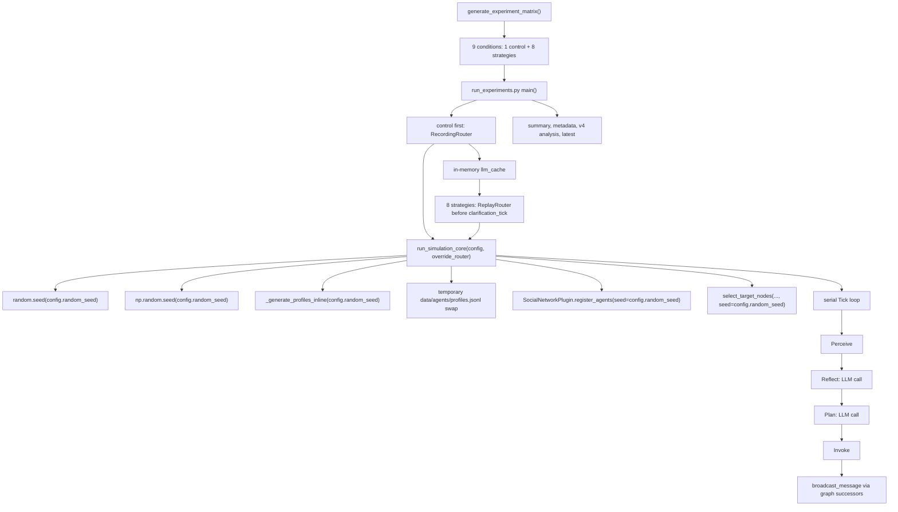

# TASK_005 Phase 0 审计基线：随机性来源与重复实验有效性

审计日期：2026-08-02

仓库：`E:\BaiduSyncdisk\Project\Thesis\GreenConsumer`

当前分支：`refactor/task005-replication-inference`

HEAD：`8e127a9b63b8921539aa1c691dae49dea9e656a1`

审计边界：本阶段只读审计本地代码和配置；未运行真实 LLM；未运行任何正式实验、重复实验或 `--runtime-dir`；未创建新的 `results/experiments/run_*`；未修改生产代码、测试、fixture、配置、插件、机制文件或既有运行产物。

## 1. 被审计文件

- `experiment_config.py`
- `run_experiments.py`
- `simulation_core.py`
- `generate_data.py`
- `node_selector.py`
- `configs/models_config.yaml`（只确认字段；API key 已脱敏，不在本文记录值）
- `plugins/environment/network/SocialNetworkPlugin.py`
- `plugins/agent/perceive/GreenPerceivePlugin.py`
- `plugins/agent/reflect/GreenCognitionPlugin.py`
- `plugins/agent/reflect/MemoryManager.py`
- `plugins/agent/plan/ConsumerPlanPlugin.py`
- `plugins/agent/invoke/GreenInvokePlugin.py`
- `analysis/plot_experiments.py`
- `analysis/plot_trajectories.py`
- `metrics_calculator.py`

## 2. 当前运行架构



当前实现的统计含义是“同一随机仿真情景下 8 个策略与 1 个共同对照的配对比较”，不是 9 个独立样本。TASK_005 的主要推断单元应是完整 `replicate block`：同一个 block 内恰好包含 1 个共同对照和 8 个策略条件。

## 3. 18 项随机性与非确定性来源

| ID | 文件/函数 | 随机性来源 | 当前控制方式 | 作用范围 | 条件间是否共享 | 可复现性 | 配对风险 | 建议 |
| --- | --- | --- | --- | --- | --- | --- | --- | --- |
| R01 | `experiment_config.ExperimentConfig` | `random_seed: int = 42` 作为仿真情景种子 | 默认固定为 42，9 条件相同 | run级 + condition级 | 9条件共享 | 固定seed后可复现 | 单次 run 只有一个随机世界，不能支持总体推断 | 在 TASK_005 中升级为 replicate-level seed ledger |
| R02 | `simulation_core.run_simulation_core` | Python 全局 `random` 状态 | `random_module.seed(config.random_seed)` | condition级 + 进程级 | 9条件共享同一 seed，但每条件重置 | 固定seed后可复现 | 后续若新增全局 random 调用，会被同一 seed 绑定 | 在 ledger 中记录 `simulation_seed` 和 Python 版本 |
| R03 | `simulation_core.run_simulation_core` | NumPy 全局随机状态 | `np.random.seed(config.random_seed)` | condition级 + 进程级 | 9条件共享同一 seed，但每条件重置 | 固定seed后可复现 | 后续全局 NumPy 调用会被同一 seed 绑定 | 在 ledger 中记录 NumPy 版本和 seed |
| R04 | `simulation_core._generate_profiles_inline` | agent cluster 排列/分配顺序 | `random_module.Random(seed).shuffle(cluster_order)` | Agent级 | 9条件共享 | 固定seed后可复现 | 同一 block 内配对合理；跨 block 改变 profile 和网络前置 | 保留为 `profile_seed` 或明确等于 `simulation_seed` |
| R05 | `simulation_core._generate_profiles_inline` | `social_role` 分配 | `np.random.RandomState(seed).choice(SOCIAL_ROLES, p=ROLE_PROBS)` | Agent级 | 9条件共享 | 固定seed后可复现 | 与 cluster、network 共用同一 seed，无法分解方差贡献 | ledger 中单列 `profile_seed` |
| R06 | `generate_data.generate_profiles` | 离线 profile 文件生成 | 参数 `seed` 控制 `random.seed`、`np.random.seed`、shuffle 和 choice | 环境级 | 不共享 | 固定seed后可复现 | 人工运行会改写 `data/agents/profiles.jsonl`，污染后续环境 | 后续重复实验不要依赖可变共享文件 |
| R07 | `SocialNetworkPlugin.register_agents` | BA 网络拓扑 | `nx.barabasi_albert_graph(n, m=2, seed=seed)` | replicate block级 | 9条件共享 | 固定seed后可复现 | 网络是 block 随机世界核心组成 | ledger 中单列 `network_seed` 和网络 hash |
| R08 | `SocialNetworkPlugin.register_agents` | ER fallback 网络拓扑 | `nx.erdos_renyi_graph(n, p=0.3, seed=seed)` | replicate block级 | 9条件共享 | 固定seed后可复现 | fallback 与 BA 不同分布；若发生会改变统计含义 | metadata 必须记录 fallback reason，正式分析可设为 block invalid |
| R09 | `SocialNetworkPlugin.register_agents` | 网络方向化 tie / agent 插入顺序 | degree 比较，平局使用 `>=`，node 顺序来自 agent registry | replicate block级 + Agent级 | 9条件共享 | 依赖第三方实现 | tie 顺序影响 hub、successor、传播路径 | 冻结 tie policy，并记录 sorted node/edge hash |
| R10 | `node_selector.select_target_nodes` | random 渠道目标节点抽样 | `random.Random(seed + 7777).sample(nodes, k)` | condition级 | 策略组独有 | 固定seed后可复现 | random 渠道和 hub 渠道的目标集差异是处理因素，不是独立重复 | 使用 `target_seed`，不要未记录 `seed + 7777` |
| R11 | `node_selector.select_target_nodes` | hub 渠道 degree tie | `sorted(degree_view, key=lambda x: x[1], reverse=True)` | condition级 | 策略组独有 | 依赖第三方实现 | degree 平局由 graph iteration 决定 | 明确 tie-breaker 为 `(degree desc, node_id asc)` 或记录实际目标 |
| R12 | `SocialNetworkPlugin.broadcast_message` | successor iteration 与 inbox 写入顺序 | `list(self.graph.successors(agent_id))` 后顺序循环 | Tick级 + Agent级 | 9条件共享到澄清前，澄清后可分化 | 依赖第三方实现 | inbox 顺序会改变 prompt 聚合 | 对 successor 排序，或记录传播顺序 hash |
| R13 | `GreenCognitionPlugin.execute` | Reflect 阶段 LLM 输出 | `await model.chat(prompt)`，配置来自 router | LLM调用级 | Replay窗口内共享；澄清后不共享 | 外部服务不可严格保证 | 澄清后 response 差异会放大路径分化 | ledger 记录 LLM provenance，Replay cache 只限 block 内 |
| R14 | `ConsumerPlanPlugin.execute` | Plan 阶段 LLM 输出 | `await model.chat(prompt)`，配置来自 router | LLM调用级 | Replay窗口内共享；澄清后不共享 | 外部服务不可严格保证 | 直接影响购买和发帖行为 | 同 R13，并记录解析失败和重试 |
| R15 | `MemoryManager._get_embedding` | SBERT embedding 数值输出 | `_SBERT_MODEL.encode(text, normalize_embeddings=True)` | Agent级 + Tick级 | 9条件共享到路径分化前 | 依赖第三方实现 | 模型版本、设备、缓存变化会影响 memory retrieval | 记录 package/model/cache/version/device，或固定 fallback |
| R16 | `MemoryManager._get_embedding` | fallback embedding 的 Python `hash()` | `hash(w) % dim`、`hash(bg) % dim` | 进程级 + 环境级 | 仅同一进程共享 | 跨进程不稳定 | 不同进程的 memory retrieval 可变 | 固定并记录 `PYTHONHASHSEED`，或改用 SHA-256 |
| R17 | `run_experiments.RecordingRouter._pk` | Replay cache prompt key | `hash(prompt[:200]) & 0xFFFFFFFF` + tick + call index | 进程级 + LLM调用级 | 仅同一进程共享 | 仅同一进程稳定 | key 不能跨进程或跨 block 持久复用 | 改为稳定 SHA-256；cache_scope 固定为 replicate-block-only |
| R18 | `run_experiments.main` / `configs/models_config.yaml` | LLM provider 参数和服务端随机状态 | YAML 中 `model=qwen-plus`、`temperature=0.3`、独立 `seed=42` | 环境级 + LLM调用级 | 未能确认 | 未能确认 | 不能声明真实 LLM 被 `config.random_seed` 控制 | `llm_seed_supported=unknown`，正式运行前 BLOCKER |

## 4. `random_seed` 覆盖结论

当前 `ExperimentConfig.random_seed` 实际控制：

- Python 全局 `random`；
- NumPy 全局随机状态；
- inline profile 生成；
- cluster 排列或分配；
- social_role 分配；
- NetworkX 网络生成；
- random 渠道目标节点选择。

当前没有证据表明 `ExperimentConfig.random_seed` 会覆盖：

- `configs/models_config.yaml` 中的 `seed`；
- provider 请求中的 LLM seed；
- 服务端模型随机状态。

YAML 中的 `seed=42` 是独立配置值，不是从 `config.random_seed` 派生。当前 `config.random_seed` 不是多个独立随机源的 ledger，而是同时改变画像、网络和目标选点等组成的“整体仿真情景种子”。

这意味着：

- 跨 block 可以估计整体随机世界变化产生的总变异；
- 当前不能分解 profile、network 和 target-selection 各自的方差贡献；
- 不能声称 LLM 随机性也由 simulation seed 控制。

已核实的调用链：

```text
generate_experiment_matrix()
  -> ExperimentConfig.random_seed
  -> run_simulation_core(config)
  -> random_module.seed(config.random_seed)
  -> np.random.seed(config.random_seed)
  -> _generate_profiles_inline(config.num_agents, config.random_seed)
  -> SocialNetworkPlugin.register_agents(agents, seed=config.random_seed)
  -> select_target_nodes(graph, channel_factor, budget_k, config.random_seed)
```

其中每一段均有代码证据支持，未从函数名推断。

## 5. Recording / Replay 边界

逐项结论：

1. control 通过 `RecordingRouter(_real_router)` Recording；`RecordingRouter.chat()` 在调用真实 router 后把 response 写入 in-memory cache。
2. immediate 条件 `clarification_tick=6`，Replay 条件是 `current_tick < replay_until_tick`，因此只回放 Tick 1-5。
3. delayed 条件 `clarification_tick=10`，因此只回放 Tick 1-9。
4. clarification Tick 本身不在回放窗口内。
5. clarification Tick 及之后调用真实 router。
6. 澄清后不同策略的 prompt、调用次数和行为路径可能分化，这是策略效应和 LLM 残余随机性的共同来源。
7. cache key 由三部分共同组成：prompt 前 200 字符的 Python hash、`current_tick`、同一 prompt key 下的 `call_index`。
8. Python hash 盐的影响：同一进程内不破坏配对；不同进程之间 key 不稳定；cache 不能可靠持久化或跨 block 复用。

共同随机数覆盖边界：

- 覆盖策略澄清前的已录制 LLM 路径；
- 不覆盖澄清 Tick 及其后的真实 LLM 输出；
- 不保证策略澄清后的调用序列相同；
- 不允许使用一个 block 的控制缓存服务另一个 block。

## 6. LLM 随机性三种情形

### A. provider 确认支持 seed

- requested seed 仍必须进入 ledger；
- 记录 provider 返回的 seed、response id、model version 或 system fingerprint；
- seed 只能提高重复性，不能等同于严格确定性保证；
- 若 provider 有 retry 或 backend routing，仍需记录每次调用的 provenance。

### B. provider 不支持 seed

- LLM 随机性属于 block 间总变异的一部分；
- 必须记录 temperature、top_p、model、provider 和时间；
- 不得声称真实 LLM 严格复现；
- deterministic mock 只能验证工程契约，不能替代真实 LLM 推断。

### C. seed 支持状态未能确认

- `llm_seed_supported` 写为 `unknown`；
- 正式真实 LLM 运行前属于 BLOCKER；
- 不得把配置文件中的 `seed` 字段视为已经生效。

当前选择：simulation randomness 应通过 seed ledger 控制；真实 LLM 残余随机性若无法消除，应作为重复实验总变异的一部分；deterministic mock 只验证工程管线。

## 7. Seed Ledger 方案

最低字段：

| 字段 | 语义 |
| --- | --- |
| `replication_schema_version` | 复制实验 schema 版本 |
| `master_seed` | 预注册主 seed |
| `replicate_index` | 从 1 开始 |
| `replicate_id` | `R001`、`R002` 等 |
| `simulation_seed` | 当前代码实际可传入 `ExperimentConfig.random_seed` 的仿真 seed |
| `requested_llm_seed` | 独立命名空间派生的 LLM 请求 seed |
| `llm_seed_supported` | `true`、`false` 或 `unknown` |
| `matrix_version` | 固定为 `3.0` |
| `metrics_schema_version` | 当前 v4 metrics schema |
| `condition_count` | 固定为 `9` |
| `control_exp_id` | 固定为 `NoClarification-Control` |
| `execution_order` | control first，再按 `exp_id` 排序的 8 个策略 |
| `cache_scope` | 固定为 `replicate-block-only` |
| `profile_seed` | 可选；画像子 seed |
| `network_seed` | 可选；网络子 seed |
| `target_seed` | 可选；目标选点子 seed |
| `python_hash_seed` | 可选；进程 hash seed |
| `provider_model` | 可选；真实 LLM model |
| `provider_system_fingerprint` | 可选；provider 返回或未能确认 |

字段数：19。

基础语义：

- `replicate_index` 从 1 开始；
- `replicate_id` 格式为 `R001`、`R002`；
- `condition_count` 固定 9；
- `execution_order` 为 control first，再按 `exp_id` 排序的 8 个策略；
- `cache_scope` 固定为 `replicate-block-only`；
- `simulation_seed` 在不同 block 间唯一；
- `requested_llm_seed` 使用独立命名空间；
- `llm_seed_supported` 允许 `true`、`false`、`unknown`；
- `requested_llm_seed` 不代表服务端确定性保证。

SHA-256 派生伪代码：

```python
import hashlib

def derive_seed(master_seed, replicate_index, namespace):
    payload = (
        f"task005|{master_seed}|{replicate_index}|{namespace}"
    ).encode("utf-8")
    digest = hashlib.sha256(payload).digest()
    return 1 + int.from_bytes(digest[:8], "big") % (2**32 - 1)

simulation_seed = derive_seed(
    master_seed,
    replicate_index,
    "simulation",
)

requested_llm_seed = derive_seed(
    master_seed,
    replicate_index,
    "llm",
)
```

说明：

- 结果落入 `1` 至 `2**32 - 1`；
- 不使用未记录来源的 `seed + 1`；
- ledger 中保存派生结果和派生算法版本；
- 即使暂时只使用 `simulation_seed`，也保留未来子 seed 扩展能力。

## 8. 并发与共享文件风险

当前单进程串行运行基本可控，但并行重复实验不安全：

- `simulation_core.py` 在每个实验中备份并改写 `data/agents/profiles.jsonl`；
- `run_experiments._run_with_patch()` 临时改写模块级 `simulation_core.ENTERPRISE_STRATEGY`；
- `run_experiments.sync_latest_snapshot()` 会清理并重建 `results/experiments/latest` 管理文件；
- `analysis/plot_experiments.py` 和 `analysis/plot_trajectories.py` 使用模块级目录变量，不适合在同一解释器内并行多 run_dir 后处理；
- `RecordingRouter` / `ReplayRouter` cache 是进程内可变对象，只能 block 内使用；
- Python `hash()` 随进程盐变化，影响 fallback embedding 和 replay cache key。

当前不允许并行重复实验。允许并行前至少需要隔离 profile 输入、事件 timeline、run_dir、latest、Replay cache 和 Python hash seed。

## 9. 统计独立性说明

- 20 个 Agent 共享网络、事件和实验条件，不能当作 `n=20`。
- 30 个 Tick 是同一动态轨迹中的序列相关观测，不能当作 `n=30`。
- 8 个策略共享同一 block 的画像、网络和控制路径，不能当作 8 次独立重复。
- 单次 LLM 调用嵌套在 Agent、Tick 和 block 内，不能作为独立样本。
- 完整 replicate block 才是主要推断的独立单位。

## 10. Pilot 与 Formal 样本量方案

Pilot：

- deterministic mock：3 个 block，仅验证 ledger、隔离、恢复和产物；
- real LLM：候选 3 至 5 个 block；
- pilot 用于估计三个主指标的 block 间标准差、失败率和单 block 成本；
- pilot 不做策略显著性结论；
- pilot 是否并入 formal 必须在 pilot 开始前预注册。

Formal 样本量不在 Phase 0 冻结具体 block 数。正式 block 数应在 pilot 后、formal 前预注册。对每个主指标 `j`：

```text
n_j = ceil((z_0.975 * s_j / h_j) ** 2)
```

其中：

- `s_j` 为 pilot 估计的 block 间标准差；
- `h_j` 为预先指定的 95% 置信区间半宽；
- formal block 数取三个 `n_j` 中的最大值；
- 同时设置预先冻结的 `N_min` 和 `N_max`；
- 不得查看策略排名后再追加 block。

候选精度表：

| 主指标 | 标准精度候选半宽 `h_j` | 高精度候选半宽 `h_j` | 备注 |
| --- | ---: | ---: | --- |
| `final_trust_gain_vs_control` | 0.020 | 0.010 | 候选值，待 pilot 后冻结 |
| `post_scandal_auc_gain_vs_control` | 0.300 | 0.150 | 候选值，待 pilot 后冻结 |
| `local_trust_effect_did_3` | 0.015 | 0.0075 | 候选值，待 pilot 后冻结；local DID 可能波动更大，待 pilot 验证 |

local DID 通常可能比终点指标波动更大，因此可能成为样本量约束指标；当前尚无数据支持，必须待 pilot 验证。

## 11. 统计分析契约

每个策略、每个主指标必须报告：

- block 均值；
- 标准差；
- 标准误；
- 95% 置信区间；
- 中位数；
- IQR；
- 有效 block 数；
- 失败 block 数。

因子效应必须先在每个 block 内计算 contrast，再跨 block 汇总：

- Content 主效应；
- Channel 主效应；
- Timing 主效应；
- Content×Channel；
- Content×Timing；
- Channel×Timing；
- 三阶交互作为探索性。

报告原则：

- 置信区间和效应量为主要报告；
- Holm 校正 p 值仅作为补充；
- 不用单一 `p < 0.05` 替代机制解释；
- 不能将 8 行策略直接作为普通独立样本拟合模型。

排名分析：

- 基于跨 block 聚合均值计算正式 Pareto；
- 通过 block bootstrap 估计 rank 分布；
- 报告 top1 概率、Pareto 概率、mean rank、median rank 和 rank interval；
- TASK_004 单次 run 等权排名仅为补充诊断。

## 12. 后续文件职责与产物契约

建议新增代码：

1. `replication_config.py`
   - 职责：schema、seed 派生和 ledger 校验。
2. `run_replications.py`
   - 职责：串行 block 编排、恢复、失败处理和 manifest 写出。
3. `replication_analysis.py`
   - 职责：block 配对汇总、factorial contrasts、CI 和排名稳定性。

建议产物：

| 产物 | 行单位 | 主键 | 字段来源 |
| --- | --- | --- | --- |
| `replicate_manifest.csv` | 一个 replicate block | `replicate_id` | seed ledger 与预注册配置 |
| `replicate_runs.csv` | 一个 replicate block × condition | `replicate_id + exp_id` | 每个 block 的 run metadata 与 experiment metadata |
| `paired_effects.csv` | 一个 replicate block × strategy exp_id | `replicate_id + exp_id` | 每个 block 的 `summary.csv` 正式 v4 字段 |
| `factorial_contrasts.csv` | `replicate_id × metric × contrast` | `replicate_id + metric + contrast_name` | 同 block 8 个策略的配对 contrast |
| `aggregate_effects.csv` | `metric × estimand` | `metric + estimand_name` | 跨 block 汇总 |
| `replication_metadata.json` | 一个 replication batch | `replication_id` | 预注册配置、环境、LLM provenance、输入/输出 SHA |
| `replication_failures.csv` | 一个失败 block 或 condition | `replicate_id + exp_id + failure_stage` | runner 捕获的失败、Replay/network/postprocess 状态 |

## 13. 证据附录

simulation seed 覆盖路径：

```python
# experiment_config.py
random_seed: int = 42

# simulation_core.py
random_module.seed(config.random_seed)
np.random.seed(config.random_seed)
profiles = _generate_profiles_inline(config.num_agents, config.random_seed)
net_plugin.register_agents(agents, seed=config.random_seed)
target_nodes = select_target_nodes(
    net_plugin.graph, config.channel_factor, config.budget_k, config.random_seed
)
```

profile 共享文件替换：

```python
# simulation_core.run_simulation_core
original_profiles_path = os.path.join(current_dir, "data", "agents", "profiles.jsonl")
original_backup_path = os.path.join(current_dir, "data", "agents", "profiles.jsonl.bak")
os.rename(original_profiles_path, original_backup_path)
with open(original_profiles_path, "w", encoding="utf-8") as f:
    ...
```

`ENTERPRISE_STRATEGY` patch：

```python
# run_experiments._run_with_patch
original = _sc.ENTERPRISE_STRATEGY.copy()
_sc.ENTERPRISE_STRATEGY.clear()
_sc.ENTERPRISE_STRATEGY.update(_SINGLE_SCANDAL)
try:
    return await run_simulation_core(config, override_router=override_router)
finally:
    _sc.ENTERPRISE_STRATEGY.clear()
    _sc.ENTERPRISE_STRATEGY.update(original)
```

Replay 窗口条件：

```python
# run_experiments.ReplayRouter.chat
if self._current_tick < self._replay_until:
    key = (pk, self._current_tick, count)
    if key not in self._cache:
        self.miss_count += 1
        raise ReplayAlignmentError(
            exp_id=self._exp_id,
            tick=self._current_tick,
            replay_until=self._replay_until,
            miss_count=self.miss_count,
        )
    return self._cache[key]
return await self._inner.chat(prompt)
```

cache key：

```python
# run_experiments.RecordingRouter._pk
return str(hash(prompt[:200]) & 0xFFFFFFFF)

# RecordingRouter.chat
key = (pk, self._current_tick, count)
```

random 渠道选点：

```python
# node_selector.select_target_nodes
rng = random.Random(seed + 7777)
selected = rng.sample(nodes, k)
```

NetworkX seed：

```python
# SocialNetworkPlugin.register_agents
undirected = nx.barabasi_albert_graph(n, m=2, seed=seed)
undirected = nx.erdos_renyi_graph(n, p=0.3, seed=seed)
```

fallback Python hash：

```python
# MemoryManager._get_embedding
h = hash(w) % dim
h = hash(bg) % dim
```

latest 同步清理：

```python
# run_experiments.sync_latest_snapshot
for name in LATEST_MANAGED_TARGETS:
    target = os.path.join(latest_dir, name)
    if os.path.isdir(target):
        shutil.rmtree(target)
    elif os.path.exists(target):
        os.remove(target)
```

LLM 配置读取：

```python
# run_experiments.main
with open(os.path.join(current_dir, "configs/models_config.yaml"), "r") as f:
    _models_conf = yaml.safe_load(f)
from agentkernel_standalone.toolkit.models.router import ModelRouter, AsyncModelRouter
_real_router = ModelRouter(AsyncModelRouter(_models_conf))
```

## 14. 风险分级

### BLOCKER（5）

1. 真实 LLM seed 支持、模型版本和服务端确定性未能确认；正式真实 LLM 运行前必须解决或显式登记为残余随机性。
2. 当前没有 seed ledger，不能证明每个 replicate block 的随机来源完整可复算。
3. 当前 `data/agents/profiles.jsonl` 是共享可变文件，不能安全并行运行 blocks。
4. 当前 `_run_with_patch()` 改写模块级 `ENTERPRISE_STRATEGY`，不能在同一进程内并行。
5. 当前没有 block-level 成功/失败契约；任一条件失败后如何进入统计未冻结。

### MAJOR（7）

1. `PYTHONHASHSEED` 未固定时，MemoryManager fallback embedding 跨进程不稳定。
2. Replay cache key 依赖 Python `hash()`，只适合同一进程、同一 block 内使用。
3. hub tie、successor iteration 和 inbox 顺序未在 metadata 中冻结。
4. `latest/` 清理/同步是共享全局输出，和并行 replicate 不兼容。
5. analysis 模块使用全局路径变量，不适合同一解释器并行多 run_dir 后处理。
6. LLM metadata 记录缺少 provider seed support、system fingerprint、response id 或服务端版本。
7. 单个 v3.0 batch 只有一个随机世界，不能直接支持主效应统计推断。

### MINOR（4）

1. 运行环境中的包版本、BLAS/设备、`PYTHONHASHSEED` 尚未进入 run metadata 完整记录。
2. configs 中存在 API key 字段，审计和报告必须持续脱敏。
3. `generate_data.py` 仍可人工改写 `data/agents/profiles.jsonl`，与 simulation inline path 容易混淆。
4. v3/v4 后处理图形输出是 run-level 产物，跨 block 汇总图应另建命名空间。

## 15. 预正式实验检查清单

- [ ] 冻结 TASK_005 设计文档和验收测试。
- [ ] 建立 `replicate_id` 与 seed ledger schema。
- [ ] 明确 `master_seed` 到 `simulation_seed`、`requested_llm_seed` 及可选子 seed 的派生规则。
- [ ] 保证每个 block 恰好 9 个条件、1 个 control、8 个 strategy。
- [ ] `execution_order` 固定为 control first，再按 `exp_id` 排序的 8 个策略。
- [ ] Recording cache 只在 block 内共享。
- [ ] Replay miss、网络不一致和产物不完整时 block fail-closed。
- [ ] 移除或隔离 `profiles.jsonl` 共享写入。
- [ ] 移除或隔离 `ENTERPRISE_STRATEGY` 全局 patch。
- [ ] 固定或记录 `PYTHONHASHSEED`。
- [ ] 记录 LLM provider、model、temperature、top_p、requested seed、seed support、response id、system fingerprint 或未能确认字段。
- [ ] 禁止把 strategy rows、Agent、Tick 或 LLM 调用当独立样本。
- [ ] 定义 block-level missing/failure policy。
- [ ] 增加 deterministic mock pilot。
- [ ] 增加 runtime-dir 正式验收，检查每个 block 的完整性和 SHA。
- [ ] 在 pilot 后、formal 前预注册正式样本量、`N_min`、`N_max` 和停止规则。

## 16. 阻断结论

TASK_005 可以进入设计阶段，但不能直接启动并行重复实验，也不能把当前单次 v3.0 矩阵扩展为统计推断结果。

最小后续路径：

1. 冻结 seed ledger 与 replicate block 契约；
2. 实现串行 replicate runner；
3. 用 deterministic mock 跑 3 个 block 验证工程管线；
4. 根据 pilot 估计的 `s_j` 和预注册 `h_j` 冻结 formal 样本量；
5. 解决或登记真实 LLM seed support；
6. 再决定是否隔离共享文件和全局 patch 以支持并行；
7. 最后运行真实 LLM pilot 或 formal。
